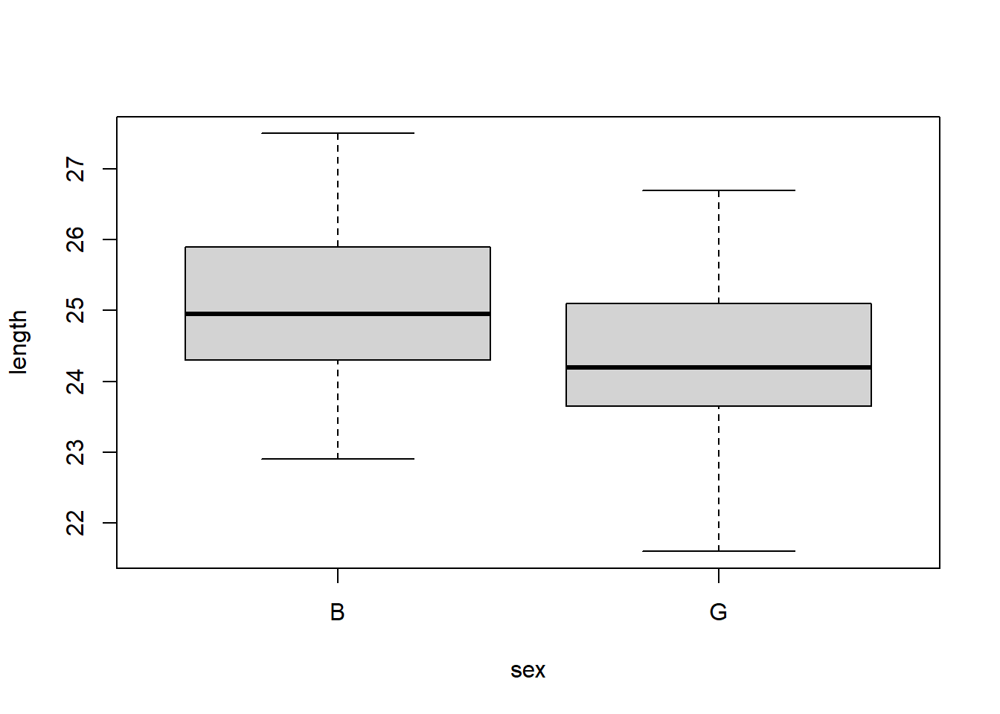
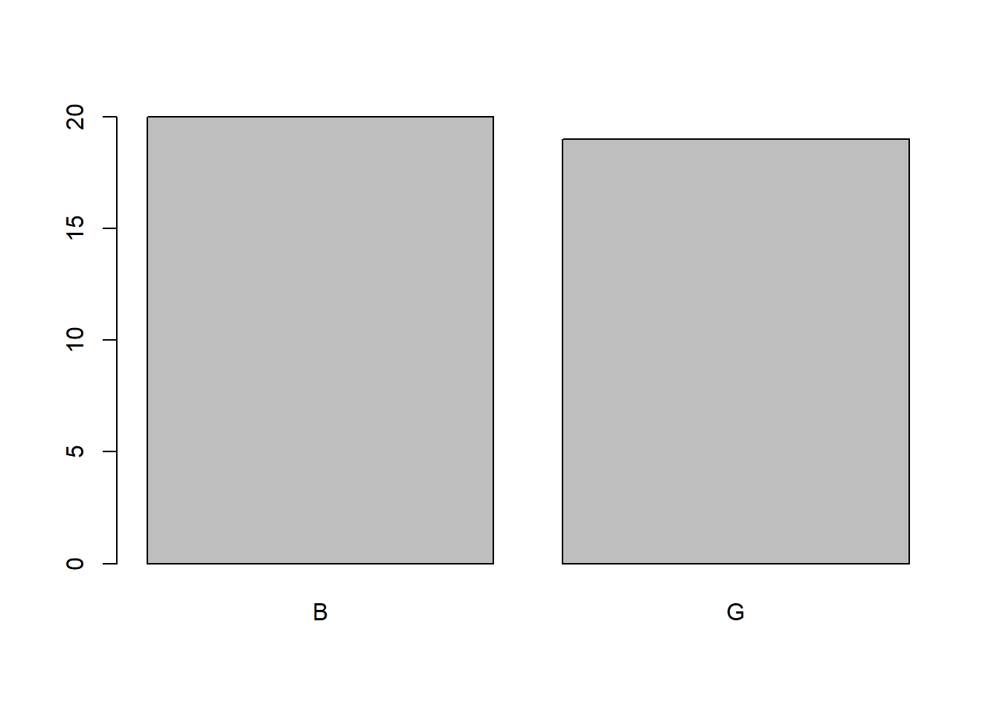
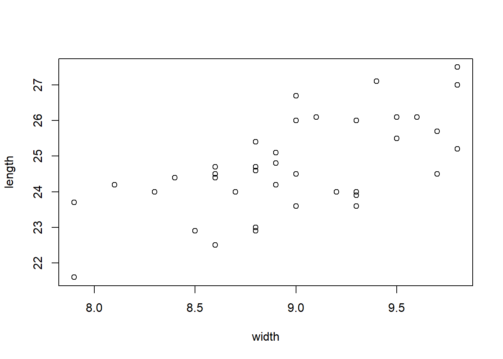
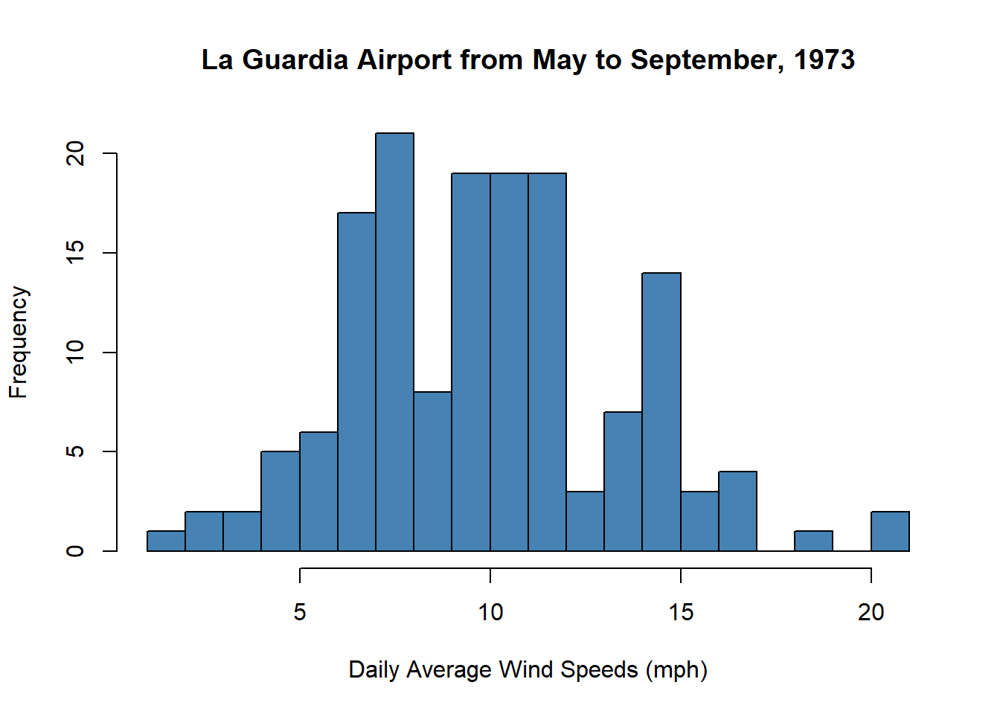
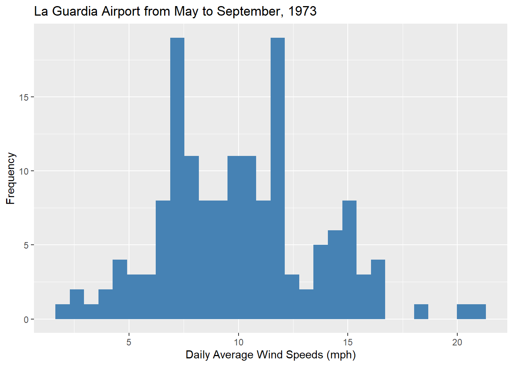
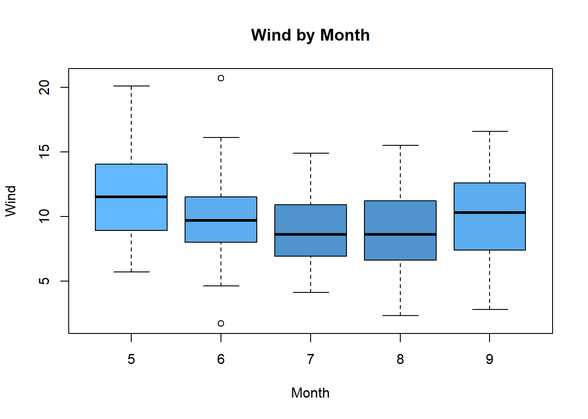
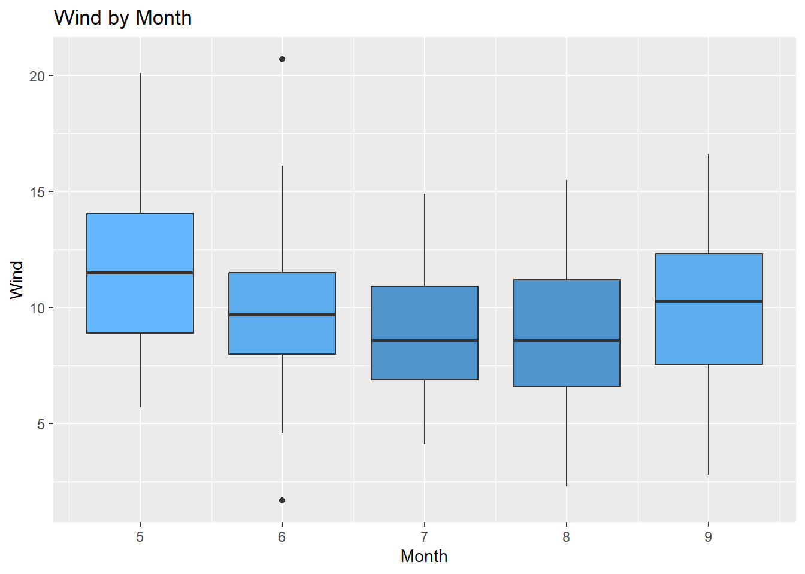
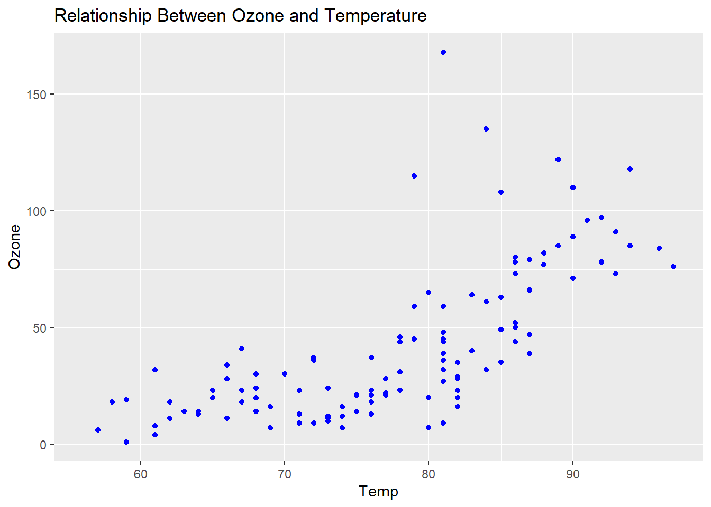

# Week 2 Day 1
__Group 1__


::: {.cell}

```{.r .cell-code}
library(mosaic)
library(pander)
library(tidyverse)
View(KidsFeet)
```
:::

::: {.cell}

```{.r .cell-code}
boxplot(length~sex,data=KidsFeet)
```

::: {.cell-output-display}
{width=672}
:::
:::

::: {.cell}

```{.r .cell-code}
KidsFeet %>% 
  group_by(sex) %>% 
  summarise(min = min(length), Q1=quantile(length,0.25), median=median(length),Q3=quantile(length,0.75),
            max=max(length))
```

::: {.cell-output-display}

`````{=html}
<div data-pagedtable="false">
  <script data-pagedtable-source type="application/json">
{"columns":[{"label":["sex"],"name":[1],"type":["fct"],"align":["left"]},{"label":["min"],"name":[2],"type":["dbl"],"align":["right"]},{"label":["Q1"],"name":[3],"type":["dbl"],"align":["right"]},{"label":["median"],"name":[4],"type":["dbl"],"align":["right"]},{"label":["Q3"],"name":[5],"type":["dbl"],"align":["right"]},{"label":["max"],"name":[6],"type":["dbl"],"align":["right"]}],"data":[{"1":"B","2":"22.9","3":"24.35","4":"24.95","5":"25.8","6":"27.5"},{"1":"G","2":"21.6","3":"23.65","4":"24.20","5":"25.1","6":"26.7"}],"options":{"columns":{"min":{},"max":[10]},"rows":{"min":[10],"max":[10]},"pages":{}}}
  </script>
</div>
`````

:::
:::

::: {.cell}

```{.r .cell-code}
favstats(length~sex,data=KidsFeet)
```

::: {.cell-output-display}

`````{=html}
<div data-pagedtable="false">
  <script data-pagedtable-source type="application/json">
{"columns":[{"label":["sex"],"name":[1],"type":["chr"],"align":["left"]},{"label":["min"],"name":[2],"type":["dbl"],"align":["right"]},{"label":["Q1"],"name":[3],"type":["dbl"],"align":["right"]},{"label":["median"],"name":[4],"type":["dbl"],"align":["right"]},{"label":["Q3"],"name":[5],"type":["dbl"],"align":["right"]},{"label":["max"],"name":[6],"type":["dbl"],"align":["right"]},{"label":["mean"],"name":[7],"type":["dbl"],"align":["right"]},{"label":["sd"],"name":[8],"type":["dbl"],"align":["right"]},{"label":["n"],"name":[9],"type":["int"],"align":["right"]},{"label":["missing"],"name":[10],"type":["int"],"align":["right"]}],"data":[{"1":"B","2":"22.9","3":"24.35","4":"24.95","5":"25.8","6":"27.5","7":"25.10500","8":"1.216758","9":"20","10":"0"},{"1":"G","2":"21.6","3":"23.65","4":"24.20","5":"25.1","6":"26.7","7":"24.32105","8":"1.330238","9":"19","10":"0"}],"options":{"columns":{"min":{},"max":[10]},"rows":{"min":[10],"max":[10]},"pages":{}}}
  </script>
</div>
`````

:::
:::


__Group 2__


::: {.cell}

```{.r .cell-code}
barplot(table(KidsFeet$sex))
```

::: {.cell-output-display}
{width=672}
:::

```{.r .cell-code}
table(KidsFeet$sex)
```

::: {.cell-output .cell-output-stdout}

```

 B  G 
20 19 
```


:::
:::


__Group 3__


::: {.cell}

```{.r .cell-code}
plot(length~width, data=KidsFeet)
```

::: {.cell-output-display}
{width=672}
:::

```{.r .cell-code}
KidsFeet %>% 
  summarise(Correlation=cor(width,length))
```

::: {.cell-output-display}

`````{=html}
<div data-pagedtable="false">
  <script data-pagedtable-source type="application/json">
{"columns":[{"label":["Correlation"],"name":[1],"type":["dbl"],"align":["right"]}],"data":[{"1":"0.6410961"}],"options":{"columns":{"min":{},"max":[10]},"rows":{"min":[10],"max":[10]},"pages":{}}}
  </script>
</div>
`````

:::

```{.r .cell-code}
#Add any notes to your Index file in the Statistics Notebook
```
:::


# Week 2 Day 2


::: {.cell}

```{.r .cell-code}
library(mosaic)
library(tidyverse)

View(airquality)
?airquality
```
:::

::: {.cell}

```{.r .cell-code}
#Histograms (length)
hist(airquality$Wind,main="La Guardia Airport from May to September, 1973", 
     xlab="Daily Average Wind Speeds (mph)",ylab="Frequency",col="steelblue",breaks = 22)
```

::: {.cell-output-display}
{width=672}
:::

```{.r .cell-code}
ggplot(airquality,aes(x=Wind))+
  geom_histogram(fill="steelblue")+
  labs(title="La Guardia Airport from May to September, 1973",
       x="Daily Average Wind Speeds (mph)",
       y="Frequency")
```

::: {.cell-output-display}
{width=672}
:::
:::

::: {.cell}

```{.r .cell-code}
#boxplots
boxplot(Wind~Month,main="Wind by Month", xlab="Month",
     ylab="Wind",col=c("steelblue1",
                       "steelblue2", 
                       "steelblue3",
                       "steelblue3",
                       "steelblue2"),
                data=airquality)
```

::: {.cell-output-display}
{width=672}
:::

```{.r .cell-code}
ggplot(data=airquality,aes(y=Wind,x=Month,group=Month))+
  geom_boxplot(fill=c("steelblue1", 
                      "steelblue2", 
                      "steelblue3",
                      "steelblue3",
                      "steelblue2"))+
  labs(title = "Wind by Month",
       y="Wind",
       x="Month")
```

::: {.cell-output-display}
{width=672}
:::
:::

::: {.cell}

```{.r .cell-code}
#scatterplots 

plot(Ozone~Temp, data=airquality, main="Relationship Between Ozone and Temperature",
     xlab="Temp", 
     ylab="Ozone",
     pch = 19, 
     col="blue")
```

::: {.cell-output-display}
{width=672}
:::

```{.r .cell-code}
ggplot(airquality,aes(x=Temp,y=Ozone))+
  geom_point(color="blue")+
  labs(title="Relationship Between Ozone and Temperature", 
       x="Temp", 
       y="Ozone")
```

::: {.cell-output-display}
{width=672}
:::

```{.r .cell-code}
## Go over the Stephanie analysis
```
:::
