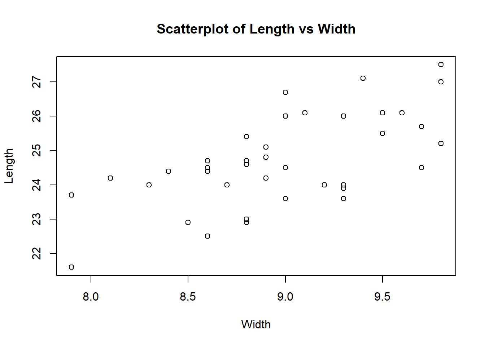
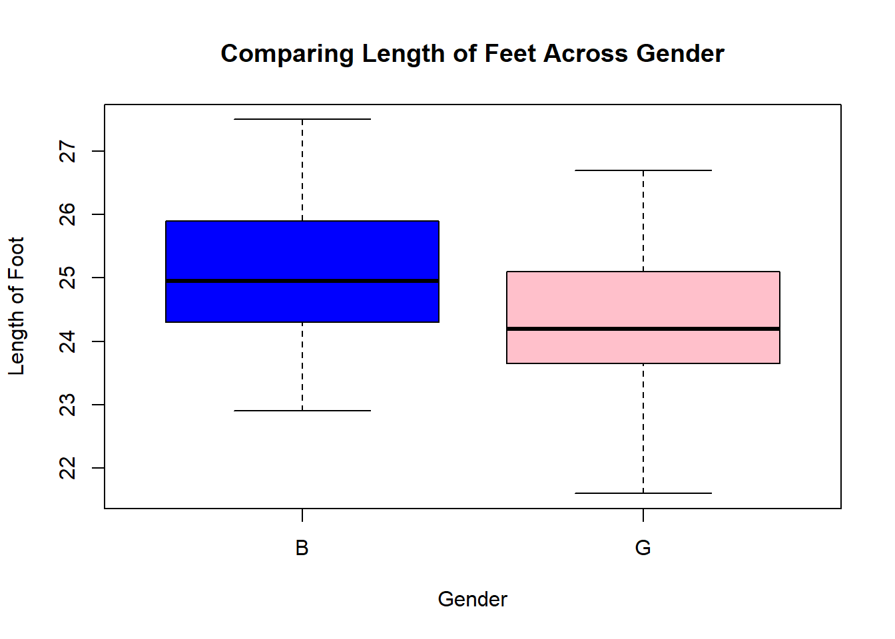
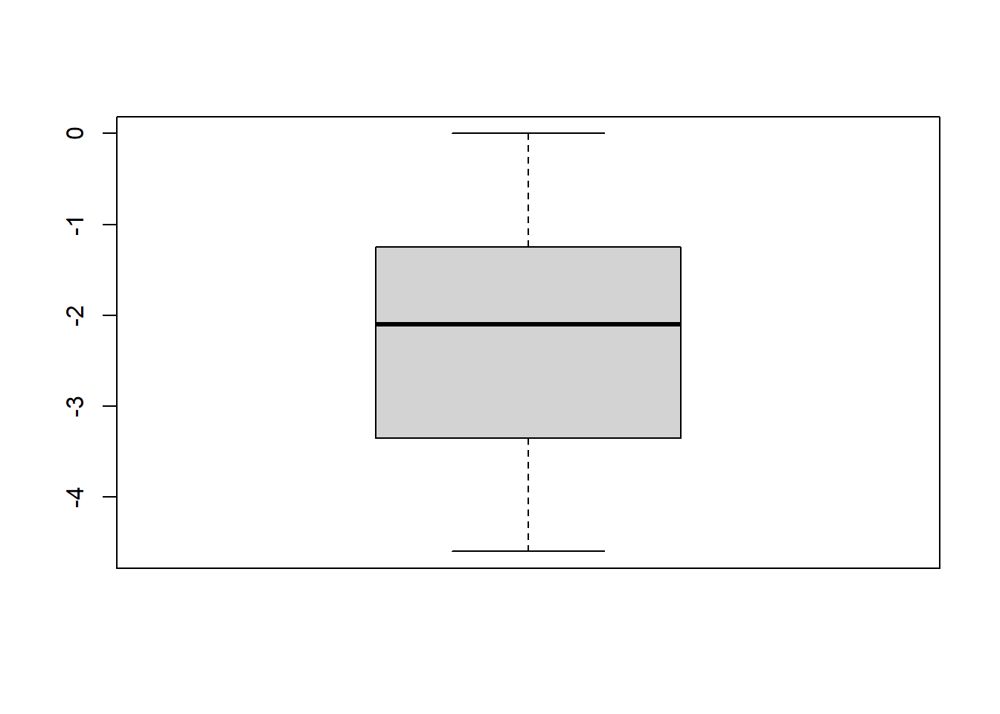

# Week 2 Day 1


::: {.cell}

```{.r .cell-code}
library(mosaic)
library(pander)
library(tidyverse)
library(car)
```
:::


## Making Inference

### Define Inference


::: {.cell}

```{.r .cell-code}
# Define inference first in class and then with the group.
# Do not use the textbook when going over this. Use the script below as your guide.
```
:::


### Hypothesis Testing


## Type I Error vs Type II Error – Examples (Flip flops vs medicine)


::: {.cell}

```{.r .cell-code}
# Type I error: False positive (rejecting a true null hypothesis)
# Type II error: False negative (failing to reject a false null hypothesis)

# Example:
# Imagine a scenario where you are testing the effectiveness of a new medicine.
# - Null hypothesis (H0): The medicine has no effect.
# - Type I error: You conclude that the medicine is effective when it actually isn't. 
#   This can lead to unnecessary side effects and costs.
# - Type II error: You conclude that the medicine is not effective when it actually is.
#   This means a useful treatment is rejected, possibly harming patients who need it.

# Another Example:
# Suppose you are testing if flip-flops are waterproof.
# - Null hypothesis (H0): Flip-flops are waterproof.
# - Type I error: You conclude that flip-flops are not waterproof when they actually are.
# - Type II error: You conclude that flip-flops are waterproof when they actually aren’t.
```
:::


## Type I Error and Level of Significance


::: {.cell}

```{.r .cell-code}
# Type I error = Level of significance = 1 – level of confidence
# The significance level (alpha) represents the probability of making a Type I error.
# Example: If the confidence level is 95%, then the significance level (alpha) is 0.05.
# This means there is a 5% chance of rejecting a true null hypothesis.
```
:::


## Type II Errors and Power


::: {.cell}

```{.r .cell-code}
# Power = 1 - Type II error rate
# The power of a test is the probability of correctly rejecting a false null hypothesis.
# A higher power means a lower probability of making a Type II error.
# Increasing sample size, effect size, or significance level can improve statistical power.
```
:::


## Sufficient Evidence – Not Proof


::: {.cell}

```{.r .cell-code}
# Hypothesis testing does not provide absolute proof but rather sufficient statistical evidence.
# - A statistically significant result suggests that an effect exists, but it does not confirm it with certainty.
# - External factors, assumptions, and sample limitations must be considered.
# - Scientific conclusions should be drawn cautiously based on the strength of the evidence.
```
:::


## P-value Calculation


::: {.cell}

```{.r .cell-code}
# P-value needs two things: a test statistic and a sampling distribution of the test statistic
# - The test statistic is calculated based on sample data (e.g., t-score, z-score, F-statistic).
# - The sampling distribution describes how the test statistic behaves under the null hypothesis.
# - The p-value measures how extreme the observed test statistic is, assuming the null hypothesis is true.
# - A small p-value suggests evidence against the null hypothesis, leading to potential rejection of H0.
```
:::


### Peer Review Analysis


::: {.cell}

```{.r .cell-code}
# 1) Go to the Analysis Menu and open Good Example Analysis
# 2) Summary of Student Peer Reviews for the Good Example Analysis
# 3) Identify at least one student who you would like feedback from
# 4) Identify at least one student that you would NOT like to give you feedback on future assignments.
# 5) Find an example of Good Specific Feedback
# To practice, locate at least one student feedback where the feedback
# is specific enough that if it were given to the wrong student
# that student wouldn't find it useful, but the right student would find it useful.
# 6) With Peers, identify things you should avoid doing
# 7) With Peers, identify principles that would make for a good critique
```
:::


### Data Exploration


::: {.cell}

```{.r .cell-code}
View(KidsFeet)
```
:::


### Group 1 Analysis


::: {.cell}

```{.r .cell-code}
boxplot(length~sex, data=KidsFeet)
```

::: {.cell-output-display}
{width=672}
:::
:::

::: {.cell}

```{.r .cell-code}
summary <- KidsFeet %>% 
  group_by(sex) %>% 
  summarise(min = min(length), 
            Q1=quantile(length, 0.25), 
            median=median(length), 
            Q3=quantile(length, 0.75),
            max=max(length))

summary
```

::: {.cell-output-display}

`````{=html}
<div data-pagedtable="false">
  <script data-pagedtable-source type="application/json">
{"columns":[{"label":["sex"],"name":[1],"type":["fct"],"align":["left"]},{"label":["min"],"name":[2],"type":["dbl"],"align":["right"]},{"label":["Q1"],"name":[3],"type":["dbl"],"align":["right"]},{"label":["median"],"name":[4],"type":["dbl"],"align":["right"]},{"label":["Q3"],"name":[5],"type":["dbl"],"align":["right"]},{"label":["max"],"name":[6],"type":["dbl"],"align":["right"]}],"data":[{"1":"B","2":"22.9","3":"24.35","4":"24.95","5":"25.8","6":"27.5"},{"1":"G","2":"21.6","3":"23.65","4":"24.20","5":"25.1","6":"26.7"}],"options":{"columns":{"min":{},"max":[10]},"rows":{"min":[10],"max":[10]},"pages":{}}}
  </script>
</div>
`````

:::
:::

::: {.cell}

```{.r .cell-code}
summary <- favstats(length~sex, data=KidsFeet)

summary
```

::: {.cell-output-display}

`````{=html}
<div data-pagedtable="false">
  <script data-pagedtable-source type="application/json">
{"columns":[{"label":["sex"],"name":[1],"type":["chr"],"align":["left"]},{"label":["min"],"name":[2],"type":["dbl"],"align":["right"]},{"label":["Q1"],"name":[3],"type":["dbl"],"align":["right"]},{"label":["median"],"name":[4],"type":["dbl"],"align":["right"]},{"label":["Q3"],"name":[5],"type":["dbl"],"align":["right"]},{"label":["max"],"name":[6],"type":["dbl"],"align":["right"]},{"label":["mean"],"name":[7],"type":["dbl"],"align":["right"]},{"label":["sd"],"name":[8],"type":["dbl"],"align":["right"]},{"label":["n"],"name":[9],"type":["int"],"align":["right"]},{"label":["missing"],"name":[10],"type":["int"],"align":["right"]}],"data":[{"1":"B","2":"22.9","3":"24.35","4":"24.95","5":"25.8","6":"27.5","7":"25.10500","8":"1.216758","9":"20","10":"0"},{"1":"G","2":"21.6","3":"23.65","4":"24.20","5":"25.1","6":"26.7","7":"24.32105","8":"1.330238","9":"19","10":"0"}],"options":{"columns":{"min":{},"max":[10]},"rows":{"min":[10],"max":[10]},"pages":{}}}
  </script>
</div>
`````

:::
:::


### Group 2 Analysis


::: {.cell}

```{.r .cell-code}
barplot(table(KidsFeet$sex))
```

::: {.cell-output-display}
{width=672}
:::
:::

::: {.cell}

```{.r .cell-code}
table(KidsFeet$sex)
```

::: {.cell-output .cell-output-stdout}

```

 B  G 
20 19 
```


:::
:::


### Group 3 Analysis


::: {.cell}

```{.r .cell-code}
plot(length~width, data=KidsFeet)
```

::: {.cell-output-display}
{width=672}
:::
:::

::: {.cell}

```{.r .cell-code}
KidsFeet %>% 
  summarise(Correlation=cor(width, length))
```

::: {.cell-output-display}

`````{=html}
<div data-pagedtable="false">
  <script data-pagedtable-source type="application/json">
{"columns":[{"label":["Correlation"],"name":[1],"type":["dbl"],"align":["right"]}],"data":[{"1":"0.6410961"}],"options":{"columns":{"min":{},"max":[10]},"rows":{"min":[10],"max":[10]},"pages":{}}}
  </script>
</div>
`````

:::
:::


### Notes


::: {.cell}

```{.r .cell-code}
# Add any notes to your Index file in the Statistics Notebook
```
:::


# Week 2 Day 2

# Day 1

## A) Take a few moments to knit your index.rmd file
## B) Do the Good Graphics question in the quiz


::: {.cell}

```{.r .cell-code}
library(mosaic)
library(tidyverse)
```
:::

::: {.cell}

```{.r .cell-code}
View(airquality)
# ?airquality
```
:::


## Histograms (length)


::: {.cell}

```{.r .cell-code}
hist(airquality$Wind,main="La Guardia Airport from May to September, 1973", 
     xlab="Daily Average Wind Speeds (mph)",ylab="Frequency",col="steelblue",breaks = 22)
```

::: {.cell-output-display}
{width=672}
:::
:::

::: {.cell}

```{.r .cell-code}
ggplot(airquality,aes(x=Wind))+
  geom_histogram(fill="steelblue")+
  labs(title="La Guardia Airport from May to September, 1973",
       x="Daily Average Wind Speeds (mph)",
       y="Frequency")
```

::: {.cell-output-display}
{width=672}
:::
:::


## Go through the four questions below for Question 3

## Boxplots


::: {.cell}

```{.r .cell-code}
boxplot(Wind~Month,main="Wind by Month", xlab="Month",
     ylab="Wind",col=c("steelblue1", "steelblue2", "steelblue3","steelblue3",
                       "steelblue2"),data=airquality)
```

::: {.cell-output-display}
{width=672}
:::
:::

::: {.cell}

```{.r .cell-code}
ggplot(data=airquality,aes(y=Wind,x=Month,group=Month))+
  geom_boxplot(fill=c("steelblue1", "steelblue2", "steelblue3","steelblue3",
                      "steelblue2"))+
  labs(title = "Wind by Month",
       y="Wind",
       x="Month")
```

::: {.cell-output-display}
{width=672}
:::
:::


## Scatterplots


::: {.cell}

```{.r .cell-code}
plot(Ozone~Temp,data=airquality,main="Relationship Between Ozone and Temperature",
     xlab="Temp", ylab="Ozone",pch = 19, col="blue")
```

::: {.cell-output-display}
{width=672}
:::
:::

::: {.cell}

```{.r .cell-code}
ggplot(airquality,aes(x=Temp,y=Ozone))+
  geom_point(color="blue")+
  labs(title="Relationship Between Ozone and Temperature", 
       x="Temp", 
       y="Ozone")
```

::: {.cell-output-display}
{width=672}
:::
:::


## Go over the Stephanie analysis


# Week 3


::: {.cell}

```{.r .cell-code}
library(mosaic)
library(tidyverse)
library(pander)
```
:::


## Day 1

### A) Quantitative vs Categorical Data - KidsFeet


::: {.cell}

```{.r .cell-code}
# One Quantitative Response Variable Y - length
summary(KidsFeet$length) %>%
  pander()
```

::: {.cell-output-display}

--------------------------------------------------
 Min.   1st Qu.   Median   Mean    3rd Qu.   Max. 
------ --------- -------- ------- --------- ------
 21.6     24       24.5    24.72    25.6     27.5 
--------------------------------------------------


:::
:::

::: {.cell}

```{.r .cell-code}
# Quantitative Y | Categorical X (2 Groups) - length by sex
tapply(KidsFeet$length, KidsFeet$sex, summary) %>%
  pander()
```

::: {.cell-output-display}


  * **B**:

    --------------------------------------------------
     Min.   1st Qu.   Median   Mean    3rd Qu.   Max.
    ------ --------- -------- ------- --------- ------
     22.9    24.35    24.95    25.11    25.8     27.5
    --------------------------------------------------

  * **G**:

    --------------------------------------------------
     Min.   1st Qu.   Median   Mean    3rd Qu.   Max.
    ------ --------- -------- ------- --------- ------
     21.6    23.65     24.2    24.32    25.1     26.7
    --------------------------------------------------


<!-- end of list -->


:::

```{.r .cell-code}
# NOTE: tapply() is a function used to apply a function to subsets of a vector, grouped by factors. It is particularly useful for summarizing data by categories
```
:::

::: {.cell}

```{.r .cell-code}
# Quantitative Y | Categorical X (3+ Groups) - Nothing in the data with 3+ groups
```
:::

::: {.cell}

```{.r .cell-code}
# Quantitative Y | Multiple Categorical X - length by sex and biggerfoot
tapply(KidsFeet$length, list(KidsFeet$sex, KidsFeet$biggerfoot), summary) %>%
  pander()
```

::: {.cell-output-display}

------------------------------------------------------------------------
 &nbsp;                 L                               R               
-------- ------------------------------- -------------------------------
 **B**    24.20000, 24.60000, 25.20000,   22.9, 23.9, 24.5, 24.7, 25.5, 
          25.43636, 26.10000, 27.10000                27.5              

 **G**    22.90000, 24.10000, 24.50000,      21.600, 23.325, 23.850,    
          24.77273, 26.00000, 26.70000       23.700, 24.175, 25.500     
------------------------------------------------------------------------


:::
:::

::: {.cell}

```{.r .cell-code}
# Quantitative Y | Quantitative X - length and width
cor(KidsFeet$length, KidsFeet$width) %>%
  pander()
```

::: {.cell-output-display}
_0.6411_
:::

```{.r .cell-code}
# The function cor(KidsFeet$length, KidsFeet$width) in R calculates the Pearson correlation 
# coefficient between the length and width columns of the KidsFeet dataset, measuring the 
# strength and direction of their linear relationship. A result close to 1 indicates a 
# strong positive correlation (as foot length increases, width also increases), while a 
# result near -1 suggests a strong negative correlation (as length increases, width 
# decreases). A value around 0 implies no significant linear relationship between the two 
# variables.
```
:::

::: {.cell}

```{.r .cell-code}
# Quantitative Y | Multiple X  - length and width and sex
lm(length ~ width + sex, data = KidsFeet) %>%
  pander()
```

::: {.cell-output-display}

---------------------------------------------------------------
     &nbsp;        Estimate   Std. Error   t value   Pr(>|t|)  
----------------- ---------- ------------ --------- -----------
 **(Intercept)**    10.36       3.323       3.118    0.003575  

    **width**       1.604       0.3607      4.447    8.015e-05 

    **sexG**       -0.1329      0.363      -0.3661    0.7164   
---------------------------------------------------------------

Table: Fitting linear model: length ~ width + sex


:::

```{.r .cell-code}
# NOTE: lm() is a function used for linear regression modeling. It is short for 
# "linear model" and helps you fit a linear relationship between a dependent 
# variable and one or more independent variables.
```
:::

::: {.cell}

```{.r .cell-code}
# Binomial Y | Quantitative X - sex and length - opposite x and y 
glm(sex ~ length, data = KidsFeet, family = binomial) %>%
  pander()
```

::: {.cell-output-display}

--------------------------------------------------------------
     &nbsp;        Estimate   Std. Error   z value   Pr(>|z|) 
----------------- ---------- ------------ --------- ----------
 **(Intercept)**    12.49       6.966       1.792    0.07306  

   **length**      -0.5074      0.2818     -1.801    0.07174  
--------------------------------------------------------------

Table: Fitting generalized (binomial/logit) linear model: sex ~ length


:::

```{.r .cell-code}
# NOTE: The glm() function in R is used for Generalized Linear Models (GLMs), 
# which extend linear regression (lm()) to support non-normal response 
# distributions (e.g., binary, count data).
```
:::

::: {.cell}

```{.r .cell-code}
# Binomial Y | Multiple X - Don't worry about it
```
:::

::: {.cell}

```{.r .cell-code}
# Categorical Y | Categorical X - biggerfoot and domhand
table(KidsFeet$biggerfoot, KidsFeet$domhand) %>%
  pander()
```

::: {.cell-output-display}

-----------------
 &nbsp;   L   R  
-------- --- ----
 **L**    2   20 

 **R**    6   11 
-----------------


:::
:::


### B - Summary Statistics


::: {.cell}

```{.r .cell-code}
# group_by() - categorical
KidsFeet %>% 
  group_by(sex) %>% 
  summarise(mean_length = mean(length))  %>%
    pander()
```

::: {.cell-output-display}

-------------------
 sex   mean_length 
----- -------------
  B       25.11    

  G       24.32    
-------------------


:::
:::


### C - Visualization


::: {.cell}

```{.r .cell-code}
# Histogram - quantitative
hist(KidsFeet$length, main="Histogram of Kids Feet Length", xlab="Length")
```

::: {.cell-output-display}
{width=672}
:::
:::

::: {.cell}

```{.r .cell-code}
# Boxplot - quantitative
boxplot(KidsFeet$length, main="Boxplot of Kids Feet Length", xlab="Length")
```

::: {.cell-output-display}
{width=672}
:::
:::

::: {.cell}

```{.r .cell-code}
# Dot plot - quantitative
stripchart(KidsFeet$length, method = "jitter", pch = 19, col = "blue", main = "Dot Plot of Kids Feet Length")
```

::: {.cell-output-display}
{width=672}
:::
:::

::: {.cell}

```{.r .cell-code}
# Scatterplot - quantitative
plot(KidsFeet$width, KidsFeet$length, main="Scatterplot of Length vs Width", xlab="Width", ylab="Length")
```

::: {.cell-output-display}
{width=672}
:::
:::

::: {.cell}

```{.r .cell-code}
# Bar plot - categorical
barplot(table(KidsFeet$sex), main="Barplot of Gender Count", col=c("blue","pink"))
```

::: {.cell-output-display}
{width=672}
:::
:::


### D - Answering Specific Questions


::: {.cell}

```{.r .cell-code}
# How many boys and how many girls are in the KidsFeet dataset?
table(KidsFeet$sex)  %>%
  pander()
```

::: {.cell-output-display}

---------
 B    G  
---- ----
 20   19 
---------


:::
:::

::: {.cell}

```{.r .cell-code}
barplot(table(KidsFeet$sex), col=c("blue", "pink"), main="Count of Boys and Girls")
```

::: {.cell-output-display}
{width=672}
:::
:::

::: {.cell}

```{.r .cell-code}
# What is the average length of feet in the KidsFeet dataset?
favstats(KidsFeet$length) %>% pander()
```

::: {.cell-output-display}

-----------------------------------------------------------------
 min    Q1   median    Q3    max    mean     sd     n    missing 
------ ---- -------- ------ ------ ------- ------- ---- ---------
 21.6   24    24.5    25.6   27.5   24.72   1.318   39      0    
-----------------------------------------------------------------


:::
:::

::: {.cell}

```{.r .cell-code}
boxplot(KidsFeet$length, main="Length of Kids Feet")
```

::: {.cell-output-display}
{width=672}
:::
:::

::: {.cell}

```{.r .cell-code}
# Do boys or girls have longer feet, on average?
favstats(length~sex, data=KidsFeet) %>% 
  pander()
```

::: {.cell-output-display}

--------------------------------------------------------------------------
 sex   min     Q1     median    Q3    max    mean     sd     n    missing 
----- ------ ------- -------- ------ ------ ------- ------- ---- ---------
  B    22.9   24.35   24.95    25.8   27.5   25.11   1.217   20      0    

  G    21.6   23.65    24.2    25.1   26.7   24.32   1.33    19      0    
--------------------------------------------------------------------------


:::
:::

::: {.cell}

```{.r .cell-code}
boxplot(length~sex, data=KidsFeet, main="Comparing Length of Feet Across Gender", 
        xlab="Gender", ylab="Length of Foot", col=c("blue","pink"))
```

::: {.cell-output-display}
{width=672}
:::
:::

::: {.cell}

```{.r .cell-code}
# Are there certain months of the year associated with longer feet?
favstats(length~birthmonth, data=KidsFeet) %>% 
  pander()
```

::: {.cell-output-display}

----------------------------------------------------------------------------------
 birthmonth   min     Q1     median    Q3     max    mean      sd     n   missing 
------------ ------ ------- -------- ------- ------ ------- -------- --- ---------
     1        21.6   22.5     23.4    24.3    25.2   23.4    2.546    2      0    

     2        25.1   25.6     26.1    26.1    26.1   25.77   0.5774   3      0    

     3        22.9   24.65   25.15    25.77    27    25.14   1.218    8      0    

     4        23.6   23.65    23.7    24.2    24.7    24     0.6083   3      0    

     5        23.6   23.8      24     24.2    24.4    24     0.5657   2      0    

     6         23    23.75     24     24.68   26.7   24.43   1.588    4      0    

     7        22.5   23.45    24.4    25.75   27.1   24.67   2.312    3      0    

     8        23.9   24.45     25     25.55   26.1    25     1.556    2      0    

     9        22.9    24      24.5    24.6    27.5   24.7    1.704    5      0    

     10       24.2   24.5     24.8    25.1    25.4   24.8    0.8485   2      0    

     11       24.2   24.65    25.1    25.55    26    25.1    1.273    2      0    

     12        24    24.25    24.5     25     25.5   24.67   0.7638   3      0    
----------------------------------------------------------------------------------


:::
:::

::: {.cell}

```{.r .cell-code}
boxplot(length~birthmonth, data=KidsFeet, col="navy",
        xlab = "Numerical Birth Month", ylab="Feet Length")
```

::: {.cell-output-display}
{width=672}
:::
:::

::: {.cell}

```{.r .cell-code}
# Is there a relationship between foot length and width?
cor(KidsFeet$length, KidsFeet$width)  %>%
  pander()
```

::: {.cell-output-display}
_0.6411_
:::
:::

::: {.cell}

```{.r .cell-code}
plot(length~width, data=KidsFeet, main="Relationship Between Length and Width of Kids Feet", 
     xlab="Width of Foot", ylab = "Length of Foot")
```

::: {.cell-output-display}
{width=672}
:::
:::

::: {.cell}

```{.r .cell-code}
# Is one gender more likely to be born in certain seasons?
Kids3 <- KidsFeet %>% 
  mutate(
    season = case_when(
      birthmonth %in% c(12,1,2) ~ "Winter",
      birthmonth %in% c(3,4,5) ~ "Spring",
      birthmonth %in% c(6,7,8) ~ "Summer",
      birthmonth %in% c(9,10,11) ~ "Fall"
    )
  )  
```
:::

::: {.cell}

```{.r .cell-code}
pander(table(Kids3$season, KidsFeet$sex))
```

::: {.cell-output-display}

--------------------
   &nbsp;     B   G 
------------ --- ---
  **Fall**    4   5 

 **Spring**   6   7 

 **Summer**   5   4 

 **Winter**   5   3 
--------------------


:::
:::

::: {.cell}

```{.r .cell-code}
barplot(table(Kids3$sex, Kids3$season), beside = TRUE,
        col = c("blue","pink"), legend.text=TRUE, 
        xlab="Season", ylab="Frequency", main="Count of Gender by Season")
```

::: {.cell-output-display}
{width=672}
:::
:::


# Week 4 Day 1


## Making Inference

### Define Inference


::: {.cell}

```{.r .cell-code}
# Define inference first in class and then with the group.
# Do not use the textbook when going over this. Use the script below as your guide.
```
:::


### Hypothesis Testing

### Type I vs. Type II Errors – Example: Flip Flops vs. Medicine

#### Type I Error (FALSE POSITIVE)
- Rejecting a true null hypothesis.
- It is the probability of rejecting the null hypothesis when you **should have accepted it**.
- **Example:** A medical test incorrectly detects a disease in a healthy person.

#### Type II Error (FALSE NEGATIVE)
- Failing to reject a false null hypothesis.
- It is the probability of accepting the null hypothesis when you **should have rejected it**.
- **Example:** A medical test fails to detect a disease in a sick person.

**In decision-making,**  
- **Type I errors lead to UNNECESSARY ACTIONS.**  
- **Type II errors result in MISSED DETECTIONS.**  

---

### Remembering Type I and II Errors:

#### Hypothesis Definitions:
- **Null Hypothesis (H₀):** There is no fire.
- **Alternative Hypothesis (H₁):** There is a fire.

#### Type I Error (FALSE POSITIVE) – "False Alarm"
- You **reject** the null hypothesis when you **should have accepted it**.
- **Example:** The fire alarm goes off, but there’s **no actual fire**.
- **Think:** Overreaction—detecting something that isn’t actually there.

#### Type II Error (FALSE NEGATIVE) – "Missed Detection"
- You **accept** the null hypothesis when you **should have rejected it**.
- **Example:** You **miss** detecting a real fire because the alarm **didn’t go off**.
- **Think:** Underreaction—failing to detect something that actually exists.


| **Decision**         | **Accept H₀ (No Fire)** | **Reject H₀ (Fire Alarm Goes Off)** |
|----------------------|------------------------|-------------------------------------|
| **H₀ is True (No Fire)**  | ✅ Correct Decision  | ❌ Type I Error (False Alarm)       |
| **H₀ is False (There is a Fire)** | ❌ Type II Error (Missed Detection) | ✅ Correct Decision |


### Type I Error and Significance Level

- **Type I Error = Significance Level (α) = 1 – Confidence Level**
- The significance level (α) is the probability of making a Type I error.
- A **lower α** reduces the chance of rejecting a true null hypothesis.

#### Example:
- A **95% confidence level** means a **0.05 significance level (α = 0.05)**.
- This means there is a **5% chance of incorrectly rejecting a true null hypothesis**.

---

### Type II Errors and Power

- **Type II error:** Probability of accepting the null hypothesis when you **should have rejected it**.
- **Power of a test:** Probability of correctly rejecting a false null hypothesis.
- **Power = 1 - Probability of a Type II error**.
- A **higher power** means a **lower** chance of making a Type II error.
- **Increasing sample size, effect size, or significance level** can improve power.

#### Example:
- Suppose a new drug is being tested for effectiveness against a disease.
  - **H₀:** The drug has no effect.
  - **H₁:** The drug is effective.
- A **Type II error** occurs if we conclude the drug is ineffective (**accept H₀**)  
  when it actually works (**H₁ is true**).
- The **power** of the test is the probability of correctly detecting the drug's effectiveness.
- If power is **80%**, it means there’s a **20% chance** of failing to detect a real effect (**Type II error**).

---

### Sufficient Evidence ≠ Proof

- Hypothesis testing does **not** **prove** anything.
- It only provides **sufficient evidence** to support or reject a hypothesis.

---

### P-Value Requires Two Components:

1. **A test statistic**
2. **The sampling distribution of the test statistic**

### Parametric Distributions

The four main **parametric distributions** used in statistical tests:

1. **Normal distribution**
2. **t-distribution**
3. **Chi-square distribution**
4. **F-distribution**

These distributions are used in hypothesis testing and confidence interval estimation in **STAT 221**.

---

### Parametric vs. Non-Parametric Methods

- **Parametric methods** assume that data follows a specific distribution (e.g., normal distribution).
- **Non-parametric methods** do not require a specific distribution, making them more flexible.
- **When to use non-parametric tests:**  
  - When the assumptions for parametric tests (e.g., normality) **are not met**.  
  - When working with **small sample sizes** or **ordinal data**.  
- **Non-parametric tests** can sometimes be **more powerful** than parametric tests when assumptions are violated.


### Example of a t-Test


::: {.cell}

```{.r .cell-code}
# Conducting a one-sample t-test
t.test(KidsFeet$length, mu=25.1, alternative="two.sided", conf.level=0.95) %>%
  pander()
```

::: {.cell-output-display}

--------------------------------------------------------------------
 Test statistic   df   P value   Alternative hypothesis   mean of x 
---------------- ---- --------- ------------------------ -----------
     -1.787       38    0.082          two.sided            24.72   
--------------------------------------------------------------------

Table: One Sample t-test: `KidsFeet$length`


:::
:::

::: {.cell}

```{.r .cell-code}
# Ho: mu = 25.1, Ha: mu ≠ 25.1
# Level of significance = 0.05
# Test Statistic t = -1.7865, df = 38, p-value = 0.082
# p-value > alpha, therefore we fail to reject the Ho
# We have insufficient evidence to say that the mean is different than 25.1.
```
:::

::: {.cell}

```{.r .cell-code}
pander(t.test(KidsFeet$length, mu=25.1, alternative="less", conf.level=0.95))
```

::: {.cell-output-display}

--------------------------------------------------------------------
 Test statistic   df   P value   Alternative hypothesis   mean of x 
---------------- ---- --------- ------------------------ -----------
     -1.787       38   0.041 *            less              24.72   
--------------------------------------------------------------------

Table: One Sample t-test: `KidsFeet$length`


:::
:::

::: {.cell}

```{.r .cell-code}
# Ho: mu = 25.1, Ha: mu < 25.1
# Level of significance = 0.05
# Test Statistic t = -1.7865, df = 38, p-value = 0.041
# p-value < alpha, therefore we reject the Ho
# We have sufficient evidence to say that the mean is less than 25.1.
```
:::

::: {.cell}

```{.r .cell-code}
# Note: Because of the Central Limit Theorem, we can assume the distribution
# of sample means is normal because we have a large sample size (n >= 30).
```
:::


### Two-Sample t-Test


::: {.cell}

```{.r .cell-code}
t.test(length~sex, data=KidsFeet, mu=0, alternative="greater", conf.level=0.95)
```

::: {.cell-output .cell-output-stdout}

```

	Welch Two Sample t-test

data:  length by sex
t = 1.9174, df = 36.275, p-value = 0.03154
alternative hypothesis: true difference in means between group B and group G is greater than 0
95 percent confidence interval:
 0.09382502        Inf
sample estimates:
mean in group B mean in group G 
       25.10500        24.32105 
```


:::
:::

::: {.cell}

```{.r .cell-code}
library(mosaic)
library(pander)
library(tidyverse)
library(car)
```
:::


## Making Inference

### Define Inference


::: {.cell}

```{.r .cell-code}
# Define inference first in class and then with the group.
# Do not use the textbook when going over this. Use the script below as your guide.
```
:::


### Hypothesis Testing


::: {.cell}

```{.r .cell-code}
# a. Type I error vs Type II error – Give an example (Flip flops vs medicine)
# Type I error: False positive (rejecting a true null hypothesis)
# Type II error: False negative (failing to reject a false null hypothesis)
```
:::

::: {.cell}

```{.r .cell-code}
# b. Type I error = Level of significance = 1 – level of confidence
# Example: If confidence level is 95%, significance level is 0.05
```
:::

::: {.cell}

```{.r .cell-code}
# c. Type II errors and Power
# Power = 1 - Type II error rate
```
:::

::: {.cell}

```{.r .cell-code}
# d. Sufficient evidence – not proof
# Hypothesis testing does not prove anything; it only provides sufficient evidence to support/reject a hypothesis.
```
:::

::: {.cell}

```{.r .cell-code}
# e. P-value needs two things: a test statistic and a sampling distribution of test statistic
```
:::


### Parametric Distributions


::: {.cell}

```{.r .cell-code}
# Find the four parametric distributions (types of tests that are run in 221)
# 1. Normal distribution
# 2. t-distribution
# 3. Chi-square distribution
# 4. F-distribution
```
:::


### Parametric vs Non-Parametric Methods


::: {.cell}

```{.r .cell-code}
# Parametric methods compared to non-parametric methods
# Non-parametric tests are still powerful and are likely more powerful than parametric tests 
# if the requirements for a parametric test are not met.
```
:::


### Example of a One-Sample t-Test


::: {.cell}

```{.r .cell-code}
pander(t.test(KidsFeet$length, mu=28, alternative="two.sided", conf.level=0.95))
```

::: {.cell-output-display}

----------------------------------------------------------------------------
 Test statistic   df       P value       Alternative hypothesis   mean of x 
---------------- ---- ----------------- ------------------------ -----------
     -15.53       38   4.806e-18 * * *         two.sided            24.72   
----------------------------------------------------------------------------

Table: One Sample t-test: `KidsFeet$length`


:::
:::

::: {.cell}

```{.r .cell-code}
# Ho: mu = 28, Ha: mu ≠ 28
# Level of significance = 0.05
# Test Statistic t = -15.532, df = 38, p-value < 2.2e-16
# p-value < alpha, therefore we reject the Ho
# We have sufficient evidence to say that the mean is different than 28.
```
:::


### Example of a Paired t-Test


::: {.cell}

```{.r .cell-code}
KidsFeet3 <- KidsFeet %>% 
  mutate(width3 = 3*width, difference = length - width3) 
```
:::

::: {.cell}

```{.r .cell-code}
t.test(KidsFeet3$length, KidsFeet3$width3, mu=0, paired=TRUE,
       alternative="two.sided", conf.level=0.95)
```

::: {.cell-output .cell-output-stdout}

```

	Paired t-test

data:  KidsFeet3$length and KidsFeet3$width3
t = -11.529, df = 38, p-value = 5.668e-14
alternative hypothesis: true mean difference is not equal to 0
95 percent confidence interval:
 -2.649596 -1.858096
sample estimates:
mean difference 
      -2.253846 
```


:::
:::

::: {.cell}

```{.r .cell-code}
# Ho: mu_d = 0, Ha: mu_d ≠ 0
# Level of significance = 0.05
# t = -11.529, df = 38, p-value = 5.668e-14
# p-value < alpha, therefore we reject the Ho
# We have sufficient evidence to say that there is a difference between width*3 and length.
```
:::


### Example of an Independent Samples t-Test


::: {.cell}

```{.r .cell-code}
t.test(length~sex, mu=0, data=KidsFeet, alternative="two.sided", conf.level=0.95)
```

::: {.cell-output .cell-output-stdout}

```

	Welch Two Sample t-test

data:  length by sex
t = 1.9174, df = 36.275, p-value = 0.06308
alternative hypothesis: true difference in means between group B and group G is not equal to 0
95 percent confidence interval:
 -0.04502067  1.61291541
sample estimates:
mean in group B mean in group G 
       25.10500        24.32105 
```


:::
:::

::: {.cell}

```{.r .cell-code}
# Ho: mu_boy = mu_girl, Ha: mu_boy ≠ mu_girl
# Level of significance = 0.05
# t = 1.9174, df = 36.275, p-value = 0.06308
# p-value > alpha, therefore we fail to reject the Ho
# We have insufficient evidence to say that the length is different between boys and girls.
```
:::


### Checking Requirements


::: {.cell}

```{.r .cell-code}
# One Sample t-Test
qqPlot(KidsFeet$length)
```

::: {.cell-output-display}
{width=672}
:::

::: {.cell-output .cell-output-stdout}

```
[1] 38 11
```


:::
:::

::: {.cell}

```{.r .cell-code}
# Paired t-Test
qqPlot(KidsFeet3$length - KidsFeet3$width3)
```

::: {.cell-output-display}
{width=672}
:::

::: {.cell-output .cell-output-stdout}

```
[1]  3 16
```


:::
:::

::: {.cell}

```{.r .cell-code}
# Independent Samples t-Test
qqPlot(length~sex, data=KidsFeet)
```

::: {.cell-output-display}
{width=672}
:::
:::


### Graphics


::: {.cell}

```{.r .cell-code}
# One Sample t-Test
boxplot(KidsFeet$length)
```

::: {.cell-output-display}
{width=672}
:::

```{.r .cell-code}
ggplot(data=KidsFeet, aes(x=length)) + geom_boxplot(fill="blue")
```

::: {.cell-output-display}
{width=672}
:::
:::

::: {.cell}

```{.r .cell-code}
# Paired t-Test
boxplot(KidsFeet3$length - KidsFeet3$width3)
```

::: {.cell-output-display}
{width=672}
:::

```{.r .cell-code}
ggplot(data=KidsFeet3, aes(x=difference)) + geom_boxplot(fill="blue")
```

::: {.cell-output-display}
{width=672}
:::
:::

::: {.cell}

```{.r .cell-code}
# Independent Samples t-Test
boxplot(length~sex, data=KidsFeet)
```

::: {.cell-output-display}
{width=672}
:::

```{.r .cell-code}
ggplot(data=KidsFeet, aes(y=length, x=sex)) + geom_boxplot(fill=c("blue","pink"))
```

::: {.cell-output-display}
{width=672}
:::
:::


### Numerical Summaries


::: {.cell}

```{.r .cell-code}
# One Sample t-Test
pander(favstats(KidsFeet$length))
```

::: {.cell-output-display}

-----------------------------------------------------------------
 min    Q1   median    Q3    max    mean     sd     n    missing 
------ ---- -------- ------ ------ ------- ------- ---- ---------
 21.6   24    24.5    25.6   27.5   24.72   1.318   39      0    
-----------------------------------------------------------------


:::
:::

::: {.cell}

```{.r .cell-code}
# Paired t-Test
pander(favstats(KidsFeet3$length - KidsFeet3$width3))
```

::: {.cell-output-display}

----------------------------------------------------------------------------
 min     Q1     median    Q3        max        mean     sd     n    missing 
------ ------- -------- ------- ------------ -------- ------- ---- ---------
 -4.6   -3.35    -2.1    -1.25   -3.553e-15   -2.254   1.221   39      0    
----------------------------------------------------------------------------


:::
:::

::: {.cell}

```{.r .cell-code}
# Independent Samples t-Test
pander(favstats(length~sex, data=KidsFeet))
```

::: {.cell-output-display}

--------------------------------------------------------------------------
 sex   min     Q1     median    Q3    max    mean     sd     n    missing 
----- ------ ------- -------- ------ ------ ------- ------- ---- ---------
  B    22.9   24.35   24.95    25.8   27.5   25.11   1.217   20      0    

  G    21.6   23.65    24.2    25.1   26.7   24.32   1.33    19      0    
--------------------------------------------------------------------------


:::
:::

::: {.cell}

```{.r .cell-code}
# How to write Ho and Ha
```
:::


$$
H_0: \mu = 10 \\
$$

$$
H_a: \mu \neq 10
$$


