::: {.cell}

```{.r .cell-code}
pacman::p_load(mosaic, pander, tidyverse, car, lattice, DT, alr4, ResourceSelection)
```
:::


## Week 2 Day 1

### Graphical Summaries


::: {.cell}

```{.r .cell-code}
# Libraries used: MOSAIC, PANDER, TIDYVERSE
# Dataset:        KIDSFEET

# Group 1
boxplot(length~sex,data=KidsFeet)
```

::: {.cell-output-display}
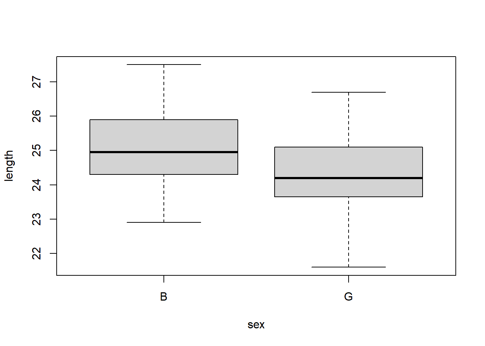{width=672}
:::

```{.r .cell-code}
KidsFeet %>% 
  group_by(sex) %>% 
  summarise(min = min(length), 
            Q1=quantile(length,0.25),
            median=median(length),
            Q3=quantile(length,0.75),
            max=max(length))
```

::: {.cell-output-display}

`````{=html}
<div data-pagedtable="false">
  <script data-pagedtable-source type="application/json">
{"columns":[{"label":["sex"],"name":[1],"type":["fct"],"align":["left"]},{"label":["min"],"name":[2],"type":["dbl"],"align":["right"]},{"label":["Q1"],"name":[3],"type":["dbl"],"align":["right"]},{"label":["median"],"name":[4],"type":["dbl"],"align":["right"]},{"label":["Q3"],"name":[5],"type":["dbl"],"align":["right"]},{"label":["max"],"name":[6],"type":["dbl"],"align":["right"]}],"data":[{"1":"B","2":"22.9","3":"24.35","4":"24.95","5":"25.8","6":"27.5"},{"1":"G","2":"21.6","3":"23.65","4":"24.20","5":"25.1","6":"26.7"}],"options":{"columns":{"min":{},"max":[10]},"rows":{"min":[10],"max":[10]},"pages":{}}}
  </script>
</div>
`````

:::

```{.r .cell-code}
favstats(length~sex,data=KidsFeet)
```

::: {.cell-output-display}

`````{=html}
<div data-pagedtable="false">
  <script data-pagedtable-source type="application/json">
{"columns":[{"label":["sex"],"name":[1],"type":["chr"],"align":["left"]},{"label":["min"],"name":[2],"type":["dbl"],"align":["right"]},{"label":["Q1"],"name":[3],"type":["dbl"],"align":["right"]},{"label":["median"],"name":[4],"type":["dbl"],"align":["right"]},{"label":["Q3"],"name":[5],"type":["dbl"],"align":["right"]},{"label":["max"],"name":[6],"type":["dbl"],"align":["right"]},{"label":["mean"],"name":[7],"type":["dbl"],"align":["right"]},{"label":["sd"],"name":[8],"type":["dbl"],"align":["right"]},{"label":["n"],"name":[9],"type":["int"],"align":["right"]},{"label":["missing"],"name":[10],"type":["int"],"align":["right"]}],"data":[{"1":"B","2":"22.9","3":"24.35","4":"24.95","5":"25.8","6":"27.5","7":"25.10500","8":"1.216758","9":"20","10":"0"},{"1":"G","2":"21.6","3":"23.65","4":"24.20","5":"25.1","6":"26.7","7":"24.32105","8":"1.330238","9":"19","10":"0"}],"options":{"columns":{"min":{},"max":[10]},"rows":{"min":[10],"max":[10]},"pages":{}}}
  </script>
</div>
`````

:::

```{.r .cell-code}
# Group 2
table(KidsFeet$sex)
```

::: {.cell-output .cell-output-stdout}

```

 B  G 
20 19 
```


:::

```{.r .cell-code}
barplot(table(KidsFeet$sex))
```

::: {.cell-output-display}
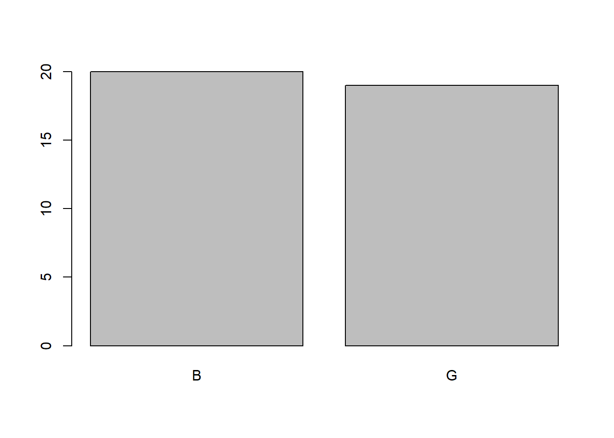{width=672}
:::

```{.r .cell-code}
# Group 3
plot(length~width, data=KidsFeet)
```

::: {.cell-output-display}
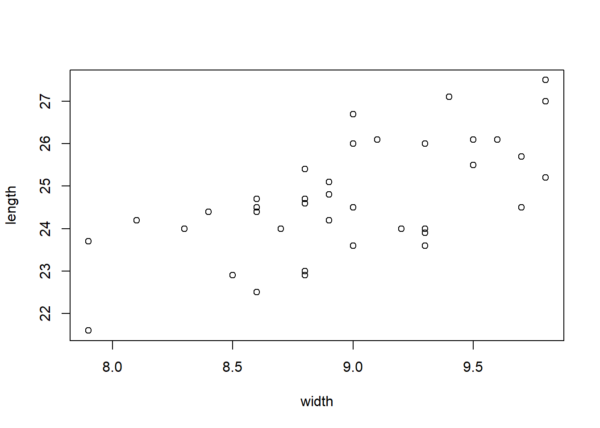{width=672}
:::

```{.r .cell-code}
KidsFeet %>% 
  summarise(Correlation=cor(width,length))
```

::: {.cell-output-display}

`````{=html}
<div data-pagedtable="false">
  <script data-pagedtable-source type="application/json">
{"columns":[{"label":["Correlation"],"name":[1],"type":["dbl"],"align":["right"]}],"data":[{"1":"0.6410961"}],"options":{"columns":{"min":{},"max":[10]},"rows":{"min":[10],"max":[10]},"pages":{}}}
  </script>
</div>
`````

:::
:::


## Week 2 Day 2

### Graphical Summaries


::: {.cell}

```{.r .cell-code}
# Libraries used: MOSAIC, TIDYVERSE
# Dataset:        AIRQUALITY

# Histograms (length)
hist(airquality$Wind,main="La Guardia Airport from May to September, 1973", 
     xlab="Daily Average Wind Speeds (mph)",
     ylab="Frequency",
     col="steelblue",
     breaks = 22)
```

::: {.cell-output-display}
{width=672}
:::

```{.r .cell-code}
ggplot(airquality, aes(x=Wind))+
  geom_histogram(fill="steelblue")+
  labs(title="La Guardia Airport from May to September, 1973",
       x="Daily Average Wind Speeds (mph)",
       y="Frequency")
```

::: {.cell-output-display}
{width=672}
:::

```{.r .cell-code}
# boxplots
boxplot(Wind~Month,main="Wind by Month", xlab="Month",
     ylab="Wind",col=c("steelblue1", "steelblue2", "steelblue3","steelblue3",
                       "steelblue2"),data=airquality)
```

::: {.cell-output-display}
{width=672}
:::

```{.r .cell-code}
ggplot(data=airquality,aes(y=Wind,x=Month,group=Month))+
  geom_boxplot(fill=c("steelblue1", "steelblue2", "steelblue3","steelblue3",
                      "steelblue2"))+
  labs(title = "Wind by Month",
       y="Wind",
       x="Month")
```

::: {.cell-output-display}
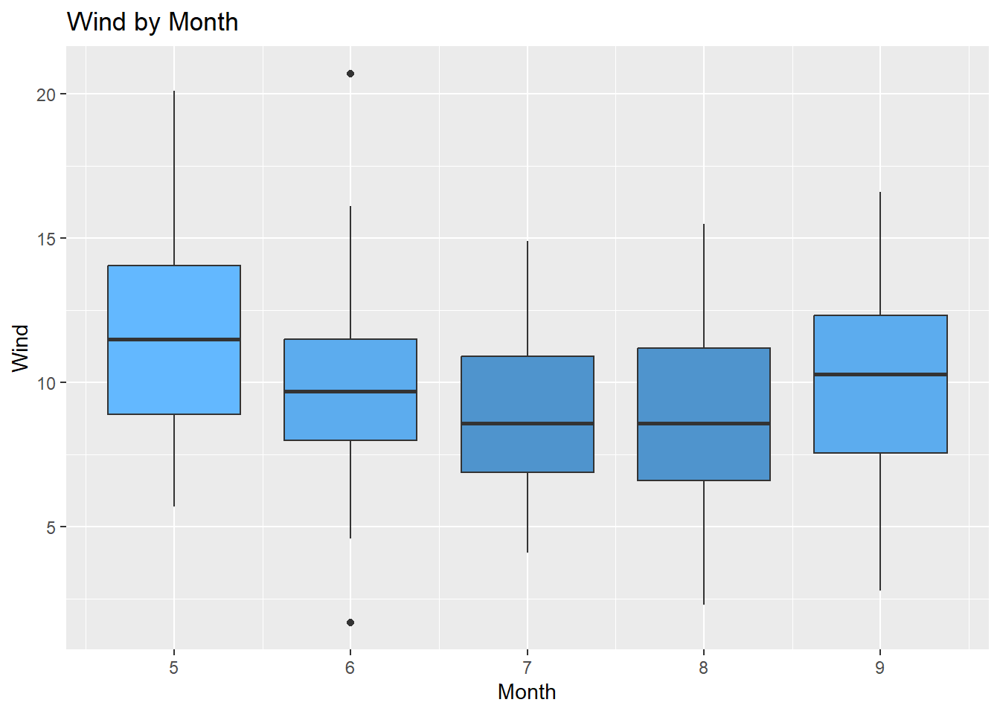{width=672}
:::

```{.r .cell-code}
# scatter plots 
plot(Ozone~Temp,data=airquality,
     main="Relationship Between Ozone and Temperature",
     xlab="Temp", 
     ylab="Ozone",
     pch = 19, 
     col="blue")
```

::: {.cell-output-display}
{width=672}
:::

```{.r .cell-code}
ggplot(airquality,aes(x=Temp,y=Ozone))+
  geom_point(color="blue")+
  labs(title="Relationship Between Ozone and Temperature", 
       x="Temp", 
       y="Ozone")
```

::: {.cell-output-display}
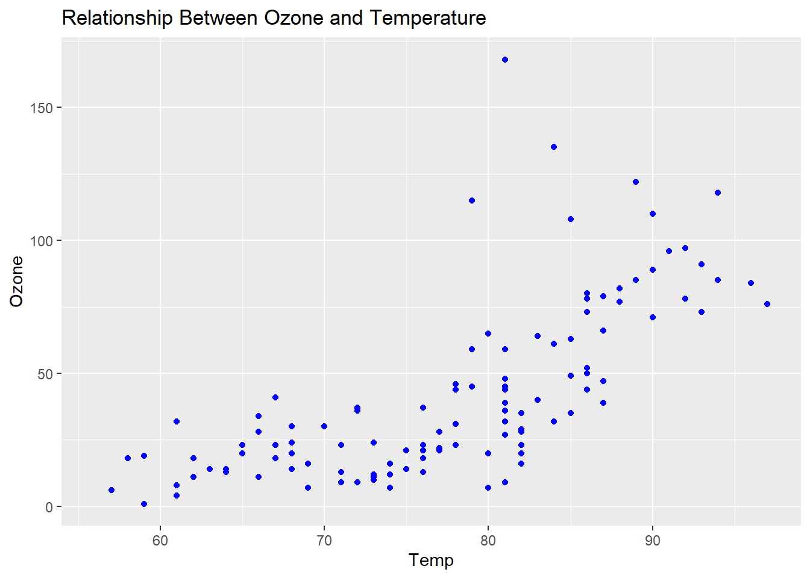{width=672}
:::

```{.r .cell-code}
## Go over the Stephanie analysis
```
:::


## Week 3 Day 1

### Graphical and Numerical Summaries


::: {.cell}

```{.r .cell-code}
# Libraries used: MOSAIC, PANDER, TIDYVERSE
# Dataset:        KIDSFEET

#Day 1
# A) Quantitative vs Categorical Data - KidsFeet
# B) Statistics-Notebook page - Identify columns where a dataset would match "data logos"

# One Quantitative | Response Variable Y      - length
# Quantitative Y  | Categorical X (2 Groups)  - length by sex
# Quantitative Y  | Categorical X (3+ Groups) - Nothing in the data with 3+ groups
# Quantitative Y  | Multiple Categorical      - length by sex and biggerfoot
# Quantitative Y  | Quantitative X            - length and width
# Quantitative Y  | Multiple X                - length and width and sex
# Binomial Y      | Quantitative X            - sex and length - opposite x and y 
# Binomial Y      | Multiple X                - Don't worry about it
# Categorical Y   | Categorical X             - biggerfoot and domhand

# C) - table - categorical
table(KidsFeet$biggerfoot, KidsFeet$domhand)
```

::: {.cell-output .cell-output-stdout}

```
   
     L  R
  L  2 20
  R  6 11
```


:::

```{.r .cell-code}
# group_by() - categorical
# summarise() - quantitative

KidsFeet %>% 
  group_by(sex) %>% 
  summarise(mean_length = mean(length))
```

::: {.cell-output-display}

`````{=html}
<div data-pagedtable="false">
  <script data-pagedtable-source type="application/json">
{"columns":[{"label":["sex"],"name":[1],"type":["fct"],"align":["left"]},{"label":["mean_length"],"name":[2],"type":["dbl"],"align":["right"]}],"data":[{"1":"B","2":"25.10500"},{"1":"G","2":"24.32105"}],"options":{"columns":{"min":{},"max":[10]},"rows":{"min":[10],"max":[10]},"pages":{}}}
  </script>
</div>
`````

:::

```{.r .cell-code}
# D) Histogram   - quantitative
# Box plot       - quantitative
# Dot plot       - quantitative
# Scatter plot   - quantitative
# Bar plot       - categorical

# E) If there is time, try some of the plots in R. Identify the (1) type of data, (2) R Commands, and (3) Graphic that could be used to answer each of the following questions:
# How many boys (B) and how many girls (G) are in the KidsFeet dataset?
# (1) type of data - sex (categorical)
# (2 & 3) table and barplot

table(KidsFeet$sex)
```

::: {.cell-output .cell-output-stdout}

```

 B  G 
20 19 
```


:::

```{.r .cell-code}
barplot(table(KidsFeet$sex))
```

::: {.cell-output-display}
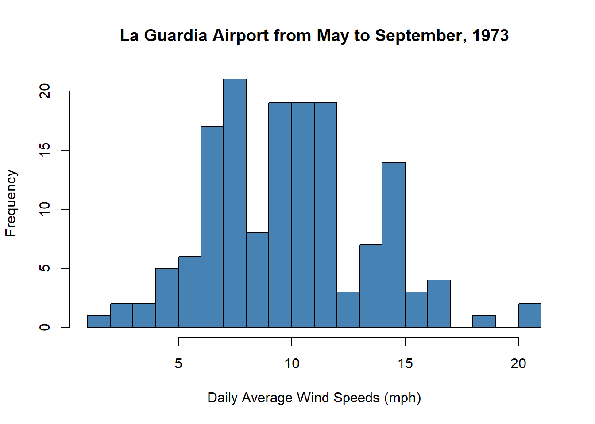{width=672}
:::

```{.r .cell-code}
# What is the average length of feet in the KidsFeet dataset?
# (1) type of data - length (quantitative)
# (2 & 3) favstats and boxplots

favstats(KidsFeet$length) %>% 
  pander()
```

::: {.cell-output-display}

-----------------------------------------------------------------
 min    Q1   median    Q3    max    mean     sd     n    missing 
------ ---- -------- ------ ------ ------- ------- ---- ---------
 21.6   24    24.5    25.6   27.5   24.72   1.318   39      0    
-----------------------------------------------------------------


:::

```{.r .cell-code}
boxplot(KidsFeet$length, 
        main="Length of Kids Feet")
```

::: {.cell-output-display}
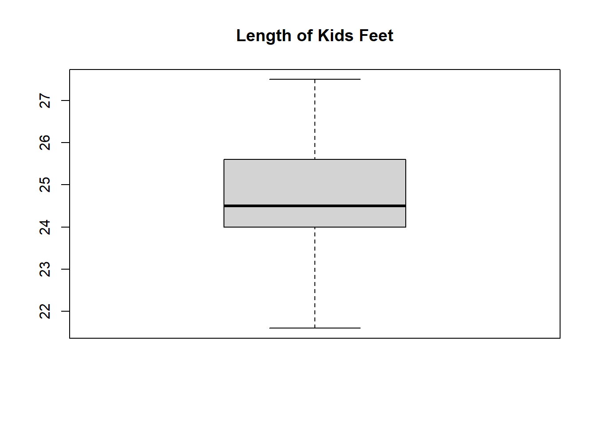{width=672}
:::

```{.r .cell-code}
ggplot(data=KidsFeet, aes(x=length)) +
  geom_boxplot(fill="navy")+
  labs(
    x="Length of Kids Feet"
  )
```

::: {.cell-output-display}
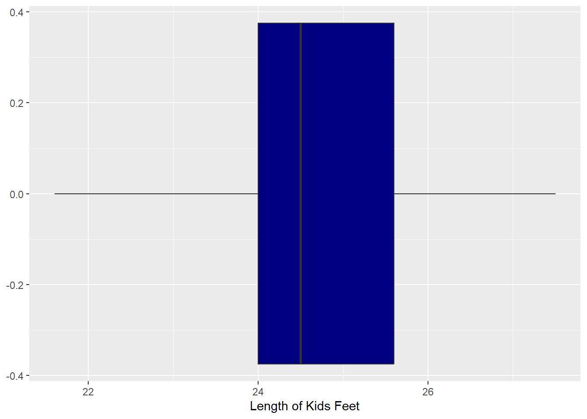{width=672}
:::

```{.r .cell-code}
# Do boys (B) or girls (G) have longer feet, on average, in the KidsFeet dataset?
# (1) type of data - length (quantitative) and sex (categorical)
# (2 & 3) favstats and boxplots
favstats(length~sex,data=KidsFeet) %>% 
  pander()
```

::: {.cell-output-display}

--------------------------------------------------------------------------
 sex   min     Q1     median    Q3    max    mean     sd     n    missing 
----- ------ ------- -------- ------ ------ ------- ------- ---- ---------
  B    22.9   24.35   24.95    25.8   27.5   25.11   1.217   20      0    

  G    21.6   23.65    24.2    25.1   26.7   24.32   1.33    19      0    
--------------------------------------------------------------------------


:::

```{.r .cell-code}
boxplot(
        length~sex,
        data=KidsFeet, 
        main="Comparing Length of Feet Across Gender", 
        xlab="Gender",
        ylab="Length of Foot",
        col=c("blue","pink")
        )
```

::: {.cell-output-display}
{width=672}
:::

```{.r .cell-code}
ggplot(KidsFeet, aes(x=sex, y=length,fill=sex)) +
  geom_boxplot()+
  labs(title = "Comparing Length of Feet Across Gender",
       x="Gender",
       y="Length of Foot")+
  scale_fill_manual(values=c("blue","pink"))
```

::: {.cell-output-display}
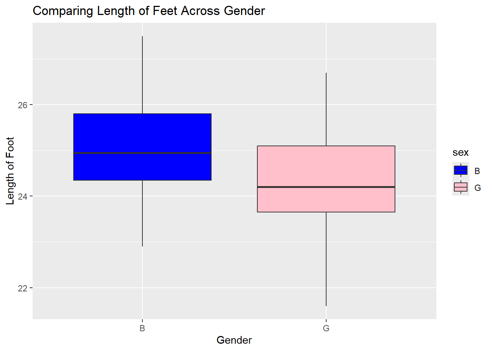{width=672}
:::

```{.r .cell-code}
# Are there certain months of the year that are associated with children having longer feet, on average, than others?
# (1) type of data - length (quantitative) and month (categorical)
# (2 & 3) favstats and boxplots
favstats(length~birthmonth,data=KidsFeet) %>% 
  pander()
```

::: {.cell-output-display}

----------------------------------------------------------------------------------
 birthmonth   min     Q1     median    Q3     max    mean      sd     n   missing 
------------ ------ ------- -------- ------- ------ ------- -------- --- ---------
     1        21.6   22.5     23.4    24.3    25.2   23.4    2.546    2      0    

     2        25.1   25.6     26.1    26.1    26.1   25.77   0.5774   3      0    

     3        22.9   24.65   25.15    25.77    27    25.14   1.218    8      0    

     4        23.6   23.65    23.7    24.2    24.7    24     0.6083   3      0    

     5        23.6   23.8      24     24.2    24.4    24     0.5657   2      0    

     6         23    23.75     24     24.68   26.7   24.43   1.588    4      0    

     7        22.5   23.45    24.4    25.75   27.1   24.67   2.312    3      0    

     8        23.9   24.45     25     25.55   26.1    25     1.556    2      0    

     9        22.9    24      24.5    24.6    27.5   24.7    1.704    5      0    

     10       24.2   24.5     24.8    25.1    25.4   24.8    0.8485   2      0    

     11       24.2   24.65    25.1    25.55    26    25.1    1.273    2      0    

     12        24    24.25    24.5     25     25.5   24.67   0.7638   3      0    
----------------------------------------------------------------------------------


:::

```{.r .cell-code}
boxplot(length~birthmonth,data=KidsFeet, 
        col="navy",
        xlab = "Numerical Birth Month",
        ylab="Feet Length")
```

::: {.cell-output-display}
{width=672}
:::

```{.r .cell-code}
ggplot(data=KidsFeet, aes(x=as.factor(birthmonth), y=length)) +
  geom_boxplot(fill="navy")+
  labs(
    x="Numerical Birth Month",
    y="Foot Length"
  )
```

::: {.cell-output-display}
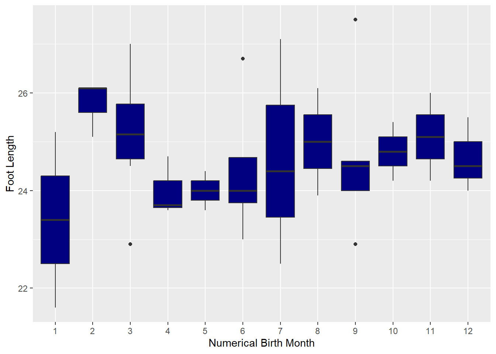{width=672}
:::

```{.r .cell-code}
# Is there a relationship between the length of children's feet and the
# width of their foot?
# (1) type of data - length and width (quantitative)
# (2 & 3) correlation and plot

cor(KidsFeet$length,KidsFeet$width)
```

::: {.cell-output .cell-output-stdout}

```
[1] 0.6410961
```


:::

```{.r .cell-code}
plot(length~width, 
      data=KidsFeet, 
      main = "Relationship Between Length and Width of Kids Feet", 
      xlab="Width of Foot", 
      ylab = "Length of Foot")
```

::: {.cell-output-display}
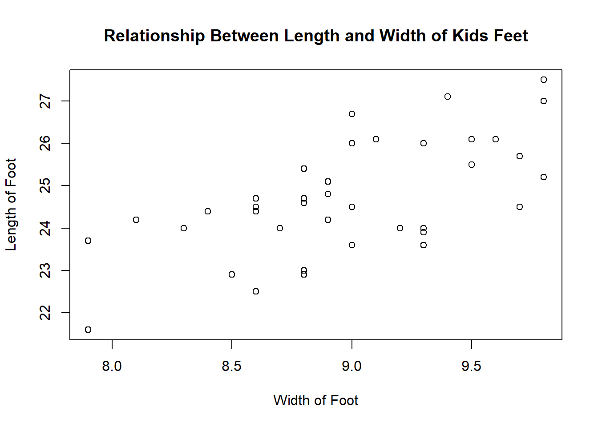{width=672}
:::

```{.r .cell-code}
ggplot(KidsFeet,aes(x=width, y=length))+
  geom_point(color="navy")+
  labs(
    title="Relationship Between Length and Width of Kids Feet",
    x="Width of Foot",
    y="Length of Foot")
```

::: {.cell-output-display}
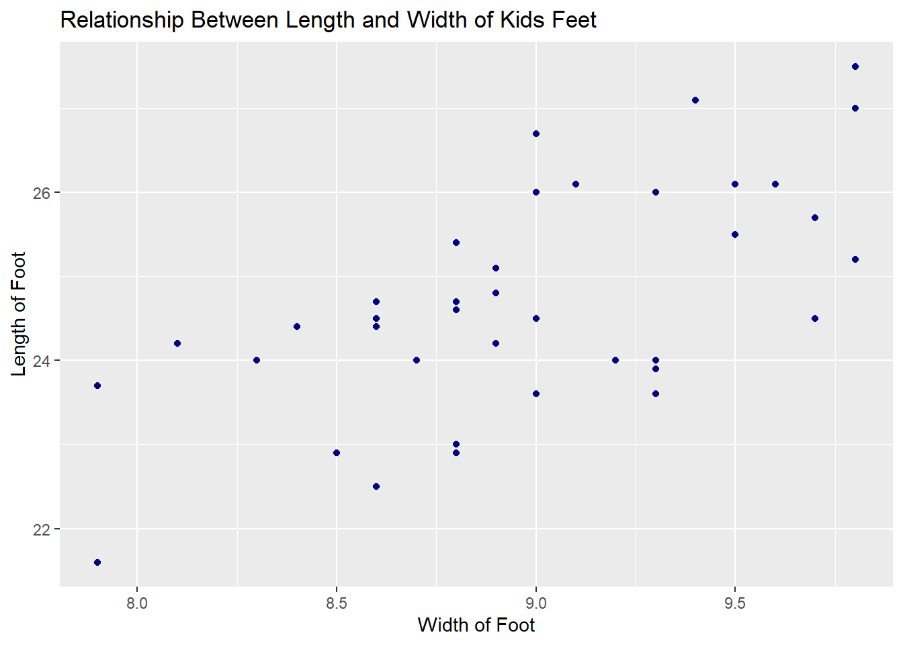{width=672}
:::

```{.r .cell-code}
ggplot(KidsFeet,aes(x=width,y=length,color=sex))+
  geom_point()+
  labs(title="Relationship Between Length and Width of Kids Feet", 
       x="Width of Foot", 
       y="Length of Foot")+
  scale_color_manual(values=c("blue","pink"))
```

::: {.cell-output-display}
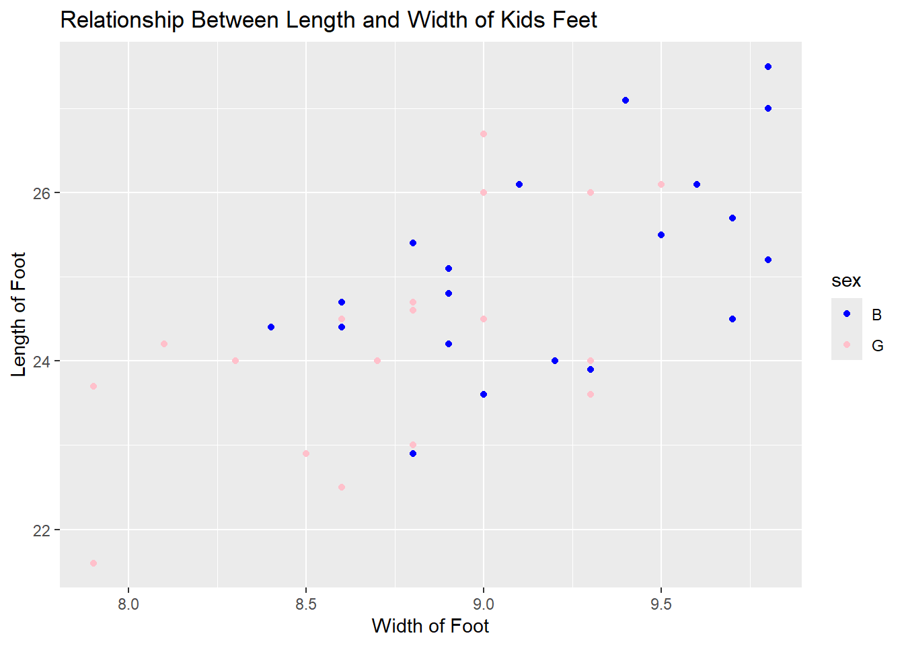{width=672}
:::

```{.r .cell-code}
# Does the width of a child's foot predict whether or not they are right-handed?
# Logistic Regression - will cover later

# Is one gender more likely to be born in certain seasons of the year?
# (1) type of data - season and sex (categorical)
# (2 & 3) table and bar plot

Kids3 <- KidsFeet %>% 
  mutate(
    season = case_when(
      birthmonth %in% c(12,1,2) ~ "Winter",
      birthmonth %in% c(3,4,5) ~ "Spring",
      birthmonth %in% c(6,7,8) ~ "Summer",
      birthmonth %in% c(9,10,11) ~ "Fall"
    )
  )  

pander(table(Kids3$season,KidsFeet$sex))
```

::: {.cell-output-display}

--------------------
   &nbsp;     B   G 
------------ --- ---
  **Fall**    4   5 

 **Spring**   6   7 

 **Summer**   5   4 

 **Winter**   5   3 
--------------------


:::

```{.r .cell-code}
barplot(table(Kids3$sex, Kids3$season),
        beside = TRUE,
        col = c("blue","pink"),
        legend.text=TRUE, 
        xlab="Handedness", 
        ylab="Frequency", 
        main="Count of Gender by Season")
```

::: {.cell-output-display}
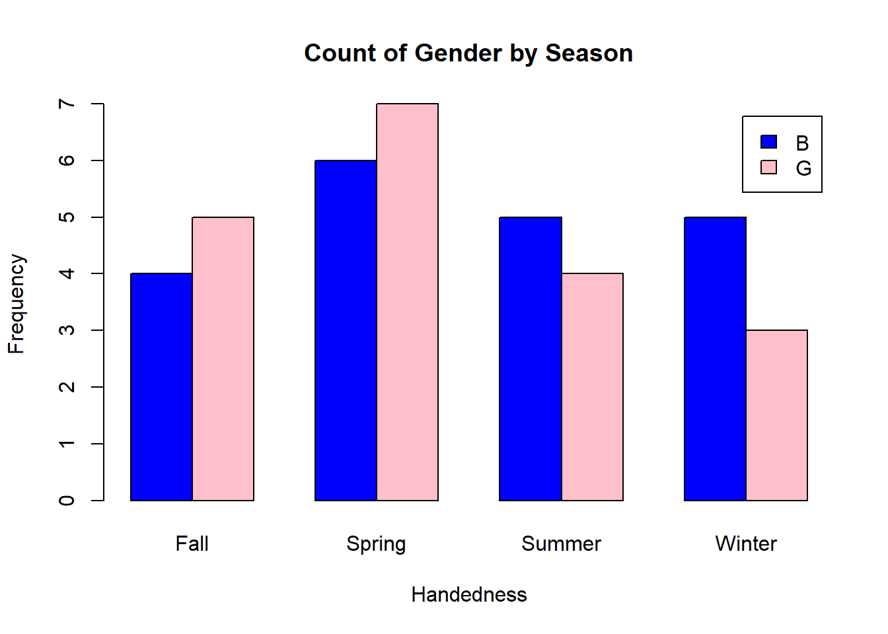{width=672}
:::

```{.r .cell-code}
ggplot(Kids3, aes(x=season,fill=sex))+
  geom_bar(position="dodge")+
  scale_fill_manual(values=c("blue","pink"))
```

::: {.cell-output-display}
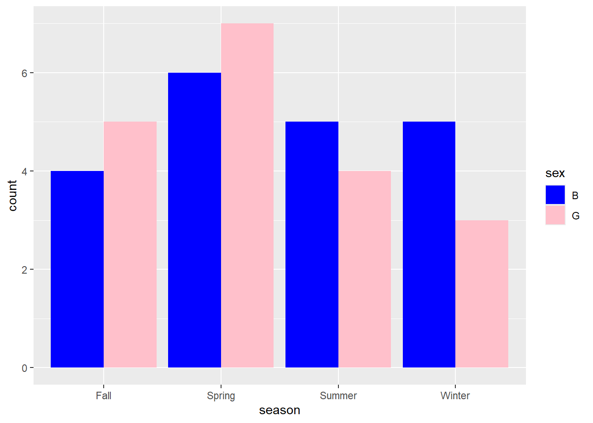{width=672}
:::

```{.r .cell-code}
#Make some notes in your index file and knit.
```
:::


## Week 4 Day 1

### T-Test


::: {.cell}

```{.r .cell-code}
# Libraries used: MOSAIC
# Dataset:        KIDSFEET


# Go to the Making inference page - this first section is referring to book
# Define inference

# Hypothesis Testing
# a.	Type I error vs Type II error – Give an example (Flip flops vs medicine)
# b.	Type I error = Level of significance = 1 – level of confidence
# c.	Type II errors  and Power
# d.	Sufficient evidence – not proof
# e.	P-value need two things: a TEST STATISTIC and a SAMPLING DISTRIBUTION OF TEST STATISTIC

# Find the four parametric distributions (types of tests that are run on each test from 221)

# Parametric methods compared to non-parametric methods
# Non parametric test are still powerful and are likely more powerful than parametric tests if the requirements for a parametric test are not met. 

# An example of doing a t.test
t.test(KidsFeet$length, 
       mu=25.1, 
       alternative="two.sided",
       conf.level=0.95)
```

::: {.cell-output .cell-output-stdout}

```

	One Sample t-test

data:  KidsFeet$length
t = -1.7865, df = 38, p-value = 0.082
alternative hypothesis: true mean is not equal to 25.1
95 percent confidence interval:
 24.29597 25.15019
sample estimates:
mean of x 
 24.72308 
```


:::

```{.r .cell-code}
# Ho: mu=25.1 Ha:mu ne 25.1
# Level of significance = 0.05
# Test Statistic t=-1.7865 
# df=38 
# p=value = 0.082
# p-value > alpha, therefore we fail to reject the Ho
# We have insufficient evidence to say that the mean is different than 25.1.

pander(t.test(KidsFeet$length, mu=25.1, alternative="less",conf.level=0.95))
```

::: {.cell-output-display}

--------------------------------------------------------------------
 Test statistic   df   P value   Alternative hypothesis   mean of x 
---------------- ---- --------- ------------------------ -----------
     -1.787       38   0.041 *            less              24.72   
--------------------------------------------------------------------

Table: One Sample t-test: `KidsFeet$length`


:::

```{.r .cell-code}
# Ho: mu=25.1 Ha:mu < 25.1
# Level of significance = 0.05
# Test Statistic t=-1.7865 df=38 p=value = 0.041
# p-value < alpha, therefore we reject the Ho
# We have sufficient evidence to say that the mean is less than 25.1.

# Note: Because of the Central Limit Theorem, we can assume the distribution of sample means is normal because we have a large sample size (n>=30).

t.test(length~sex,
       data=KidsFeet, 
       mu=0, 
       alternative = "greater",
       conf.level=0.95)
```

::: {.cell-output .cell-output-stdout}

```

	Welch Two Sample t-test

data:  length by sex
t = 1.9174, df = 36.275, p-value = 0.03154
alternative hypothesis: true difference in means between group B and group G is greater than 0
95 percent confidence interval:
 0.09382502        Inf
sample estimates:
mean in group B mean in group G 
       25.10500        24.32105 
```


:::
:::


## Week 4 Day 2

### T-Test


::: {.cell}

```{.r .cell-code}
# Libraries used: MOSAIC, PANDER, TIDYVERSE, CAR
# Dataset:        KIDSFEET

# 2)	Have students go through an explanation of what they see in Overview, R instructions, and Explanations.

# ONE SAMPLE T-TEST
pander(t.test(KidsFeet$length, mu=28, alternative="two.sided",conf.level=0.95))
```

::: {.cell-output-display}

----------------------------------------------------------------------------
 Test statistic   df       P value       Alternative hypothesis   mean of x 
---------------- ---- ----------------- ------------------------ -----------
     -15.53       38   4.806e-18 * * *         two.sided            24.72   
----------------------------------------------------------------------------

Table: One Sample t-test: `KidsFeet$length`


:::

```{.r .cell-code}
# Ho: mu = 28 Ha: mu ne 28
# $$ H_o: \mu=28 $$
# $$ H_a:\mu \neq 28 $$
# Level of Signficance = 0.05 ($$ \alpha $$)
# Test Statistic t=-15.532 
# DF=38
# p-value < 2.2e-16
# p-value < alpha, therefore we reject the Ho
# We have sufficient evidence to say that the mean is different than 28.

# Note: Because of the Central Limit Theorem, we can assume the distribution of sample means is normal because we have a large sample size (n>30).

# PAIRED T-TEST
KidsFeet3 <- KidsFeet %>% 
  mutate(width3 = 3*width,difference = length -width3) 

t.test(KidsFeet3$length, KidsFeet3$width3, mu=0, paired=TRUE,
       alternative="two.sided",conf.level=0.95)
```

::: {.cell-output .cell-output-stdout}

```

	Paired t-test

data:  KidsFeet3$length and KidsFeet3$width3
t = -11.529, df = 38, p-value = 5.668e-14
alternative hypothesis: true mean difference is not equal to 0
95 percent confidence interval:
 -2.649596 -1.858096
sample estimates:
mean difference 
      -2.253846 
```


:::

```{.r .cell-code}
t.test(KidsFeet3$difference, mu=0, 
       alternative="two.sided",conf.level=0.95)
```

::: {.cell-output .cell-output-stdout}

```

	One Sample t-test

data:  KidsFeet3$difference
t = -11.529, df = 38, p-value = 5.668e-14
alternative hypothesis: true mean is not equal to 0
95 percent confidence interval:
 -2.649596 -1.858096
sample estimates:
mean of x 
-2.253846 
```


:::

```{.r .cell-code}
# Ho: mu_d = 0 Ha: mu_d ne 0
# $$ H_o: \mu_d = 0 H_a:\mu_d \neq 0 $$
# Level of Significance = 0.05 ($$ \alpha $$)
# t = -11.529, df = 38, p-value = 5.668e-14
# p-value < alpha, therefore we reject the Ho
# We have sufficient evidence to say that there is a difference between (width*3) and length.
  
# Note: Because of the Central Limit Theorem, we can assume the distribution of sample means is normal because we have a large sample size (n>30).
  
# INDEPENDENT SAMPLES T-TEST
t.test(length~sex, 
       data=KidsFeet, 
       mu=0,  
       alternative="two.sided",
       conf.level=0.95)
```

::: {.cell-output .cell-output-stdout}

```

	Welch Two Sample t-test

data:  length by sex
t = 1.9174, df = 36.275, p-value = 0.06308
alternative hypothesis: true difference in means between group B and group G is not equal to 0
95 percent confidence interval:
 -0.04502067  1.61291541
sample estimates:
mean in group B mean in group G 
       25.10500        24.32105 
```


:::

```{.r .cell-code}
# Ho: mu_boy = mu_girl Ha: mu_boy = mu_girl
# $$ H_o: \mu_boy = \mu_girl H_a:\mu_boy \neq \mu_girl $$
# level of signficance = 0.05 ($$ \alpha $$)
# t = 1.9174, df = 36.275, p-value = 0.06308
# p-value > alpha, therefore we fail to reject the Ho
# We have *insufficient evidence to say that the length is different between boys and girls.
  
# Note: Because of the Central Limit Theorem, we can assume the distribution of sample means is normal because we have a large sample size (n>30).

# CHECKING REQUIREMENTS:
#One Sample t test
qqPlot(KidsFeet$length)
```

::: {.cell-output-display}
{width=672}
:::

::: {.cell-output .cell-output-stdout}

```
[1] 38 11
```


:::

```{.r .cell-code}
#Paired t test
qqPlot(KidsFeet3$length-KidsFeet3$width3)
```

::: {.cell-output-display}
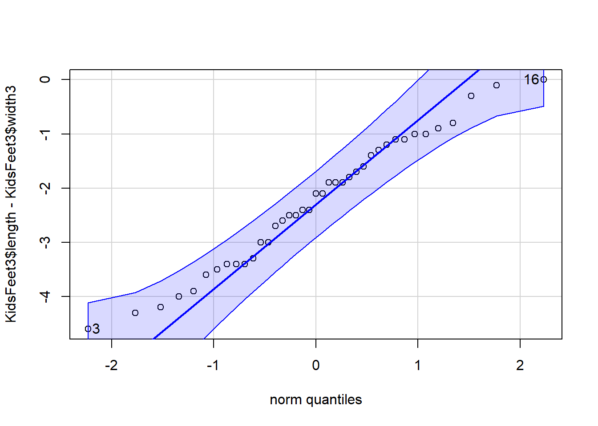{width=672}
:::

::: {.cell-output .cell-output-stdout}

```
[1]  3 16
```


:::

```{.r .cell-code}
#Independent Samples t test
qqPlot(length~sex,data=KidsFeet)
```

::: {.cell-output-display}
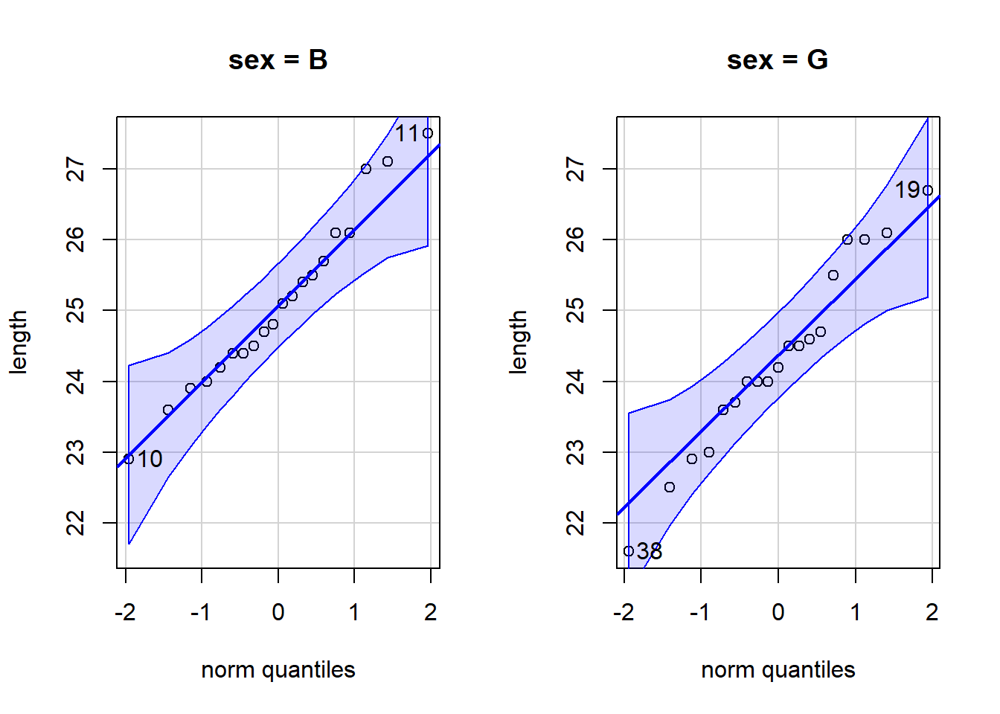{width=672}
:::

```{.r .cell-code}
# GRAPHS:
# One Sample t test
boxplot(KidsFeet$length)
```

::: {.cell-output-display}
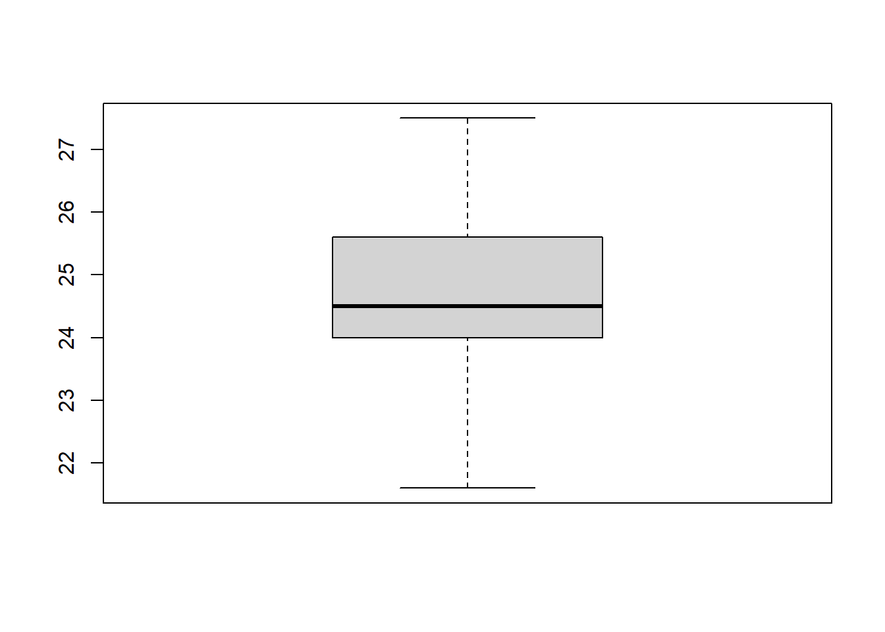{width=672}
:::

```{.r .cell-code}
ggplot(data=KidsFeet, aes(x=length))+
  geom_boxplot(fill="blue")
```

::: {.cell-output-display}
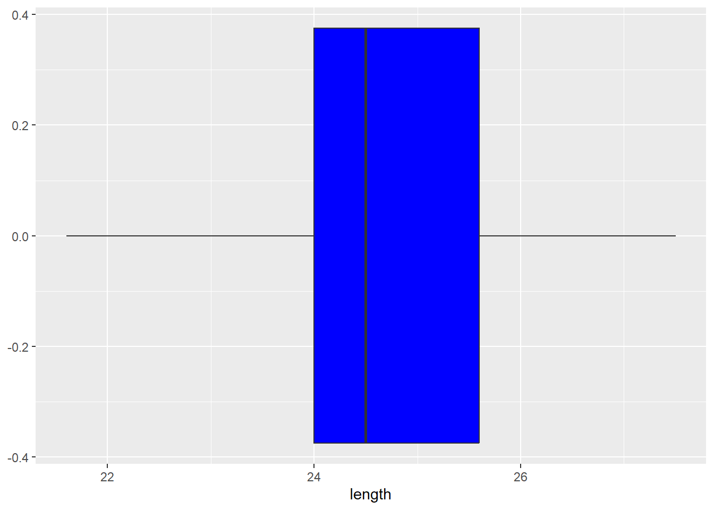{width=672}
:::

```{.r .cell-code}
# Paired t test
boxplot(KidsFeet3$length-KidsFeet3$width3)
```

::: {.cell-output-display}
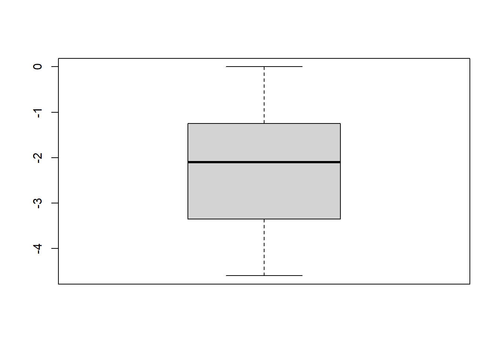{width=672}
:::

```{.r .cell-code}
ggplot(data=KidsFeet3, aes(x=difference))+
  geom_boxplot(fill="blue")
```

::: {.cell-output-display}
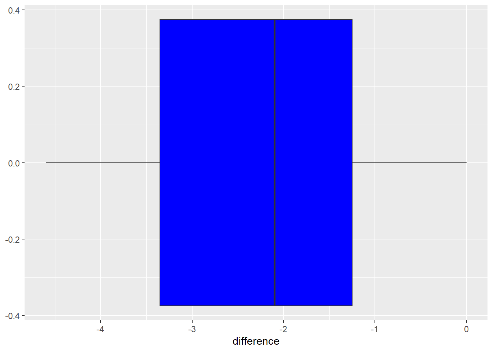{width=672}
:::

```{.r .cell-code}
#Independent Samples t test
boxplot(length~sex,data=KidsFeet)
```

::: {.cell-output-display}
{width=672}
:::

```{.r .cell-code}
ggplot(data=KidsFeet, aes(y=length, x=sex))+
  geom_boxplot(fill=c("blue","pink"))
```

::: {.cell-output-display}
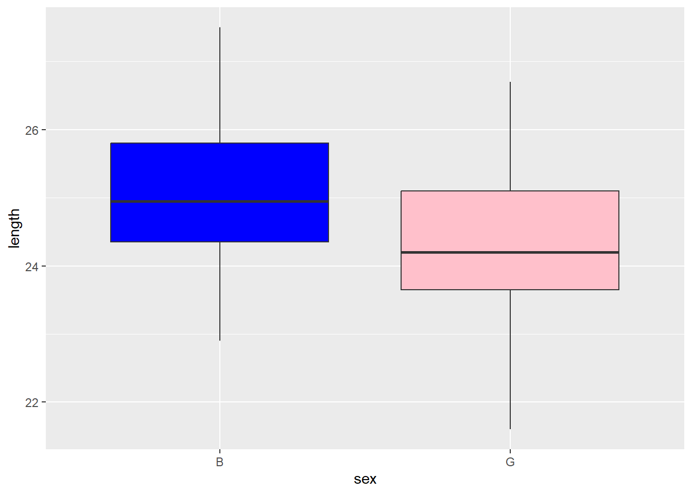{width=672}
:::

```{.r .cell-code}
# NUMERICAL SUMMARIES
# One Sample t test
pander(favstats(KidsFeet$length))
```

::: {.cell-output-display}

-----------------------------------------------------------------
 min    Q1   median    Q3    max    mean     sd     n    missing 
------ ---- -------- ------ ------ ------- ------- ---- ---------
 21.6   24    24.5    25.6   27.5   24.72   1.318   39      0    
-----------------------------------------------------------------


:::

```{.r .cell-code}
# Paired t test
pander(favstats(KidsFeet3$length-KidsFeet3$width3))
```

::: {.cell-output-display}

----------------------------------------------------------------------------
 min     Q1     median    Q3        max        mean     sd     n    missing 
------ ------- -------- ------- ------------ -------- ------- ---- ---------
 -4.6   -3.35    -2.1    -1.25   -3.553e-15   -2.254   1.221   39      0    
----------------------------------------------------------------------------


:::

```{.r .cell-code}
#Independent Samples t test
pander(favstats(length~sex,data=KidsFeet))
```

::: {.cell-output-display}

--------------------------------------------------------------------------
 sex   min     Q1     median    Q3    max    mean     sd     n    missing 
----- ------ ------- -------- ------ ------ ------- ------- ---- ---------
  B    22.9   24.35   24.95    25.8   27.5   25.11   1.217   20      0    

  G    21.6   23.65    24.2    25.1   26.7   24.32   1.33    19      0    
--------------------------------------------------------------------------


:::

```{.r .cell-code}
#Put some notes within the the index rmd file
```
:::


## Week 5 Day 1

### Wilcoxon Test


::: {.cell}

```{.r .cell-code}
# Libraries used: MOSAIC, CAR
# Dataset:        KIDSFEET

# Five steps of doing the Wilcoxon SIGNED-RANK test

# Performing T-TEST
t.test(KidsFeet$length, mu=25)
```

::: {.cell-output .cell-output-stdout}

```

	One Sample t-test

data:  KidsFeet$length
t = -1.3125, df = 38, p-value = 0.1972
alternative hypothesis: true mean is not equal to 25
95 percent confidence interval:
 24.29597 25.15019
sample estimates:
mean of x 
 24.72308 
```


:::

```{.r .cell-code}
qqPlot(KidsFeet$length)
```

::: {.cell-output-display}
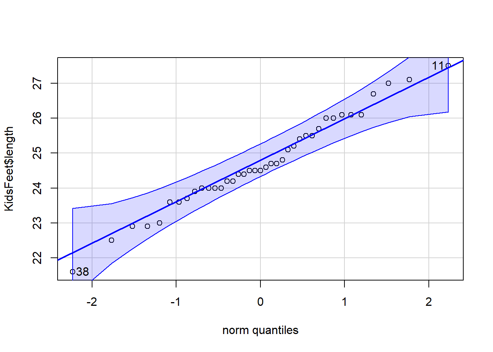{width=672}
:::

::: {.cell-output .cell-output-stdout}

```
[1] 38 11
```


:::

```{.r .cell-code}
# Performing WILCOXON TEST
wilcox.test(KidsFeet$length, 
            mu=25)
```

::: {.cell-output .cell-output-stdout}

```

	Wilcoxon signed rank test with continuity correction

data:  KidsFeet$length
V = 298.5, p-value = 0.2037
alternative hypothesis: true location is not equal to 25
```


:::

```{.r .cell-code}
# Ho: median = 25
# Ha: median neq 25
# What does the alternative hypothesis means?
# Alternative hypothesis: true location shift is not equal to 0

# Five steps of doing the Wilcoxon RANKED-SUM test (Mann-Whitney)

t.test(length ~ sex, 
       data=KidsFeet)
```

::: {.cell-output .cell-output-stdout}

```

	Welch Two Sample t-test

data:  length by sex
t = 1.9174, df = 36.275, p-value = 0.06308
alternative hypothesis: true difference in means between group B and group G is not equal to 0
95 percent confidence interval:
 -0.04502067  1.61291541
sample estimates:
mean in group B mean in group G 
       25.10500        24.32105 
```


:::

```{.r .cell-code}
wilcox.test(length ~ sex, 
            data=KidsFeet)
```

::: {.cell-output .cell-output-stdout}

```

	Wilcoxon rank sum test with continuity correction

data:  length by sex
W = 252, p-value = 0.0836
alternative hypothesis: true location shift is not equal to 0
```


:::

```{.r .cell-code}
# The test is negatively affected WHEN THERE ARE TIES (repeated values) present in the data, but the results are STILL USEFUL IF there are relatively few ties.
```
:::


## Week 5 Day 2

### Wilcoxon Test


::: {.cell}

```{.r .cell-code}
# Question 1
# 1) Function to to use to add a new column - Mutate
# 2) Plots to look at two or more groups    - boxplots and dotplots
# 3) p-value                                - needs test statistic and probability distribution
# 4) Independent Samples t vs Wilcoxon      - Parametric requirements not met? Use Wilcoxon
# 5) Hypothesis
#    Ho: mu1 = mu2  Ha: mu1 ne mu2          - indepdendent samples
#    Ho: difference in medians = 0 Ha:difference in medians ne 0

# Question 2
# 1) Wilcoxon Applet and follow instructions in quiz
# 2) Go through the four questions

# Question 3
# 1) Prepping for next week's assignment
#   https://www.brainhq.com/brain-connection/word-list-recall/
```
:::


## Week 6 Day 1

### One Way ANOVA


::: {.cell}

```{.r .cell-code}
# Libraries used: MOSAIC, PANDER, TIDYVERSE, LATTICE
# Dataset:        AIRQUALITY

# Find the ANOVA using Statistics Notebook
# Compare the difference between t-test, ANOVA using the index.html file
# Go through the Overview, Explanation, and Instructions in the Textbook

# Using the Airquality data - Define Factor and Level of a Factor
# State briefly that we will cover two-way ANOVA next week

# Use the Airquality Example
# Numerical and Graphical Summary
boxplot(Wind~Month,data=airquality)
```

::: {.cell-output-display}
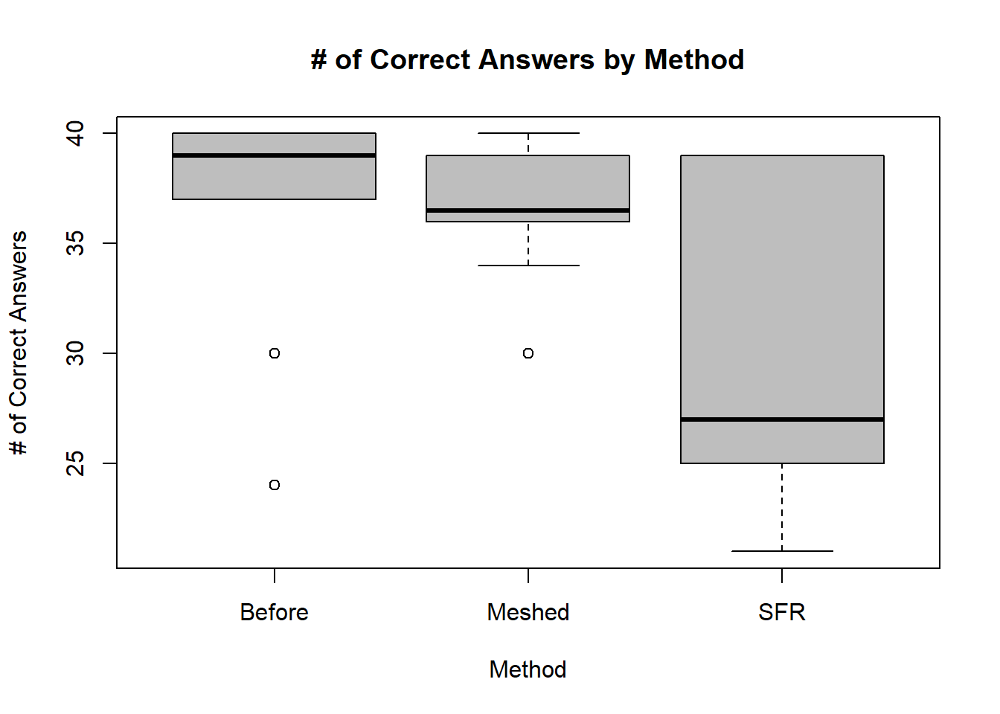{width=672}
:::

```{.r .cell-code}
ggplot(data=airquality, aes(x=as.factor(Month), y=Wind))+
  geom_boxplot(fill=c("blue","red","yellow","green","purple"))
```

::: {.cell-output-display}
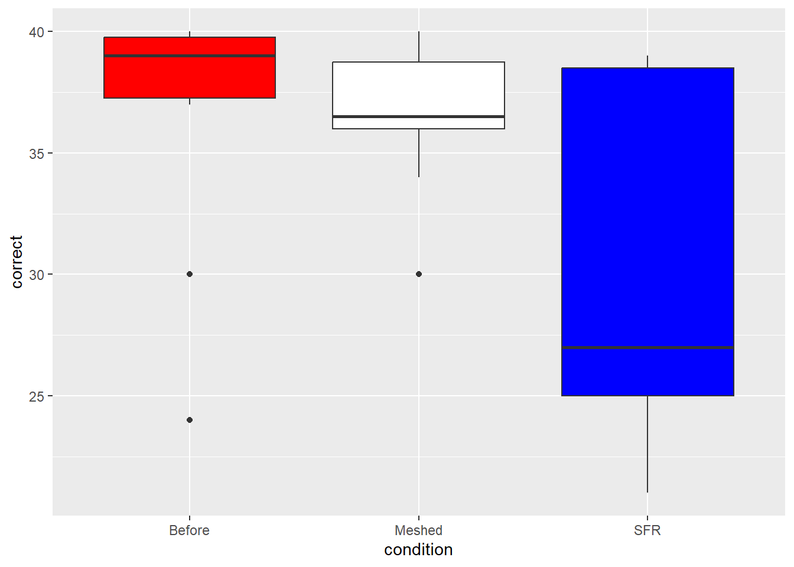{width=672}
:::

```{.r .cell-code}
pander(favstats(Wind~Month,data=airquality))
```

::: {.cell-output-display}

---------------------------------------------------------------------------
 Month   min    Q1    median    Q3     max    mean     sd     n    missing 
------- ----- ------ -------- ------- ------ ------- ------- ---- ---------
   5     5.7   8.9     11.5    14.05   20.1   11.62   3.531   31      0    

   6     1.7    8      9.7     11.5    20.7   10.27   3.769   30      0    

   7     4.1   6.9     8.6     10.9    14.9   8.942   3.036   31      0    

   8     2.3   6.6     8.6     11.2    15.5   8.794   3.226   31      0    

   9     2.8   7.55    10.3    12.32   16.6   10.18   3.461   30      0    
---------------------------------------------------------------------------


:::

```{.r .cell-code}
# Analysis - One Way ANOVA
airq.aov <- aov(Wind~as.factor(Month),data=airquality)

pander(summary(airq.aov))
```

::: {.cell-output-display}

-------------------------------------------------------------------
        &nbsp;          Df    Sum Sq   Mean Sq   F value   Pr(>F)  
---------------------- ----- -------- --------- --------- ---------
 **as.factor(Month)**    4    164.3     41.07     3.529    0.00879 

    **Residuals**       148    1722     11.64      NA        NA    
-------------------------------------------------------------------

Table: Analysis of Variance Model


:::

```{.r .cell-code}
# Checking Requirements
par(mfrow=c(1,2))

plot(airq.aov,which=1:2)
```

::: {.cell-output-display}
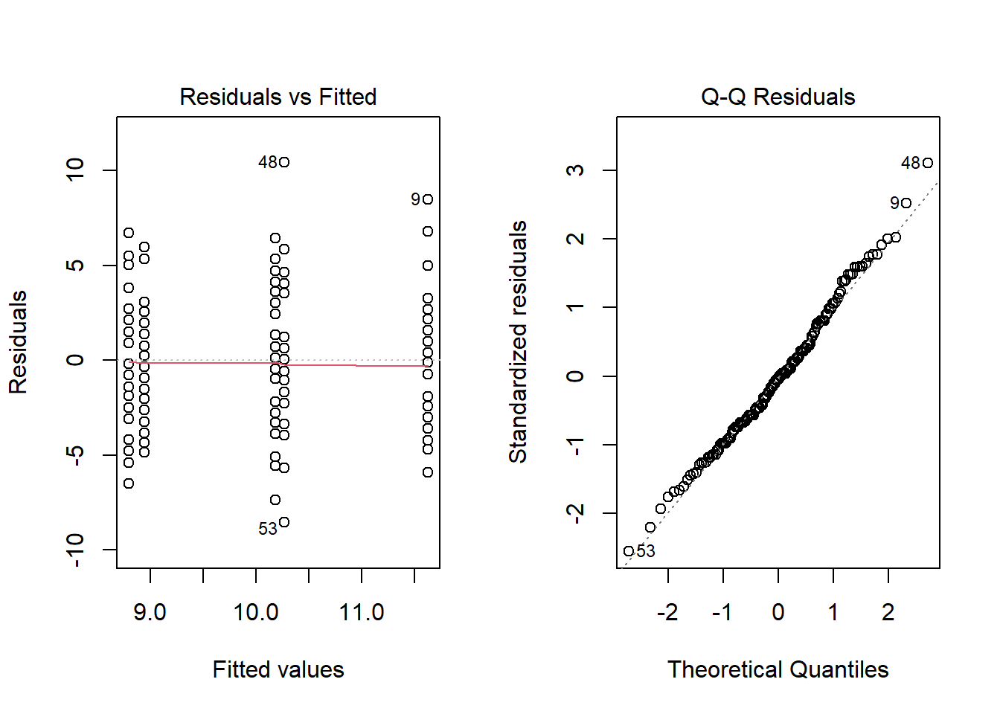{width=672}
:::

```{.r .cell-code}
par(mfrow=c(1,1))

# Use the Chickwt Example
# Null and alternative hypotheses
# $$ H_0:\mu_1 = \mu_2 = \mu_3 = \mu_4 = \mu_5 = \mu_6 $$
# $$ H_a: \text{at least one } \mu \text{ is different} $$
  
# Numerical and Graphical Summary
boxplot(weight~feed,data=chickwts)
```

::: {.cell-output-display}
{width=672}
:::

```{.r .cell-code}
ggplot(data=chickwts, aes(y=weight, x=feed))+
  geom_boxplot(fill = c("blue","white","green","yellow","orange","brown"))
```

::: {.cell-output-display}
{width=672}
:::

```{.r .cell-code}
xyplot(weight ~ feed, 
      data=chickwts,
      main="Experiment on how Feed Type impacts Chicken Growth",
      ylab="Adult Weight of Chickens (in grams)",
      xlab="Type of Feed Chickens were Fed \n 
      (Blue line shows average weights per feed type.)", 
      type=c("p","a"))
```

::: {.cell-output-display}
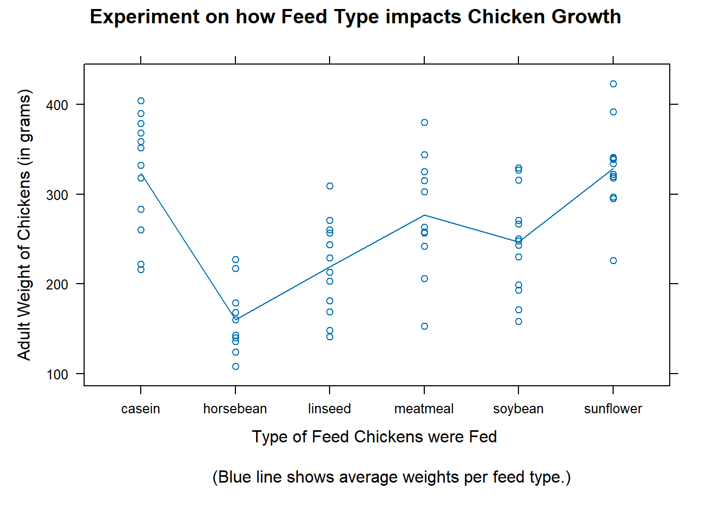{width=672}
:::

```{.r .cell-code}
pander(favstats(weight~feed,data=chickwts)[,c("feed","mean","sd","n")])
```

::: {.cell-output-display}

--------------------------------
   feed      mean     sd     n  
----------- ------- ------- ----
  casein     323.6   64.43   12 

 horsebean   160.2   38.63   10 

  linseed    218.8   52.24   12 

 meatmeal    276.9   64.9    11 

  soybean    246.4   54.13   14 

 sunflower   328.9   48.84   12 
--------------------------------


:::

```{.r .cell-code}
# Analysis - One Way ANOVA
chickwt.aov <- aov(weight~feed,
                   data=chickwts)

pander(summary(chickwt.aov))
```

::: {.cell-output-display}

-------------------------------------------------------------
    &nbsp;       Df   Sum Sq   Mean Sq   F value    Pr(>F)   
--------------- ---- -------- --------- --------- -----------
   **feed**      5    231129    46226     15.36    5.936e-10 

 **Residuals**   65   195556    3009       NA         NA     
-------------------------------------------------------------

Table: Analysis of Variance Model


:::

```{.r .cell-code}
# Checking Requirements
par(mfrow=c(1,2))

plot(chickwt.aov,which=1:2)
```

::: {.cell-output-display}
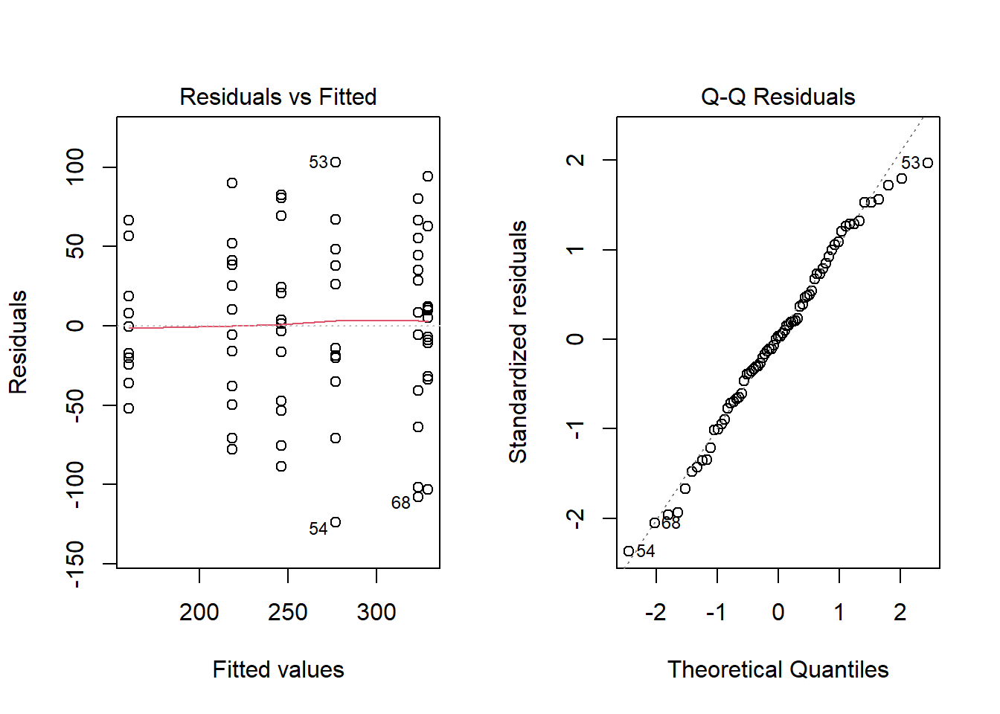{width=672}
:::

```{.r .cell-code}
# warpbreaks dataset. 

# Question - Are each of the two factors significant and do they interaction
# with each other

# Null and alternative hypotheses
# The first set of null and alternative hypotheses are LISTED FOR EACH FACTOR:

# $$ H_0:\mu_1 = \mu_2 = \mu_3 =\mu \text{for tension}$$
# $$ H_a: \text{at least one } \mu \text{ is different for tension} $$

# $$ H_0:\mu_1 = \mu_2 = \mu \text{for wool}$$
# $$ H_a: \text{at least one } \mu \text{ is different for wool} $$

# $$ H_0:\text{ The effect of tension is the same for all types of wool} $$
# $$ H_a:\text{ The effect of tension is not the same for all types of wool}$$

# install.packages("lattice")


# Numerical Summaries
warpbreaks %>% 
  group_by(tension) %>% 
  summarise(ave=mean(breaks),sd=sd(breaks),SampleSize=n()) %>% 
  pander()
```

::: {.cell-output-display}

--------------------------------------
 tension    ave     sd     SampleSize 
--------- ------- ------- ------------
    L      36.39   16.45       18     

    M      26.39   9.121       18     

    H      21.67   8.353       18     
--------------------------------------


:::

```{.r .cell-code}
warpbreaks %>% 
  group_by(wool) %>% 
  summarise(ave=mean(breaks),sd=sd(breaks),SampleSize=n()) %>% 
  pander()
```

::: {.cell-output-display}

-----------------------------------
 wool    ave     sd     SampleSize 
------ ------- ------- ------------
  A     31.04   15.85       27     

  B     25.26   9.301       27     
-----------------------------------


:::

```{.r .cell-code}
warpbreaks %>% 
  group_by(wool, tension) %>% 
  summarise(ave=mean(breaks),sd=sd(breaks),SampleSize=n()) %>% 
  pander()
```

::: {.cell-output-display}

---------------------------------------------
 wool   tension    ave     sd     SampleSize 
------ --------- ------- ------- ------------
  A        L      44.56   18.1        9      

  A        M       24     8.66        9      

  A        H      24.56   10.27       9      

  B        L      28.22   9.859       9      

  B        M      28.78   9.431       9      

  B        H      18.78   4.893       9      
---------------------------------------------


:::

```{.r .cell-code}
favstats(breaks~wool+tension,data=warpbreaks)
```

::: {.cell-output-display}

`````{=html}
<div data-pagedtable="false">
  <script data-pagedtable-source type="application/json">
{"columns":[{"label":["wool.tension"],"name":[1],"type":["chr"],"align":["left"]},{"label":["min"],"name":[2],"type":["dbl"],"align":["right"]},{"label":["Q1"],"name":[3],"type":["dbl"],"align":["right"]},{"label":["median"],"name":[4],"type":["dbl"],"align":["right"]},{"label":["Q3"],"name":[5],"type":["dbl"],"align":["right"]},{"label":["max"],"name":[6],"type":["dbl"],"align":["right"]},{"label":["mean"],"name":[7],"type":["dbl"],"align":["right"]},{"label":["sd"],"name":[8],"type":["dbl"],"align":["right"]},{"label":["n"],"name":[9],"type":["int"],"align":["right"]},{"label":["missing"],"name":[10],"type":["int"],"align":["right"]}],"data":[{"1":"A.L","2":"25","3":"26","4":"51","5":"54","6":"70","7":"44.55556","8":"18.097729","9":"9","10":"0"},{"1":"B.L","2":"14","3":"20","4":"29","5":"31","6":"44","7":"28.22222","8":"9.858724","9":"9","10":"0"},{"1":"A.M","2":"12","3":"18","4":"21","5":"30","6":"36","7":"24.00000","8":"8.660254","9":"9","10":"0"},{"1":"B.M","2":"16","3":"21","4":"28","5":"39","6":"42","7":"28.77778","8":"9.431036","9":"9","10":"0"},{"1":"A.H","2":"10","3":"18","4":"24","5":"28","6":"43","7":"24.55556","8":"10.272671","9":"9","10":"0"},{"1":"B.H","2":"13","3":"15","4":"17","5":"21","6":"28","7":"18.77778","8":"4.893306","9":"9","10":"0"}],"options":{"columns":{"min":{},"max":[10]},"rows":{"min":[10],"max":[10]},"pages":{}}}
  </script>
</div>
`````

:::

```{.r .cell-code}
# Graphical Summaries xyplots 3 plots
xyplot(breaks ~ wool, data=warpbreaks, type=c("p","a"),
       main="Type of Wool", col='blue', 
       xlab="Type of Wool", ylab="Number of Warps that Broke")
```

::: {.cell-output-display}
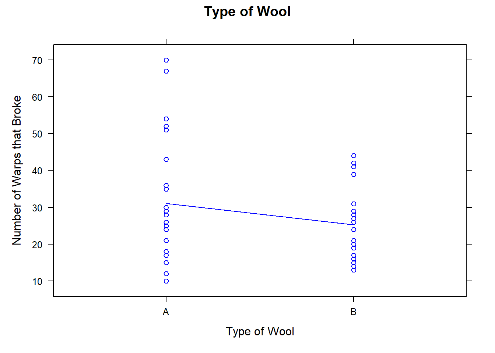{width=672}
:::

```{.r .cell-code}
xyplot(breaks ~ tension, data=warpbreaks, type=c("p","a"),
       main="Type of Tension", col='blue', 
       xlab="Type of Tension", ylab="Number of Warps that Broke")
```

::: {.cell-output-display}
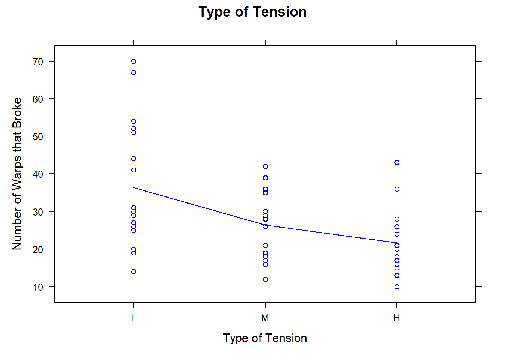{width=672}
:::

```{.r .cell-code}
xyplot(breaks ~ tension, data=warpbreaks, groups=wool, type=c("p","a"), 
       main="Significance of the Interaction",
       auto.key=list(corner=c(1,1)))
```

::: {.cell-output-display}
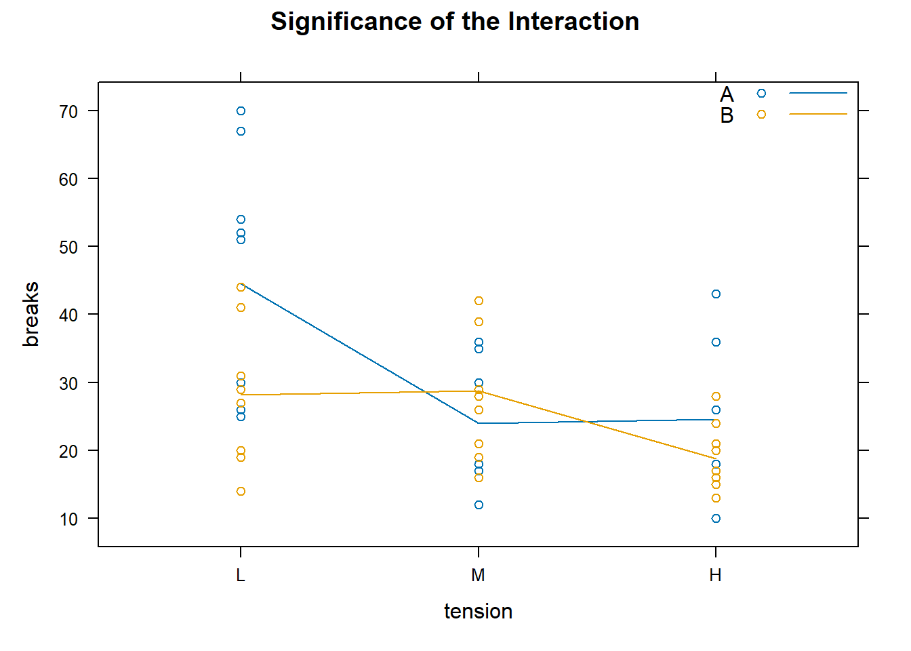{width=672}
:::

```{.r .cell-code}
# Inferential Statistics
warp.aov <- aov(breaks ~ wool + tension + wool:tension, data=warpbreaks)

summary(warp.aov) %>% 
  pander()
```

::: {.cell-output-display}

----------------------------------------------------------------
      &nbsp;        Df   Sum Sq   Mean Sq   F value    Pr(>F)   
------------------ ---- -------- --------- --------- -----------
     **wool**       1    450.7     450.7     3.765     0.05821  

   **tension**      2     2034     1017      8.498    0.0006926 

 **wool:tension**   2     1003     501.4     4.189     0.02104  

  **Residuals**     48    5745     119.7      NA         NA     
----------------------------------------------------------------

Table: Analysis of Variance Model


:::

```{.r .cell-code}
par(mfrow=c(1,2))

plot(warp.aov, which=1:2, pch=16)
```

::: {.cell-output-display}
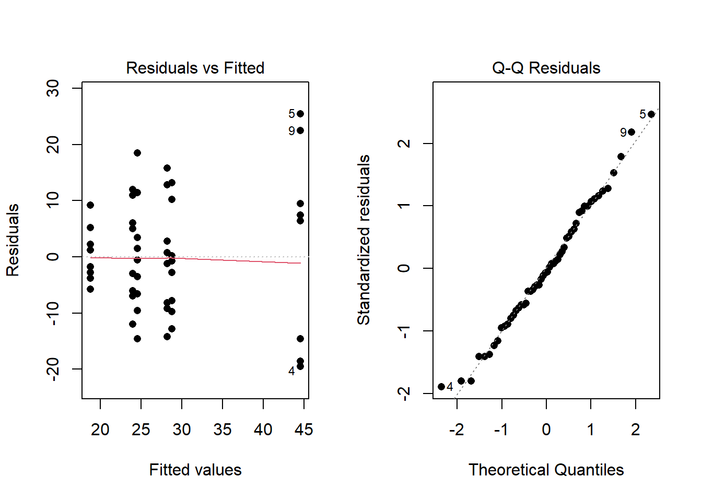{width=672}
:::
:::


## Week 7 Day 2

### Kruskal Wallis


::: {.cell}

```{.r .cell-code}
# Libraries used: MOSAIC, PANDER, CAR
# Dataset:        KIDSFEET

# Similarities and Differences Between Kruskal-Wallis and Wilcoxon Rank Sum Test
# Hypotheses for Kruskal-Wallis
# Go through explanation of Calculating of Test Statistic - Briefly show the six steps in the explanation
# What can you conclude with a p-value from a Kruskal Wallis
# Kruskal-Wallis Test and Wilcoxon Rank Sum test – If you have multiple samples and not just two, use Kruskal-Wallis test. It is also the non-parametric version of ANOVA.

# Hypotheses

#Kruskal Wallis – go through a few examples below and in the end explain what three codes they need for Kruskal Wallis

par(mfrow=c(1,1))

boxplot(correct ~ condition, data=Friendly, col='grey', ylab="# of Correct Answers", main="# of Correct Answers by Method", xlab="Method")
```

::: {.cell-output-display}
{width=672}
:::

```{.r .cell-code}
ggplot(data=Friendly, aes(x=condition, y=correct))+
  geom_boxplot(fill=c("red","white","blue"))
```

::: {.cell-output-display}
{width=672}
:::

```{.r .cell-code}
favstats(correct ~ condition, data=Friendly)[,-10] %>%pander(caption="# of Correct Answers by Method")
```

::: {.cell-output-display}

--------------------------------------------------------------------
 condition   min    Q1     median    Q3     max   mean    sd     n  
----------- ----- ------- -------- ------- ----- ------ ------- ----
  Before     24    37.25     39     39.75   40    36.6   5.337   10 

  Meshed     30     36      36.5    38.75   40    36.6   3.026   10 

    SFR      21     25       27     38.5    39    30.3   7.334   10 
--------------------------------------------------------------------

Table: # of Correct Answers by Method


:::

```{.r .cell-code}
# Performing ANOVA
sharky.aov <- aov(correct ~ condition,
                  data=Friendly)

summary(sharky.aov) %>%
  pander()
```

::: {.cell-output-display}

-----------------------------------------------------------
    &nbsp;       Df   Sum Sq   Mean Sq   F value   Pr(>F)  
--------------- ---- -------- --------- --------- ---------
 **condition**   2    264.6     132.3     4.341    0.02319 

 **Residuals**   27   822.9     30.48      NA        NA    
-----------------------------------------------------------

Table: Analysis of Variance Model


:::

```{.r .cell-code}
# Checking Requirements
par(mfrow=c(1,2))

plot(sharky.aov,which=1)

qqPlot(sharky.aov$residuals)
```

::: {.cell-output-display}
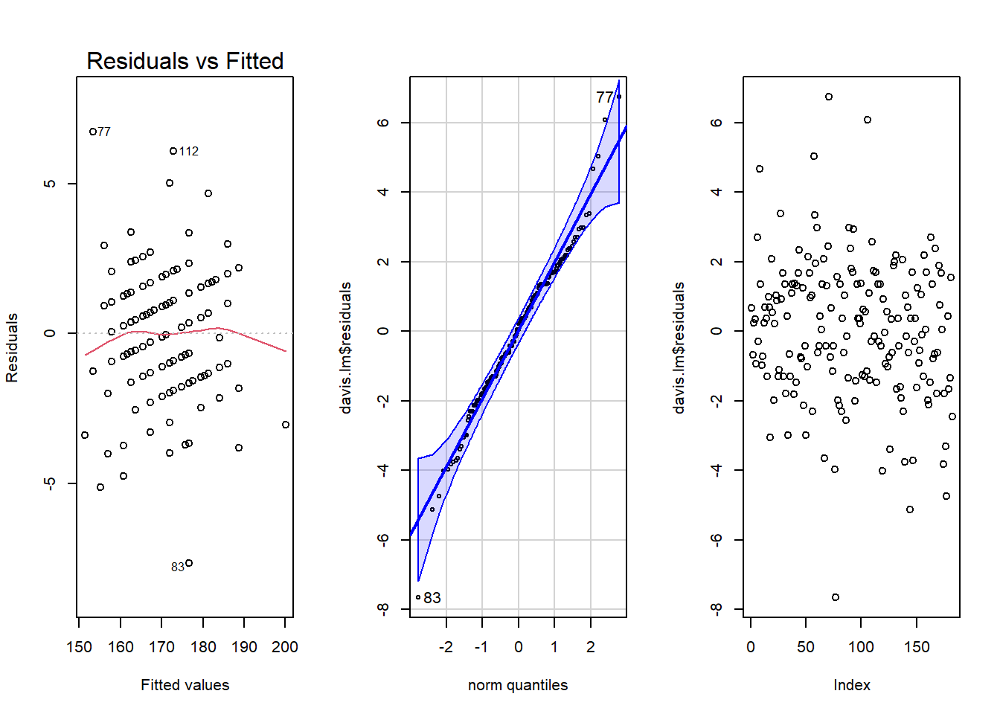{width=672}
:::

::: {.cell-output .cell-output-stdout}

```
[1] 16  7
```


:::

```{.r .cell-code}
# Performing KRUSKAL-WALIS TEST
kruskal.test(correct ~ condition,
             data=Friendly)
```

::: {.cell-output .cell-output-stdout}

```

	Kruskal-Wallis rank sum test

data:  correct by condition
Kruskal-Wallis chi-squared = 5.1817, df = 2, p-value = 0.07496
```


:::

```{.r .cell-code}
# Use the Chickwt Example
# Numerical and Graphical Summary
par(mfrow=c(1,1))

boxplot(weight~feed,data=chickwts)
```

::: {.cell-output-display}
{width=672}
:::

```{.r .cell-code}
ggplot(data=chickwts, aes(x=feed, y=weight))+
  geom_boxplot(fill=c("red","white","blue","red","white","blue"))
```

::: {.cell-output-display}
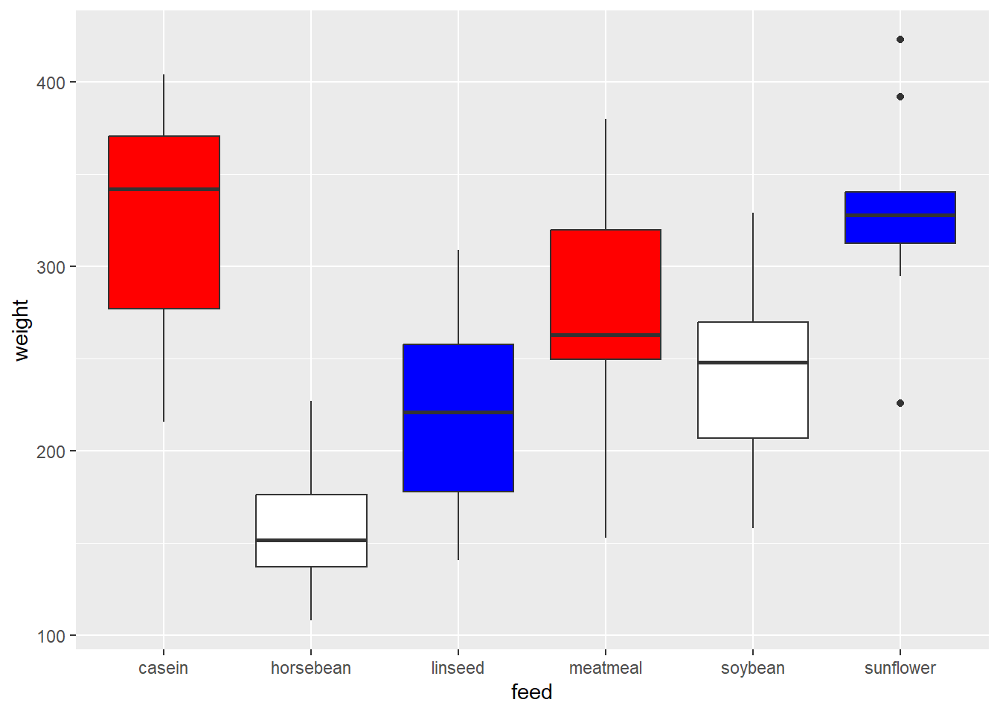{width=672}
:::

```{.r .cell-code}
pander(favstats(weight~feed,data=chickwts))
```

::: {.cell-output-display}

-------------------------------------------------------------------------------
   feed      min    Q1     median    Q3     max   mean     sd     n    missing 
----------- ----- ------- -------- ------- ----- ------- ------- ---- ---------
  casein     216   277.2    342     370.8   404   323.6   64.43   12      0    

 horsebean   108    137    151.5    176.2   227   160.2   38.63   10      0    

  linseed    141    178     221     257.8   309   218.8   52.24   12      0    

 meatmeal    153   249.5    263      320    380   276.9   64.9    11      0    

  soybean    158   206.8    248      270    329   246.4   54.13   14      0    

 sunflower   226   312.8    328     340.2   423   328.9   48.84   12      0    
-------------------------------------------------------------------------------


:::

```{.r .cell-code}
# Analysis - One Way ANOVA
chickwt.aov <- aov(weight~feed,
                   data=chickwts)

summary(chickwt.aov) %>%
  pander()
```

::: {.cell-output-display}

-------------------------------------------------------------
    &nbsp;       Df   Sum Sq   Mean Sq   F value    Pr(>F)   
--------------- ---- -------- --------- --------- -----------
   **feed**      5    231129    46226     15.36    5.936e-10 

 **Residuals**   65   195556    3009       NA         NA     
-------------------------------------------------------------

Table: Analysis of Variance Model


:::

```{.r .cell-code}
# Checking Requirements
par(mfrow=c(1,2))

plot(chickwt.aov,which=1)

qqPlot(sharky.aov$residuals)
```

::: {.cell-output-display}
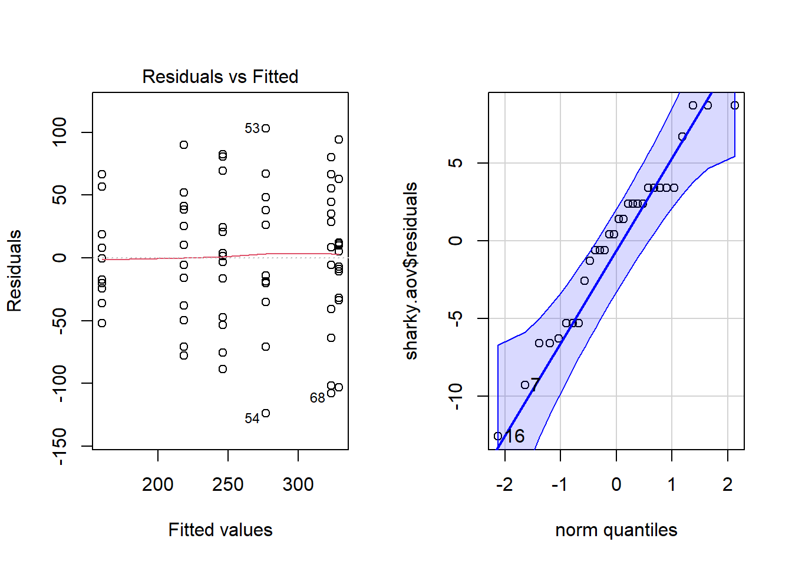{width=672}
:::

::: {.cell-output .cell-output-stdout}

```
[1] 16  7
```


:::

```{.r .cell-code}
# Analysis - Kruskal Wallis
kruskal.test(weight~feed,
             data=chickwts)
```

::: {.cell-output .cell-output-stdout}

```

	Kruskal-Wallis rank sum test

data:  weight by feed
Kruskal-Wallis chi-squared = 37.343, df = 5, p-value = 5.113e-07
```


:::
:::


## Week 8 Day 1

### Simple Linear?


::: {.cell}

```{.r .cell-code}
# Libraries used: MOSAIC, PANDER, TIDYVERSE, DT, CAR
# Dataset:        DAVIS, KIDSFEET

# 1) Students are to find some data to do a simple linear regression for Friday; Need to find two quantitative variables to determine a linear relationship
# 2) Predicted final exam score
# 3) Regression Applet
#   a) Move the sliders on the right - What does "a" represent and what does "b" represent
#   a.	Height to Shoe Size
#   b.	Move sliders and a and b to try and fit the data.
#   c.	Best fit and compare to your line
#   d.	Residuals – squared residuals
#4)	Discuss with neighbor and then with group
#   a.	Changing a? – Explaining the slope

#Talk from Elder Gilbert about Parable of the Slope
#   a) What does least squares regression line mean?

# Open your Statistics-Notebook to the Linear Regression page.See Overview of Simple Linear Regression

# R instructions for Simple Linear Regression and finding the y-intercept and slope
# First one section of Explanation tab
# c. Residual and Errors


# Sample Code for Simple Linear Regression

# Get a Data Set
# Assumptions
# Review some of the explanations

rm("Davis")

## $$ Y_i = \beta_0 +  \beta_1x_i + \epsilon $$
## $$ H_0: \beta_1 = 0 $$
## $$ H_a: \beta_1 \neq 0 $$

##Data Set 1
Davis2 <- Davis %>%
  filter(height>140)

# Now create the model
davis.lm <- lm(height ~ repht, 
               data = Davis2)

predict(davis.lm, 
        newdata = data.frame(repht = 160), 
        type = "response")
```

::: {.cell-output .cell-output-stdout}

```
       1 
162.6203 
```


:::

```{.r .cell-code}
summary(davis.lm) %>%
  pander()
```

::: {.cell-output-display}

---------------------------------------------------------------
     &nbsp;        Estimate   Std. Error   t value   Pr(>|t|)  
----------------- ---------- ------------ --------- -----------
 **(Intercept)**    12.92       2.639       4.894    2.185e-06 

    **repht**       0.9356     0.01564      59.83    9.81e-121 
---------------------------------------------------------------


--------------------------------------------------------------
 Observations   Residual Std. Error   $R^2$    Adjusted $R^2$ 
-------------- --------------------- -------- ----------------
     182               1.995          0.9521       0.9519     
--------------------------------------------------------------

Table: Fitting linear model: height ~ repht


:::

```{.r .cell-code}
plot(height ~ repht, 
     data = Davis2)

abline(davis.lm,
       lty=1,
       lwd=1)
```

::: {.cell-output-display}
{width=672}
:::

```{.r .cell-code}
ggplot(Davis2, aes(x = repht, y = height))+
  geom_point()+
  geom_smooth(method = "lm", 
              formula = y~x, 
              se = FALSE)
```

::: {.cell-output-display}
{width=672}
:::

```{.r .cell-code}
DavisNA <- Davis2 %>%
  filter(!is.na(repht),
         !is.na(height))

cor(DavisNA$height,DavisNA$repht)
```

::: {.cell-output .cell-output-stdout}

```
[1] 0.9757704
```


:::

```{.r .cell-code}
par(mfrow=c(1,3))

plot(davis.lm,which=1)

qqPlot(davis.lm$residuals)
```

::: {.cell-output .cell-output-stdout}

```
83 77 
77 71 
```


:::

```{.r .cell-code}
plot(davis.lm$residuals)
```

::: {.cell-output-display}
{width=672}
:::

```{.r .cell-code}
##Data Set 2
kidsfeet.lm <- lm(length ~ width, 
                  data = KidsFeet)

summary(kidsfeet.lm) %>%
  pander()
```

::: {.cell-output-display}

---------------------------------------------------------------
     &nbsp;        Estimate   Std. Error   t value   Pr(>|t|)  
----------------- ---------- ------------ --------- -----------
 **(Intercept)**    9.817       2.938       3.341    0.001915  

    **width**       1.658       0.3262      5.081    1.097e-05 
---------------------------------------------------------------


-------------------------------------------------------------
 Observations   Residual Std. Error   $R^2$   Adjusted $R^2$ 
-------------- --------------------- ------- ----------------
      39               1.025          0.411       0.3951     
-------------------------------------------------------------

Table: Fitting linear model: length ~ width


:::

```{.r .cell-code}
plot(length ~ width, 
     data = KidsFeet)

abline(kidsfeet.lm,
       lty=1,
       lwd=1)

ggplot(KidsFeet, aes(x = width, 
                     y = length))+
  geom_point()+
  geom_smooth(method = "lm", 
              formula = y~x, 
              se = FALSE)

cor(KidsFeet$length, KidsFeet$width)
```

::: {.cell-output .cell-output-stdout}

```
[1] 0.6410961
```


:::

```{.r .cell-code}
par(mfrow=c(1,3))
```

::: {.cell-output-display}
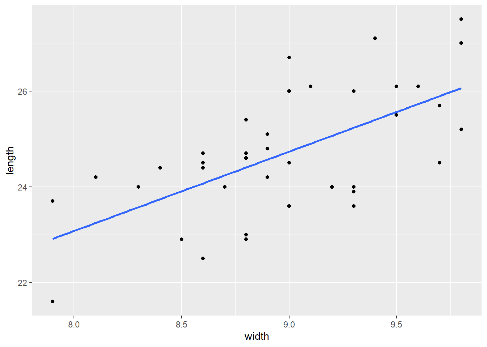{width=672}
:::

```{.r .cell-code}
plot(kidsfeet.lm,which=1:2)

plot(kidsfeet.lm$residuals)
```

::: {.cell-output-display}
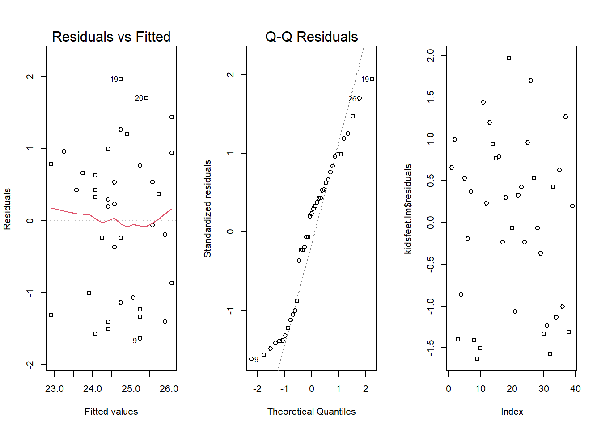{width=672}
:::

```{.r .cell-code}
# The Mathematical Model of Regression (including the equation of the best-fit line).
# How to interpret the slope and intercept in a Simple Linear Regression.
# What a residual is in a regression.
# How to measure the correlation of a regression.
# How to diagnose the appropriateness of a regression for a given data set.
# How to perform a regression in RStudio and locate the slope and intercept from the output summary.
```
:::


## Week 8 Day 2

### Simple Linear?


::: {.cell}

```{.r .cell-code}
# Libraries used: MOSAIC, PANDER, TIDYVERSE, DT, CAR
# Dataset:        KIDSFEET

# Go through the four questions in the class quiz with at least one other
# person and use the simple linear regression section within the textbook
# You can use the code below to practice items with a simple linear regression.

# Kids Feet
# $$ Y_i = \beta_0 +  \beta_1x_i + \epsilon $$
# $$ H_0: \beta_1 = 0 $$
# $$ H_a: \beta_1 \neq 0 $$

kidsfeet.lm <- lm(length ~ width, 
                  data = KidsFeet)

summary(kidsfeet.lm) %>%
  pander()
```

::: {.cell-output-display}

---------------------------------------------------------------
     &nbsp;        Estimate   Std. Error   t value   Pr(>|t|)  
----------------- ---------- ------------ --------- -----------
 **(Intercept)**    9.817       2.938       3.341    0.001915  

    **width**       1.658       0.3262      5.081    1.097e-05 
---------------------------------------------------------------


-------------------------------------------------------------
 Observations   Residual Std. Error   $R^2$   Adjusted $R^2$ 
-------------- --------------------- ------- ----------------
      39               1.025          0.411       0.3951     
-------------------------------------------------------------

Table: Fitting linear model: length ~ width


:::

```{.r .cell-code}
plot(length ~ width, 
     data = KidsFeet)

abline(kidsfeet.lm,
       lty=1,
       lwd=1)
```

::: {.cell-output-display}
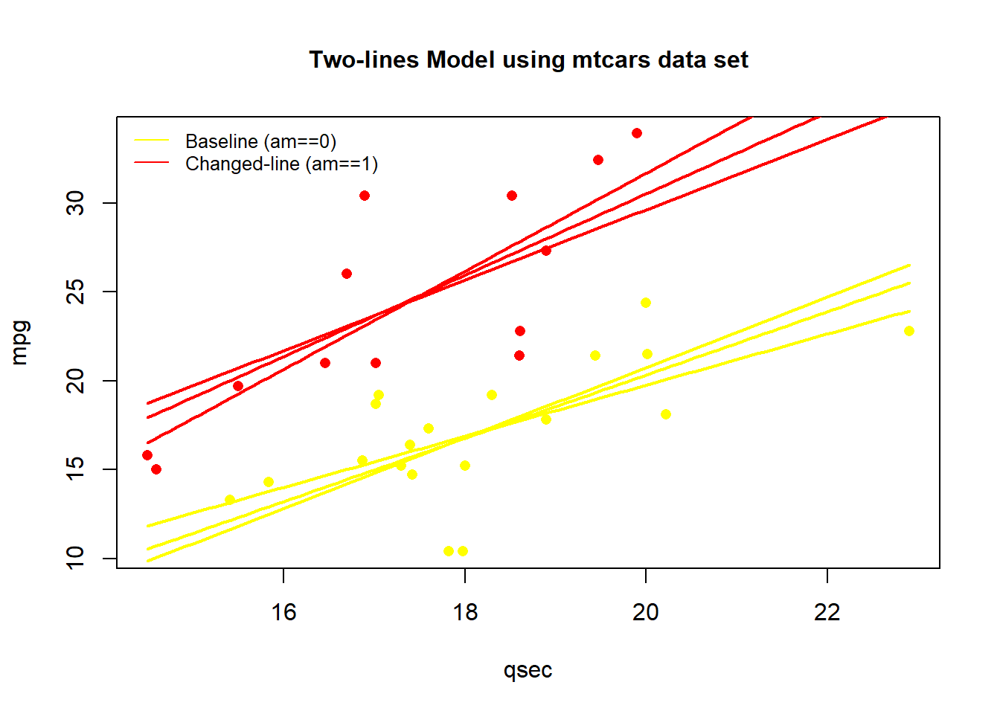{width=672}
:::

```{.r .cell-code}
ggplot(KidsFeet, aes(x = width, y = length))+
  geom_point()+
  geom_smooth(method = "lm", 
              formula = y~x, 
              se = FALSE)
```

::: {.cell-output-display}
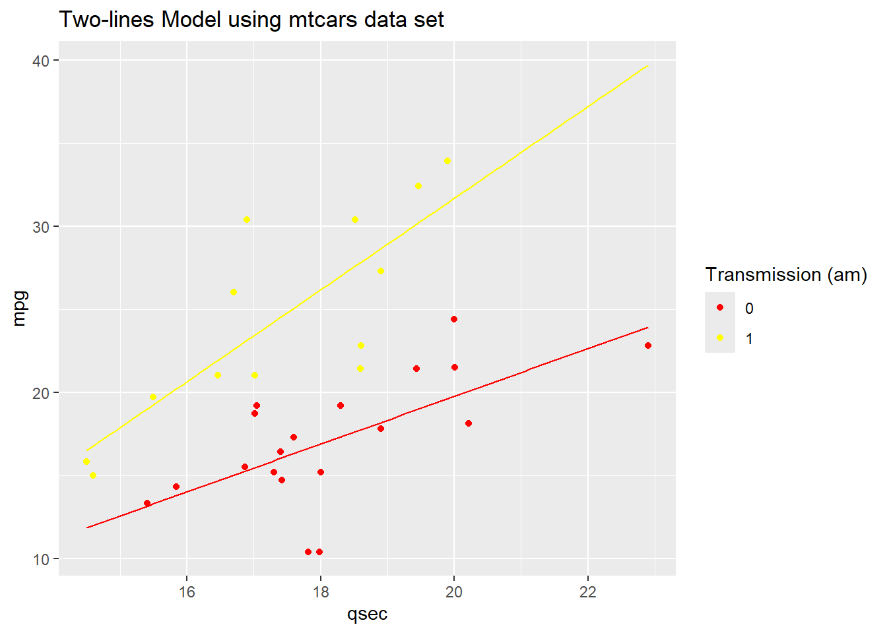{width=672}
:::

```{.r .cell-code}
par(mfrow=c(1,3))

plot(kidsfeet.lm,
     which=1:2)

plot(kidsfeet.lm$residuals)
```

::: {.cell-output-display}
{width=672}
:::
:::


## Week 9 Day 1

### Multiple Linear?


::: {.cell}

```{.r .cell-code}
# Libraries used: TIDYVERSE, CAR, PANDER
# Dataset:        MTCARS

# Go through the example using the TWO LINE MODEL.
# 1)	State the mathematical equation of two-line model
# 2) lm.2lines <-lm(mpg ~ qsec + am + qsec:am, data=mtcars) -  
#   Use the example in the textbook to go through what the estimates mean:
# 3)	Interpret the intercept and slope of each of the two lines (the answer is below)
# 4)	Create a scatterplot using the code below

#Full Model
lm.2lines <-lm(mpg ~ qsec + am + qsec:am, 
               data=mtcars)

summary(lm.2lines) %>%
  pander()
```

::: {.cell-output-display}

--------------------------------------------------------------
     &nbsp;        Estimate   Std. Error   t value   Pr(>|t|) 
----------------- ---------- ------------ --------- ----------
 **(Intercept)**    -9.01       8.218      -1.096     0.2823  

    **qsec**        1.439        0.45       3.197    0.003432 

     **am**         -14.51      12.48      -1.163     0.2548  

   **qsec:am**      1.321       0.7017      1.883    0.07012  
--------------------------------------------------------------


-------------------------------------------------------------
 Observations   Residual Std. Error   $R^2$   Adjusted $R^2$ 
-------------- --------------------- ------- ----------------
      32               3.343          0.722       0.6923     
-------------------------------------------------------------

Table: Fitting linear model: mpg ~ qsec + am + qsec:am


:::

```{.r .cell-code}
lm.2lines <-lm(mpg ~ qsec*am, 
               data=mtcars)

summary(lm.2lines) %>%
  pander()
```

::: {.cell-output-display}

--------------------------------------------------------------
     &nbsp;        Estimate   Std. Error   t value   Pr(>|t|) 
----------------- ---------- ------------ --------- ----------
 **(Intercept)**    -9.01       8.218      -1.096     0.2823  

    **qsec**        1.439        0.45       3.197    0.003432 

     **am**         -14.51      12.48      -1.163     0.2548  

   **qsec:am**      1.321       0.7017      1.883    0.07012  
--------------------------------------------------------------


-------------------------------------------------------------
 Observations   Residual Std. Error   $R^2$   Adjusted $R^2$ 
-------------- --------------------- ------- ----------------
      32               3.343          0.722       0.6923     
-------------------------------------------------------------

Table: Fitting linear model: mpg ~ qsec * am


:::

```{.r .cell-code}
#Equal Slopes Model
eqslopes <-lm(mpg ~ qsec + am, 
              data=mtcars)

summary(eqslopes) %>%
  pander()
```

::: {.cell-output-display}

---------------------------------------------------------------
     &nbsp;        Estimate   Std. Error   t value   Pr(>|t|)  
----------------- ---------- ------------ --------- -----------
 **(Intercept)**    -18.89      6.597      -2.863    0.007711  

    **qsec**        1.982       0.3601      5.503    6.271e-06 

     **am**         8.876        1.29       6.883    1.461e-07 
---------------------------------------------------------------


--------------------------------------------------------------
 Observations   Residual Std. Error   $R^2$    Adjusted $R^2$ 
-------------- --------------------- -------- ----------------
      32               3.487          0.6868       0.6652     
--------------------------------------------------------------

Table: Fitting linear model: mpg ~ qsec + am


:::

```{.r .cell-code}
#Equal Intercepts Model
eqint <-lm(mpg ~ qsec + qsec:am, 
           data=mtcars)

summary(eqint) %>%
  pander()
```

::: {.cell-output-display}

---------------------------------------------------------------
     &nbsp;        Estimate   Std. Error   t value   Pr(>|t|)  
----------------- ---------- ------------ --------- -----------
 **(Intercept)**    -15.3       6.223      -2.459     0.02015  

    **qsec**        1.781       0.3419      5.211    1.41e-05  

   **qsec:am**      0.5096     0.06994      7.286    5.042e-08 
---------------------------------------------------------------


--------------------------------------------------------------
 Observations   Residual Std. Error   $R^2$    Adjusted $R^2$ 
-------------- --------------------- -------- ----------------
      32               3.364          0.7086       0.6885     
--------------------------------------------------------------

Table: Fitting linear model: mpg ~ qsec + qsec:am


:::

```{.r .cell-code}
lm.line <-lm(mpg ~ qsec, 
             data=mtcars)

summary(lm.line) %>%
  pander()
```

::: {.cell-output-display}

--------------------------------------------------------------
     &nbsp;        Estimate   Std. Error   t value   Pr(>|t|) 
----------------- ---------- ------------ --------- ----------
 **(Intercept)**    -5.114      10.03      -0.5099    0.6139  

    **qsec**        1.412       0.5592      2.525    0.01708  
--------------------------------------------------------------


--------------------------------------------------------------
 Observations   Residual Std. Error   $R^2$    Adjusted $R^2$ 
-------------- --------------------- -------- ----------------
      32               5.564          0.1753       0.1478     
--------------------------------------------------------------

Table: Fitting linear model: mpg ~ qsec


:::

```{.r .cell-code}
#Create graph using the following code:
par(mfrow=c(1,1))

plot(mpg ~ qsec, 
    data=mtcars, 
    col=c("yellow","red")[as.factor(am)], 
    pch=16, 
    bg="gray83", 
    main="Two-lines Model using mtcars data set", 
    cex.main=1)
legend("topleft", legend=c("Baseline (am==0)", "Changed-line (am==1)"), 
bty="n", lty=1, col=c("yellow","red"), cex=0.8)

# Get the "Estimates" automatically:
# Then b will have 4 estimates:
# b[1] is the estimate of beta_0: -9.0099
# b[2] is the estimate of beta_1:  1.4385
# b[3] is the estimate of beta_2: -14.5107
# b[4] is the estimate of beta_3: 1.3214

# Full Model  - redo graph first
b <- coef(lm.2lines)
curve(b[1] + b[2]*x, 
      col="yellow", 
      lwd=2, 
      add=TRUE)  #baseline (in blue)
curve((b[1] + b[3]) + (b[2] + b[4]) * x, 
      col="red", 
      lwd=2, 
      add=TRUE) #changed line (in orange)

b %>%
  pander()
```

::: {.cell-output-display}

----------------------------------------
 (Intercept)   qsec      am     qsec:am 
------------- ------- -------- ---------
    -9.01      1.439   -14.51    1.321  
----------------------------------------


:::

```{.r .cell-code}
# Equal Slopes Model - redo graph first
b <- coef(eqslopes)
curve(b[1] + b[2]*x, col="yellow", 
      lwd=2, 
      add=TRUE)  #baseline (in blue)
curve((b[1] + b[3]) + (b[2]) * x, 
      col="red", 
      lwd=2, 
      add=TRUE) #changed line (in orange)

# Equal Intercepts Model  - redo graph first
b <- coef(eqint)
curve(b[1] + b[2]*x, 
      col="yellow", 
      lwd=2, 
      add=TRUE)  #baseline (in blue)

curve((b[1]) + (b[2] + b[3]) * x, 
      col="red", 
      lwd=2, 
      add=TRUE) #changed line (in orange)
```

::: {.cell-output-display}
{width=672}
:::

```{.r .cell-code}
# Then b will have 4 estimates:
# b[1] is the estimate of beta_0: -9.0099
# b[2] is the estimate of beta_1:  1.4385
# b[3] is the estimate of beta_2: -14.5107
# b[4] is the estimate of beta_3: 1.3214

# Full Model Graph
b <- coef(lm.2lines)
ggplot(mtcars, aes(y=mpg, x=qsec, color=factor(am))) +
  geom_point(pch=16) +
  #geom_smooth(method="lm", se=F) + #easy way, but only draws the full interaction model. The manual way using stat_function (see below) is more involved, but more dynamic.
  stat_function(fun = function(x) b[1] + b[2]*x, color="red") + #am==0 line
  stat_function(fun = function(x) (b[1]+b[3]) + (b[2]+b[4])*x,color="yellow") + #am==1 line 
  scale_color_manual(name="Transmission (am)", values=c("red","yellow")) +
  labs(title="Two-lines Model using mtcars data set")
```

::: {.cell-output-display}
{width=672}
:::

```{.r .cell-code}
# Equal Slopes Graph
b <- coef(eqslopes)

ggplot(mtcars, aes(y=mpg, x=qsec, color=factor(am))) +
  geom_point(pch=16) +
  # geom_smooth(method="lm", se=F) + #easy way, but only draws the full interaction model. The manual way using stat_function (see below) is more involved, but more dynamic.
  stat_function(fun = function(x) b[1] + b[2]*x, color="red") + #am==0 line
  stat_function(fun = function(x) (b[1]+b[3]) + (b[2])*x,color="yellow") + #am==1 line 
  scale_color_manual(name="Transmission (am)", values=c("red","yellow")) +
  labs(title="Two-lines Model using mtcars data set")
```

::: {.cell-output-display}
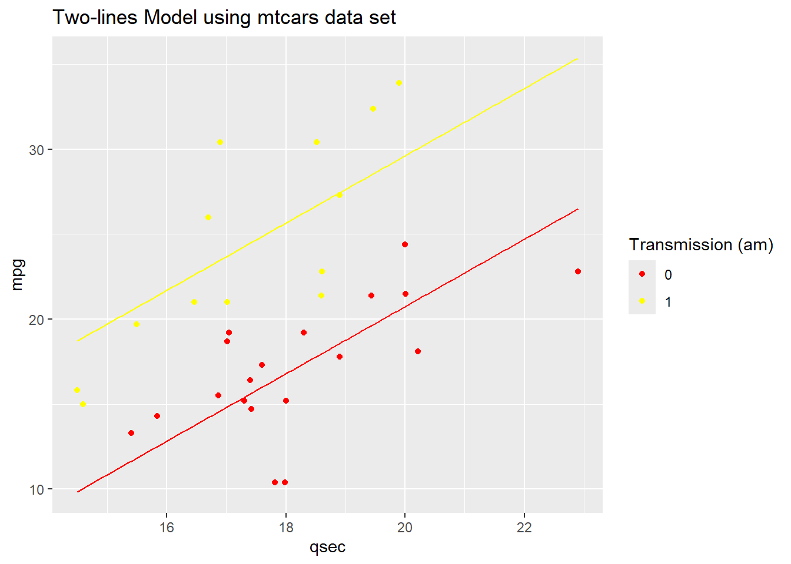{width=672}
:::

```{.r .cell-code}
# Equal Intercepts Graph
b <- coef(eqint)
ggplot(mtcars, aes(y=mpg, x=qsec, color=factor(am))) +
  geom_point(pch=16) +
  #geom_smooth(method="lm", se=F) + #easy way, but only draws the full interaction model. The manual way using stat_function (see below) is more involved, but more dynamic.
  stat_function(fun = function(x) b[1] + b[2]*x, color="red") + #am==0 line
  stat_function(fun = function(x) (b[1]) + (b[2]+b[3])*x,color="yellow") + #am==1 line 
  scale_color_manual(name="Transmission (am)", values=c("red","yellow")) +
  labs(title="Two-lines Model using mtcars data set")
```

::: {.cell-output-display}
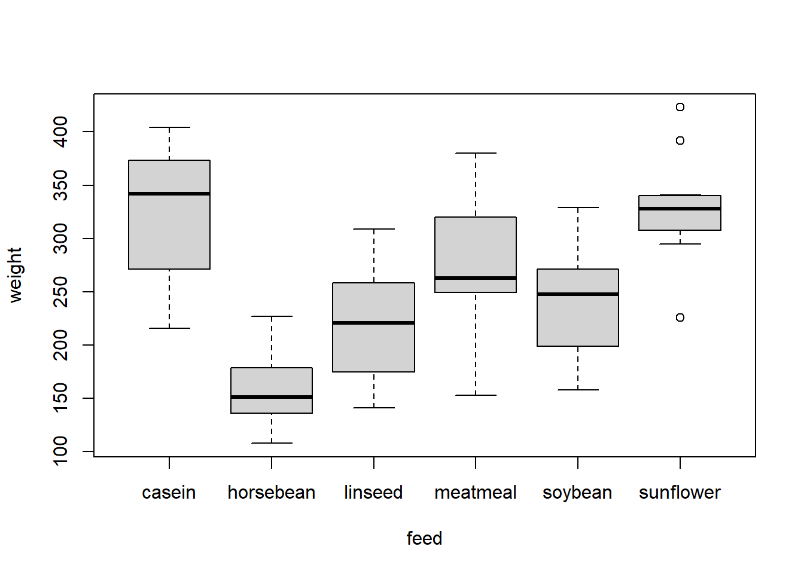{width=672}
:::

```{.r .cell-code}
ggplot(mtcars, aes(y=mpg, x=qsec, color=factor(am))) +
  geom_point(pch=16, bg="gray83") +
  geom_smooth(method="lm", se=F) + #easy way, but only draws the full interaction model. The manual way using stat_function (see below) is more involved, but more dynamic.
  scale_color_manual(name="Transmission (am)", values=c("red","yellow")) +
  labs(title="Two-lines Model using mtcars data set")
```

::: {.cell-output-display}
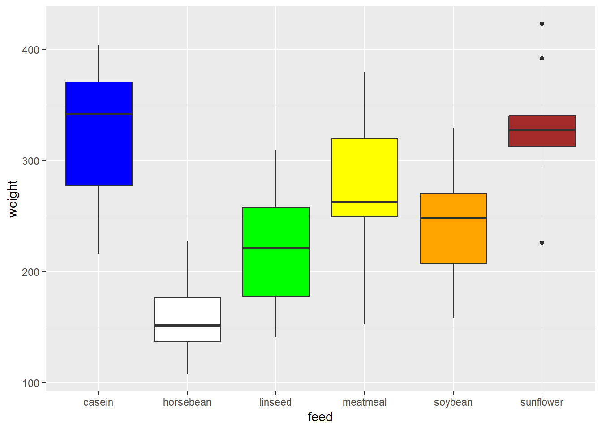{width=672}
:::

```{.r .cell-code}
# Check the requirements to see if the model is good
par(mfrow=c(1,3))
plot(lm.2lines,which=1)

qqPlot(lm.2lines$residuals)
```

::: {.cell-output .cell-output-stdout}

```
      Lotus Europa Cadillac Fleetwood 
                28                 15 
```


:::

```{.r .cell-code}
plot(lm.2lines$residuals)
```

::: {.cell-output-display}
{width=672}
:::

```{.r .cell-code}
# Check for significance
# qsec is significant  and the change of slope is significant
```
:::


## Week 9 Day 2

### Multiple Linear?


::: {.cell}

```{.r .cell-code}
# 1)	Each student draw a sketch of the two-line model and explain to one other person
# 2) LaTex code for the model and null and alternative hypotheses
# $$   Y_i = \beta_0 + \beta_1{X_{i1}} + \beta_2{X_{i2}} + \beta_3{x_{i1}}{x_{i2}} + \epsilon_i $$
# $$ H_0: \beta_1 = 0 $$
# $$ H_a: \beta_1 \neq 0 $$
# $$ H_0: \beta_2 = 0 $$
# $$ H_a: \beta_2 \neq 0 $$
# $$ H_0: \beta_3 = 0 $$
# $$ H_a: \beta_3 \neq 0 $$
# 2) Go through one example of the three and then have them try the other two:

#Equal slopes
par(mfrow=c(1,1))

palette(c("skyblue","firebrick"))

plot(mpg ~ qsec, data=mtcars, col=as.factor(am), xlim=c(0,30), ylim=c(-30,40), main="1974 Motor Trend Cars", pch=16)

equalslopes.lm <- lm(mpg~qsec + as.factor(am), data=mtcars)

summary(equalslopes.lm) %>%
  pander()
```

::: {.cell-output-display}

------------------------------------------------------------------
       &nbsp;         Estimate   Std. Error   t value   Pr(>|t|)  
-------------------- ---------- ------------ --------- -----------
  **(Intercept)**      -18.89      6.597      -2.863    0.007711  

      **qsec**         1.982       0.3601      5.503    6.271e-06 

 **as.factor(am)1**    8.876        1.29       6.883    1.461e-07 
------------------------------------------------------------------


--------------------------------------------------------------
 Observations   Residual Std. Error   $R^2$    Adjusted $R^2$ 
-------------- --------------------- -------- ----------------
      32               3.487          0.6868       0.6652     
--------------------------------------------------------------

Table: Fitting linear model: mpg ~ qsec + as.factor(am)


:::

```{.r .cell-code}
b <- coef(equalslopes.lm)

b %>%
  pander()
```

::: {.cell-output-display}

--------------------------------------
 (Intercept)   qsec    as.factor(am)1 
------------- ------- ----------------
   -18.89      1.982       8.876      
--------------------------------------


:::

```{.r .cell-code}
abline( b[1], b[2], col=palette()[1])
abline( b[1]+b[3],b[2], col=palette()[2])

legend("topleft", legend=c("automatic","manual"), pch=1, col=palette(), title="Transmission (am)", bty="n")
```

::: {.cell-output-display}
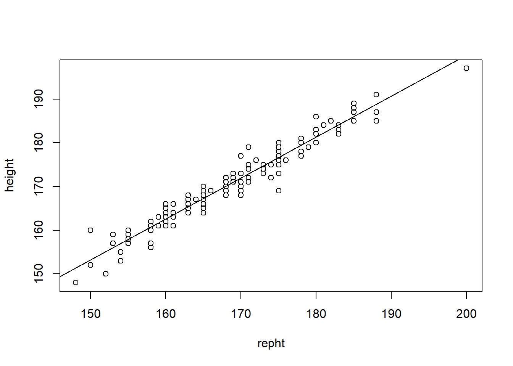{width=672}
:::

```{.r .cell-code}
# Note:  You may need to increase the graph window so the legend is in the right place.

# Equal intercepts

palette(c("skyblue","firebrick"))

plot(mpg ~ qsec, data=mtcars, col=as.factor(am), xlim=c(0,30), ylim=c(-30,40), main="1974 Motor Trend Cars", pch=16)

equalint.lm <- lm(mpg~qsec + qsec:as.factor(am), data=mtcars)

summary(equalint.lm) %>%
  pander()
```

::: {.cell-output-display}

-----------------------------------------------------------------------
         &nbsp;            Estimate   Std. Error   t value   Pr(>|t|)  
------------------------- ---------- ------------ --------- -----------
     **(Intercept)**        -15.3       6.223      -2.459     0.02015  

        **qsec**            1.781       0.3419      5.211    1.41e-05  

 **qsec:as.factor(am)1**    0.5096     0.06994      7.286    5.042e-08 
-----------------------------------------------------------------------


--------------------------------------------------------------
 Observations   Residual Std. Error   $R^2$    Adjusted $R^2$ 
-------------- --------------------- -------- ----------------
      32               3.364          0.7086       0.6885     
--------------------------------------------------------------

Table: Fitting linear model: mpg ~ qsec + qsec:as.factor(am)


:::

```{.r .cell-code}
b <- coef(equalint.lm)

b  %>%
  pander()
```

::: {.cell-output-display}

-------------------------------------------
 (Intercept)   qsec    qsec:as.factor(am)1 
------------- ------- ---------------------
    -15.3      1.781         0.5096        
-------------------------------------------


:::

```{.r .cell-code}
abline( b[1], b[2], col=palette()[1])
abline( b[1],b[2]+b[3], col=palette()[2])
legend("topleft", legend=c("automatic","manual"), pch=1, col=palette(), title="Transmission (am)", bty="n")
```

::: {.cell-output-display}
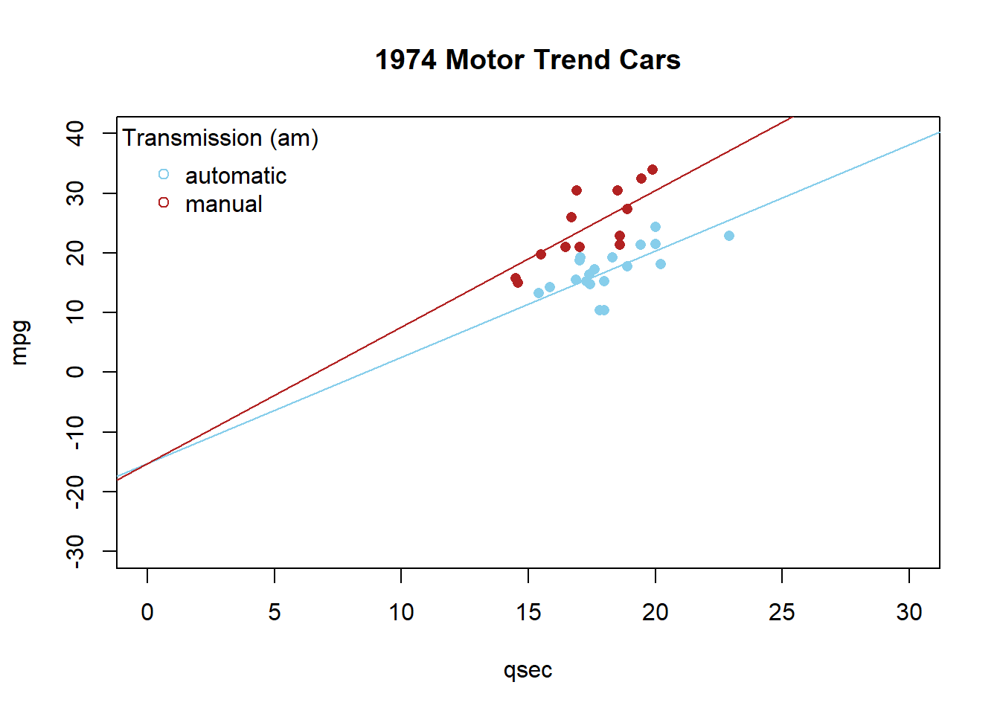{width=672}
:::

```{.r .cell-code}
#Full Model
palette(c("skyblue","firebrick"))
plot(mpg ~ qsec, data=mtcars, col=as.factor(am), xlim=c(0,30), ylim=c(-30,40), main="1974 Motor Trend Cars", pch=16)

fullmodel.lm <- lm(mpg~qsec + as.factor(am) + as.factor(am):qsec, data=mtcars)
summary(fullmodel.lm) %>%
  pander()
```

::: {.cell-output-display}

----------------------------------------------------------------------
         &nbsp;            Estimate   Std. Error   t value   Pr(>|t|) 
------------------------- ---------- ------------ --------- ----------
     **(Intercept)**        -9.01       8.218      -1.096     0.2823  

        **qsec**            1.439        0.45       3.197    0.003432 

   **as.factor(am)1**       -14.51      12.48      -1.163     0.2548  

 **qsec:as.factor(am)1**    1.321       0.7017      1.883    0.07012  
----------------------------------------------------------------------


-------------------------------------------------------------
 Observations   Residual Std. Error   $R^2$   Adjusted $R^2$ 
-------------- --------------------- ------- ----------------
      32               3.343          0.722       0.6923     
-------------------------------------------------------------

Table: Fitting linear model: mpg ~ qsec + as.factor(am) + as.factor(am):qsec


:::

```{.r .cell-code}
b <- coef(fullmodel.lm)

abline( b[1], b[2], col=palette()[1])
abline( b[1]+b[3],b[2]+b[4], col=palette()[2])

legend("topleft", legend=c("automatic","manual"), pch=1, col=palette(), title="Transmission (am)", bty="n")
```

::: {.cell-output-display}
{width=672}
:::

```{.r .cell-code}
# Summarize your Findings
# What have you learned? Discuss the following with your peers as you complete this activity.
# Are all p-values significant in your lm(...) for the full model?
# How about for the equal intercepts model?
# How about for the equal slopes model?
```
:::


## Week 10 Day 1

### Logistic Regression?


::: {.cell}

```{.r .cell-code}
# Libraries used: MOSAIC, PANDER, TIDYVERSE, DT, ALR4, RESOURCESELECTION
# Dataset:        CHALLENGER

# Open Challenger example and see if you can watch a few minutes from the video
# Look at the second paragraph on how the data was collected, then go to the explanation of the logistic model and explain:
# a.The model
# b.The log of the odds

chall.glm <- glm(fail>0 ~ temp, 
                 data=Challeng, 
                 family=binomial)

summary(chall.glm) %>% 
  pander()
```

::: {.cell-output-display}

--------------------------------------------------------------
     &nbsp;        Estimate   Std. Error   z value   Pr(>|z|) 
----------------- ---------- ------------ --------- ----------
 **(Intercept)**    15.04       7.379       2.039    0.04148  

    **temp**       -0.2322      0.1082     -2.145    0.03196  
--------------------------------------------------------------


(Dispersion parameter for  binomial  family taken to be  1 )


-------------------- --------------------------
   Null deviance:     28.27  on 22  degrees of 
                              freedom          

 Residual deviance:   20.32  on 21  degrees of 
                              freedom          
-------------------- --------------------------


:::

```{.r .cell-code}
# Plotting the model
plot( fail>0 ~ temp, data=Challeng, 
      xlab = "Outside Temperature at Time of Launch (Fahrenheit)",
      col  = c("green","red")[as.factor(fail>0)],
      ylab ='Probability of At least One O-ring Failing', pch=16, 
      main = "NASA Shuttle Launch Data from 1981 to 1985", xlim=c(30,85))

# Getting the coeffiencts
b <- coef(chall.glm)
b %>%
  pander()
```

::: {.cell-output-display}

-----------------------
 (Intercept)    temp   
------------- ---------
    15.04      -0.2322 
-----------------------


:::

```{.r .cell-code}
curve(exp(b[1]+b[2]*x)/(1+exp(b[1]+b[2]*x)), add=TRUE)
```

::: {.cell-output-display}
{width=672}
:::

```{.r .cell-code}
# Testing the fit of the model
hoslem.test(chall.glm$y, chall.glm$fitted, g=6) %>% 
  pander()
```

::: {.cell-output-display}

-------------------------------
 Test statistic   df   P value 
---------------- ---- ---------
     7.412        4    0.1157  
-------------------------------

Table: Hosmer and Lemeshow goodness of fit (GOF) test: `chall.glm$y, chall.glm$fitted`


:::

```{.r .cell-code}
# If multiple repeated x values then use the following:
pchisq(20.32, 21, lower.tail=FALSE)  %>%
  pander()
```

::: {.cell-output-display}
_0.5011_
:::

```{.r .cell-code}
# Prediciting a failure based on a temperature: 
predict(chall.glm, newdata = data.frame(temp = 64.75), type = "response") %>%
  pander()
```

::: {.cell-output-display}

--------
   1    
--------
 0.5026 
--------


:::

```{.r .cell-code}
#0.9996088

# Interpreting exp(b1) shows that the odds of the o-rings failing for a given launch decreases by a factor of 0.79 for every 1° F increase in temperature. Said differently, the odds of an o-ring failure during launch decrease by 21% (1-0.79) for every 1° F increase in temperature. (Also, from the reverse perspective, every 1° F decrease in temperature increases the odds of a failed o-ring by a factor of exp(-0.2322) exp(b[2])
#0.79

#Add some notes to your Table of Contents about logistic regression.

# Things to do Further:
# 1) Probability on y-axis
# 2) Binomial is using logit equation
# 3) Checking requirements
# 4) Explain of each of the items in the equation mean

# Another example that I cannot run:
# crime.lm <- lm(crimerate ~ exams, data=andrew)
# summary(crime.lm)
# crime.glm <- glm((crimerate > 210.5)~exames, data=andrew, family=binomial)
# summary(crime.glm)
```
:::


## Week 10 Day 2

### Logistic Regression?


::: {.cell}

```{.r .cell-code}
# Libraries used: PANDER, TIDYVERSE, RESOURCESELECTION
# Dataset:        KIDSFEET

# Do the model: 
kidsfeet.glm <- glm(sex=="B" ~ length, 
                    data=KidsFeet, 
                    family=binomial)

summary(kidsfeet.glm) %>%
  pander()
```

::: {.cell-output-display}

--------------------------------------------------------------
     &nbsp;        Estimate   Std. Error   z value   Pr(>|z|) 
----------------- ---------- ------------ --------- ----------
 **(Intercept)**    -12.49      6.966      -1.792    0.07306  

   **length**       0.5074      0.2818      1.801    0.07174  
--------------------------------------------------------------


(Dispersion parameter for  binomial  family taken to be  1 )


-------------------- --------------------------
   Null deviance:     54.04  on 38  degrees of 
                              freedom          

 Residual deviance:   50.34  on 37  degrees of 
                              freedom          
-------------------- --------------------------


:::

```{.r .cell-code}
#Plotting the model
plot( sex=="B" ~ length, 
      data=KidsFeet, 
      xlab="Length",
      col = c("red","lightblue")[as.factor(sex=="B")],
      ylab="Probability of of a Child being a Boy", 
      pch=16, 
      main="KidsFeet Logistic Regression")

b <- coef(kidsfeet.glm)
b %>%
  pander()
```

::: {.cell-output-display}

----------------------
 (Intercept)   length 
------------- --------
   -12.49      0.5074 
----------------------


:::

```{.r .cell-code}
curve(exp(b[1]+b[2]*x)/(1+exp(b[1]+b[2]*x)), add=TRUE)
```

::: {.cell-output-display}
{width=672}
:::

```{.r .cell-code}
hoslem.test(kidsfeet.glm$y, kidsfeet.glm$fitted, g=6) %>% 
  pander()
```

::: {.cell-output-display}

-------------------------------
 Test statistic   df   P value 
---------------- ---- ---------
     1.366        4    0.8501  
-------------------------------

Table: Hosmer and Lemeshow goodness of fit (GOF) test: `kidsfeet.glm$y, kidsfeet.glm$fitted`


:::

```{.r .cell-code}
# Predict 
predict(kidsfeet.glm, 
        newdata = data.frame(length = 25), 
        type = "response") %>%
  pander()
```

::: {.cell-output-display}

--------
   1    
--------
 0.5494 
--------


:::

```{.r .cell-code}
# Calculating odds
exp(b[2]) %>%
  pander()
```

::: {.cell-output-display}

--------
 length 
--------
 1.661  
--------


:::

```{.r .cell-code}
#1.660921

# Interpreting
# If beta1 is significant then the explanatory variable does well in predicting the odds of a “success”.  But interpreting e(b1) is more important.  As the length of a foot in cm goes up by one, the odds of the child being a boy increases by a factor of 0.66 or 66%. 
```
:::


## Week 12 Day 1

### Chi-squared Test


::: {.cell}

```{.r .cell-code}
# Libraries used: TIDYVERSE
# Dataset:        MTCARS, FRUIT

# Go through the combine function in the textbook
Fruitrow <- rbind( 
                  Apples = c(Good = 80, 
                              Bruised = 20, 
                              Rotten = 15), 
                  Oranges = c(Good = 75, 
                               Bruised = 25, 
                               Rotten = 10)
                  )
Fruitrow %>%
  pander()
```

::: {.cell-output-display}

---------------------------------------
   &nbsp;      Good   Bruised   Rotten 
------------- ------ --------- --------
 **Apples**     80      20        15   

 **Oranges**    75      25        10   
---------------------------------------


:::

```{.r .cell-code}
#          Good Bruised Rotten
# Apples    80      20     15
# Oranges   75      25     10

Fruitcolumn <- cbind(
                    Apples = c(Good = 80, 
                               Bruised = 20, 
                               Rotten = 15), 
                    Oranges = c(Good = 75, 
                                Bruised = 25, 
                                Rotten = 10) )

Fruitcolumn %>%
  pander()
```

::: {.cell-output-display}

--------------------------------
   &nbsp;      Apples   Oranges 
------------- -------- ---------
  **Good**       80       75    

 **Bruised**     20       25    

 **Rotten**      15       10    
--------------------------------


:::

```{.r .cell-code}
#         Apples Oranges
#Good        80      75
#Bruised     20      25
#Rotten      15      10

# 5)	Go through an example of a barplot
# 6)	Note: Rows are legends, and columns are columns or bars

barplot(Fruitrow,beside = TRUE, legend.text=TRUE)
```

::: {.cell-output-display}
{width=672}
:::

```{.r .cell-code}
barplot(Fruitcolumn,beside = TRUE, legend.text=TRUE)
```

::: {.cell-output-display}
{width=672}
:::

```{.r .cell-code}
# 9) Using data
table(mtcars$am, mtcars$cyl) %>%
  pander()
```

::: {.cell-output-display}

---------------------
 &nbsp;   4   6   8  
-------- --- --- ----
 **0**    3   4   12 

 **1**    8   3   2  
---------------------


:::

```{.r .cell-code}
ggplot(data=mtcars,aes(x=as.factor(cyl),
                       fill=as.factor(am)))+
  geom_bar(stat = "count", position = position_dodge())+
  scale_fill_manual(values = c("red","green"))+
  labs(
    x="cylinder",
    y="Number of Cars",
    fill="Transmission"
  )
```

::: {.cell-output-display}
{width=672}
:::

```{.r .cell-code}
# 10) Using data
barplot(table(mtcars$am, mtcars$cyl), 
        beside=TRUE, 
        col=c("red","green"), 
        legend.text=TRUE, 
        xlab="Cylinders")
```

::: {.cell-output-display}
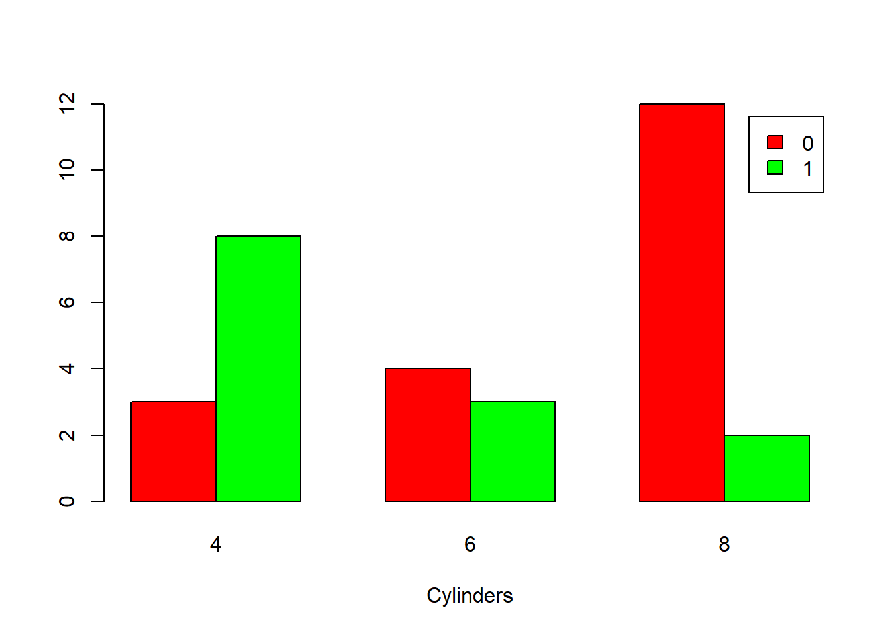{width=672}
:::

```{.r .cell-code}
# Doing chisq analysis – chisq.test(x) using both data
Fruitchi <- chisq.test(Fruitcolumn)
Fruitchi %>%
  pander()
```

::: {.cell-output-display}

-------------------------------
 Test statistic   df   P value 
---------------- ---- ---------
     1.607        2    0.4479  
-------------------------------

Table: Pearson's Chi-squared test: `Fruitcolumn`


:::

```{.r .cell-code}
mtchi <- chisq.test(table(mtcars$am, mtcars$cyl))
mtchi %>%
  pander()
```

::: {.cell-output-display}

---------------------------------
 Test statistic   df    P value  
---------------- ---- -----------
     8.741        2    0.01265 * 
---------------------------------

Table: Pearson's Chi-squared test: `table(mtcars$am, mtcars$cyl)`


:::

```{.r .cell-code}
# 12)	Check the requirements using mychisq$expected and mean(mychisq$expected) for both data
Fruitchi$expected %>%
  pander()
```

::: {.cell-output-display}

--------------------------------
   &nbsp;      Apples   Oranges 
------------- -------- ---------
  **Good**     79.22     75.78  

 **Bruised**     23       22    

 **Rotten**    12.78     12.22  
--------------------------------


:::

```{.r .cell-code}
#             Good Bruised   Rotten
#Apples  79.22222      23 12.77778
#Oranges 75.77778      22 12.22222 

mtchi$expected %>%
  pander()
```

::: {.cell-output-display}

--------------------------------
 &nbsp;     4       6       8   
-------- ------- ------- -------
 **0**    6.531   4.156   8.312 

 **1**    4.469   2.844   5.688 
--------------------------------


:::

```{.r .cell-code}
#       4       6      8
#0 6.53125 4.15625 8.3125
#1 4.46875 2.84375 5.6875

mean(mtchi$expected) %>%
  pander()
```

::: {.cell-output-display}
_5.333_
:::

```{.r .cell-code}
#[1] 5.333333

# 13)	Do Pearsons residuals on both data – mychisq$residuals
Fruitchi$residuals
```

::: {.cell-output .cell-output-stdout}

```
             Apples     Oranges
Good     0.08738402 -0.08934795
Bruised -0.62554324  0.63960215
Rotten   0.62166987 -0.63564173
```


:::

```{.r .cell-code}
mtchi$residuals %>%
  pander()
```

::: {.cell-output-display}

-------------------------------------
 &nbsp;     4         6         8    
-------- -------- ---------- --------
 **0**    -1.382   -0.07664   1.279  

 **1**     1.67    0.09266    -1.546 
-------------------------------------


:::
:::


## Week 12 Day 2

### Chi-squared Test


::: {.cell}

```{.r .cell-code}
# Libraries used: TIDYVERSE
# Dataset:        MTCARS, FRUIT

# 1)	Open statistics notebook and go through the combine function in the textbook
Fruitrow <- rbind( Apples = c(Good = 80, 
                              Bruised = 20, 
                              Rotten = 15), 
                   Oranges = c(Good = 75, 
                               Bruised = 25, 
                               Rotten = 10) )
Fruitrow %>%
  pander()
```

::: {.cell-output-display}

---------------------------------------
   &nbsp;      Good   Bruised   Rotten 
------------- ------ --------- --------
 **Apples**     80      20        15   

 **Oranges**    75      25        10   
---------------------------------------


:::

```{.r .cell-code}
#          Good Bruised Rotten
#Apples    80      20     15
#Oranges   75      25     10

Fruitcolumn <- cbind( Apples = c(Good = 80, 
                                 Bruised = 20, 
                                 Rotten = 15), 
                      Oranges = c(Good = 75, 
                                  Bruised = 25, 
                                  Rotten = 10) )
Fruitcolumn %>%
  pander()
```

::: {.cell-output-display}

--------------------------------
   &nbsp;      Apples   Oranges 
------------- -------- ---------
  **Good**       80       75    

 **Bruised**     20       25    

 **Rotten**      15       10    
--------------------------------


:::

```{.r .cell-code}
#         Apples Oranges
# Good        80      75
# Bruised     20      25
# Rotten      15      10

# 5)	Go through an example of a barplot
# 6)	Note: Rows are legends, and columns are columns or bars
barplot(Fruitrow,beside = TRUE, legend.text=TRUE)
```

::: {.cell-output-display}
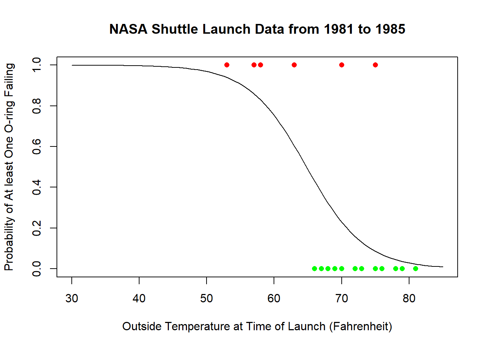{width=672}
:::

```{.r .cell-code}
barplot(Fruitcolumn,beside = TRUE, legend.text=TRUE)
```

::: {.cell-output-display}
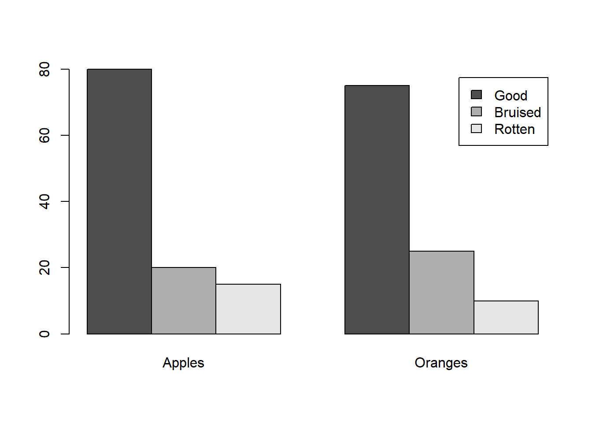{width=672}
:::

```{.r .cell-code}
# 9) Using data
table(mtcars$am, mtcars$cyl)
```

::: {.cell-output .cell-output-stdout}

```
   
     4  6  8
  0  3  4 12
  1  8  3  2
```


:::

```{.r .cell-code}
ggplot(data=mtcars,aes(x=as.factor(cyl),fill=as.factor(am)))+
  geom_bar(stat = "count",position = position_dodge())+
  scale_fill_manual(values = c("red","green"))+
  labs(
    x="cylinder",
    fill="Transmission",
    y="Number of Cars"
  )
```

::: {.cell-output-display}
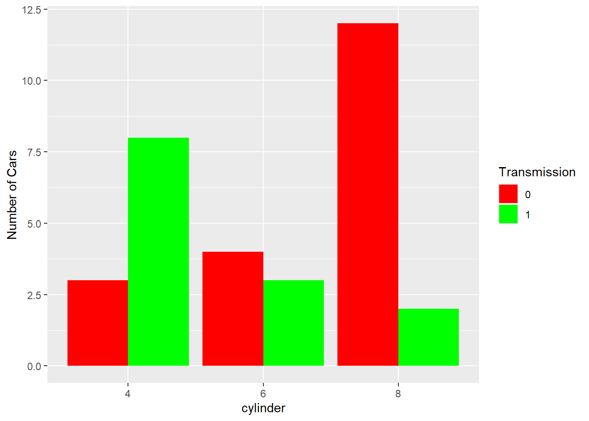{width=672}
:::

```{.r .cell-code}
# 10) Using data
barplot(table(mtcars$am, mtcars$cyl), beside=TRUE, 
        col=c("red","green"), legend.text=TRUE, xlab="Cylinders")
```

::: {.cell-output-display}
{width=672}
:::

```{.r .cell-code}
# Doing chisq analysis – chisq.test(x) using both data
Fruitchi <- chisq.test(Fruitcolumn)
Fruitchi %>%
  pander()
```

::: {.cell-output-display}

-------------------------------
 Test statistic   df   P value 
---------------- ---- ---------
     1.607        2    0.4479  
-------------------------------

Table: Pearson's Chi-squared test: `Fruitcolumn`


:::

```{.r .cell-code}
mtchi <- chisq.test(table(mtcars$am, mtcars$cyl))
mtchi %>%
  pander()
```

::: {.cell-output-display}

---------------------------------
 Test statistic   df    P value  
---------------- ---- -----------
     8.741        2    0.01265 * 
---------------------------------

Table: Pearson's Chi-squared test: `table(mtcars$am, mtcars$cyl)`


:::

```{.r .cell-code}
# 12)	Check the requirements using mychisq$expected and mean(mychisq$expected) for both data
Fruitchi$expected %>%
  pander()
```

::: {.cell-output-display}

--------------------------------
   &nbsp;      Apples   Oranges 
------------- -------- ---------
  **Good**     79.22     75.78  

 **Bruised**     23       22    

 **Rotten**    12.78     12.22  
--------------------------------


:::

```{.r .cell-code}
#             Good Bruised   Rotten
#Apples  79.22222      23 12.77778
#Oranges 75.77778      22 12.22222 

mtchi$expected %>%
  pander()
```

::: {.cell-output-display}

--------------------------------
 &nbsp;     4       6       8   
-------- ------- ------- -------
 **0**    6.531   4.156   8.312 

 **1**    4.469   2.844   5.688 
--------------------------------


:::

```{.r .cell-code}
#       4       6      8
#0 6.53125 4.15625 8.3125
#1 4.46875 2.84375 5.6875

mean(mtchi$expected) %>%
  pander()
```

::: {.cell-output-display}
_5.333_
:::

```{.r .cell-code}
#[1] 5.333333
  
#13)	Do Pearsons residuals on both data – mychisq$residuals
Fruitchi$residuals
```

::: {.cell-output .cell-output-stdout}

```
             Apples     Oranges
Good     0.08738402 -0.08934795
Bruised -0.62554324  0.63960215
Rotten   0.62166987 -0.63564173
```


:::

```{.r .cell-code}
mtchi$residuals %>%
  pander()
```

::: {.cell-output-display}

-------------------------------------
 &nbsp;     4         6         8    
-------- -------- ---------- --------
 **0**    -1.382   -0.07664   1.279  

 **1**     1.67    0.09266    -1.546 
-------------------------------------


:::
:::


## Week 13 Day 1
### Permutation Testing


::: {.cell}

```{.r .cell-code}
# 1)	Go through the Lego Example in the textbook
# 2)	The process of randomization testing involves three things:
#  a.	Computing a test statistic of original data
#  b.	Re-sample the data a bunch of times computing the test statistic each time. – This is how a distribution is created - 
#   c.	Compute the p-value by determining the percentage of permuted test statistics that are extreme or more extreme than the observed test statistic
# 3)	Note: a for loop allows for you to do a function or functions multiple times
# 4)	Example

# Step 1
library(mosaic)

myTest <- t.test(length~sex,data=KidsFeet, mu=0)
myTest
```

::: {.cell-output .cell-output-stdout}

```

	Welch Two Sample t-test

data:  length by sex
t = 1.9174, df = 36.275, p-value = 0.06308
alternative hypothesis: true difference in means between group B and group G is not equal to 0
95 percent confidence interval:
 -0.04502067  1.61291541
sample estimates:
mean in group B mean in group G 
       25.10500        24.32105 
```


:::

```{.r .cell-code}
observedTestStat <- myTest$statistic	
observedTestStat
```

::: {.cell-output .cell-output-stdout}

```
       t 
1.917445 
```


:::

```{.r .cell-code}
# Step 2
N <- 10000      
permutedTestStats <- rep(NA, N)
for (i in  1:N){
  permutedTest <- t.test(sample(length) ~ sex, data = KidsFeet, mu = 0)
  permutedTestStats[i] <- permutedTest$statistic
}
hist(permutedTestStats, col="skyblue")
abline(v=observedTestStat, col="red")
```

::: {.cell-output-display}
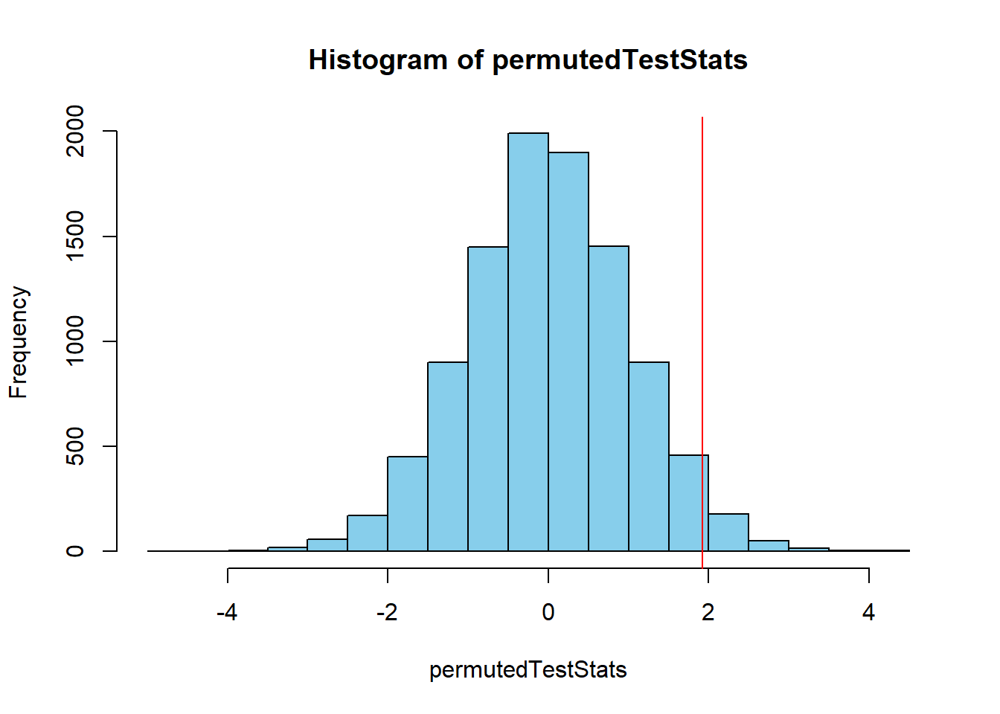{width=672}
:::

```{.r .cell-code}
# Step 3
sum(permutedTestStats >= observedTestStat)/N
```

::: {.cell-output .cell-output-stdout}

```
[1] 0.031
```


:::

```{.r .cell-code}
sum(permutedTestStats <= observedTestStat)/N
```

::: {.cell-output .cell-output-stdout}

```
[1] 0.969
```


:::

```{.r .cell-code}
2*sum(permutedTestStats >= observedTestStat)/N
```

::: {.cell-output .cell-output-stdout}

```
[1] 0.062
```


:::

```{.r .cell-code}
myTest <- t.test(extra ~ group, data = sleep, mu = 0)
observedTestStat <- myTest$statistic
observedTestStat
```

::: {.cell-output .cell-output-stdout}

```
        t 
-1.860813 
```


:::

```{.r .cell-code}
N <- 2000
permutedTestStats <- rep(NA, N)
for (i in 1:N){
  permutedTest <- t.test(sample(extra) ~ group, data = sleep, mu = 0)
  permutedTestStats[i] <- permutedTest$statistic
}

hist(permutedTestStats, col = "skyblue")
abline(v = observedTestStat, col = "red", lwd = 3)
```

::: {.cell-output-display}
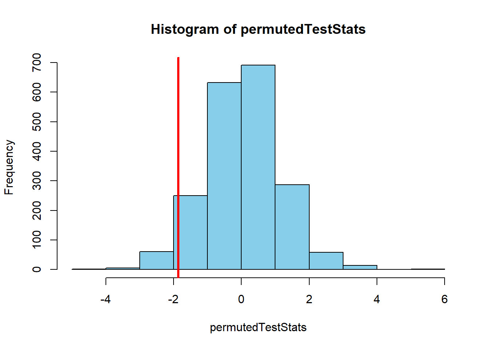{width=672}
:::

```{.r .cell-code}
sum(permutedTestStats >= observedTestStat)/N
```

::: {.cell-output .cell-output-stdout}

```
[1] 0.9595
```


:::

```{.r .cell-code}
sum(permutedTestStats <= observedTestStat)/N
```

::: {.cell-output .cell-output-stdout}

```
[1] 0.042
```


:::

```{.r .cell-code}
2*sum(permutedTestStats <= observedTestStat)/N
```

::: {.cell-output .cell-output-stdout}

```
[1] 0.084
```


:::
:::


## Week 13 Day 2
### Permutation Testing


::: {.cell}

```{.r .cell-code}
# Go through three examples as part of the quiz
# INDEPENDENT SAMPLES T TEST

# Step 1
library(mosaic)
Mtcars2 <- filter(mtcars, cyl %in% c(4,8))
myTest <- t.test(wt~cyl,data=Mtcars2, mu=0)
observedTestStat <- myTest$statistic	
observedTestStat
```

::: {.cell-output .cell-output-stdout}

```
        t 
-6.444974 
```


:::

```{.r .cell-code}
# Step 2
N <- 2000      
permutedTestStats <- rep(NA, N)
for (i in  1:N){
  permutedTest <- t.test(sample(wt) ~ cyl, data = Mtcars2, mu = 0)
  permutedTestStats[i] <- permutedTest$statistic
}
hist(permutedTestStats, col="skyblue",xlim = c(-7,4))
abline(v=observedTestStat, col="red")
```

::: {.cell-output-display}
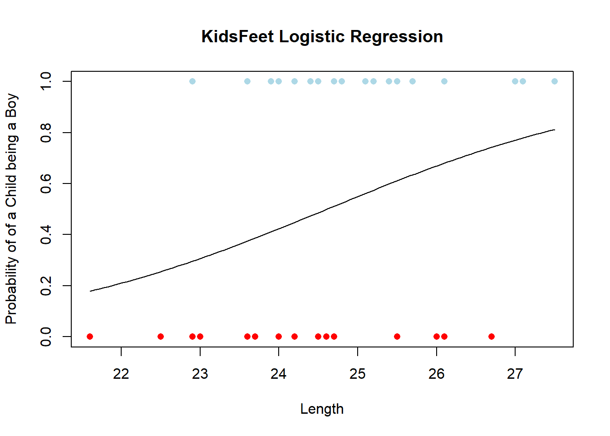{width=672}
:::

```{.r .cell-code}
# Step 3
sum(permutedTestStats >= observedTestStat)/N
```

::: {.cell-output .cell-output-stdout}

```
[1] 1
```


:::

```{.r .cell-code}
sum(permutedTestStats <= observedTestStat)/N
```

::: {.cell-output .cell-output-stdout}

```
[1] 0
```


:::

```{.r .cell-code}
2*sum(permutedTestStats <= observedTestStat)/N
```

::: {.cell-output .cell-output-stdout}

```
[1] 0
```


:::

```{.r .cell-code}
# ANOVA
# Step 1
myTest <- aov(price~clarity,data=diamonds)
observedTestStat <- summary(myTest)[[1]]$`F value`[1]
observedTestStat
```

::: {.cell-output .cell-output-stdout}

```
[1] 215.0193
```


:::

```{.r .cell-code}
# Step 2
N <- 100      
permutedTestStats <- rep(NA, N) 
for (i in  1:N){
  permutedTest <- aov(sample(price)~clarity,data=diamonds)
  permutedTestStats[i] <- summary(permutedTest)[[1]]$`F value`[1]
}
hist(permutedTestStats)
abline(v=observedTestStat)
```

::: {.cell-output-display}
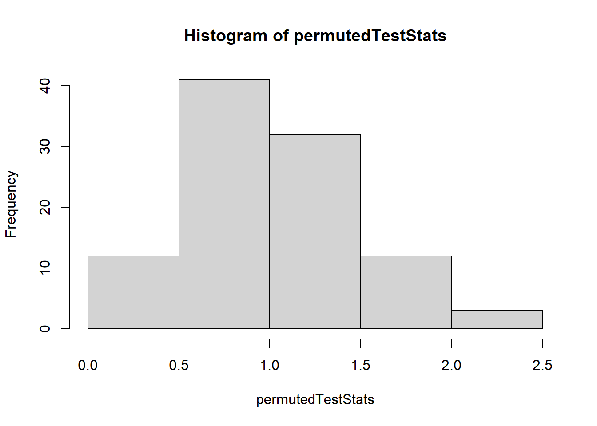{width=672}
:::

```{.r .cell-code}
# Step 3
sum(permutedTestStats >= observedTestStat)/N
```

::: {.cell-output .cell-output-stdout}

```
[1] 0
```


:::

```{.r .cell-code}
sum(permutedTestStats <= observedTestStat)/N
```

::: {.cell-output .cell-output-stdout}

```
[1] 1
```


:::

```{.r .cell-code}
2*sum(permutedTestStats >= observedTestStat)/N
```

::: {.cell-output .cell-output-stdout}

```
[1] 0
```


:::

```{.r .cell-code}
# LOGISTIC REGRESSION
# Step 1
myTest <- glm((sat>1000)~expend,data=SAT,family=binomial)
observedTestStat <- summary(myTest)[[12]][2,3]
observedTestStat
```

::: {.cell-output .cell-output-stdout}

```
[1] -2.499955
```


:::

```{.r .cell-code}
# Step 2
N <- 100      
permutedTestStats <- rep(NA, N)
for (i in  1:N){
  permutedTest <- glm((sample(sat))>1000~expend,data=SAT,family=binomial)
  permutedTestStats[i] <- summary(permutedTest)[[12]][2,3]
}
hist(permutedTestStats)
abline(v=observedTestStat, col="red")
```

::: {.cell-output-display}
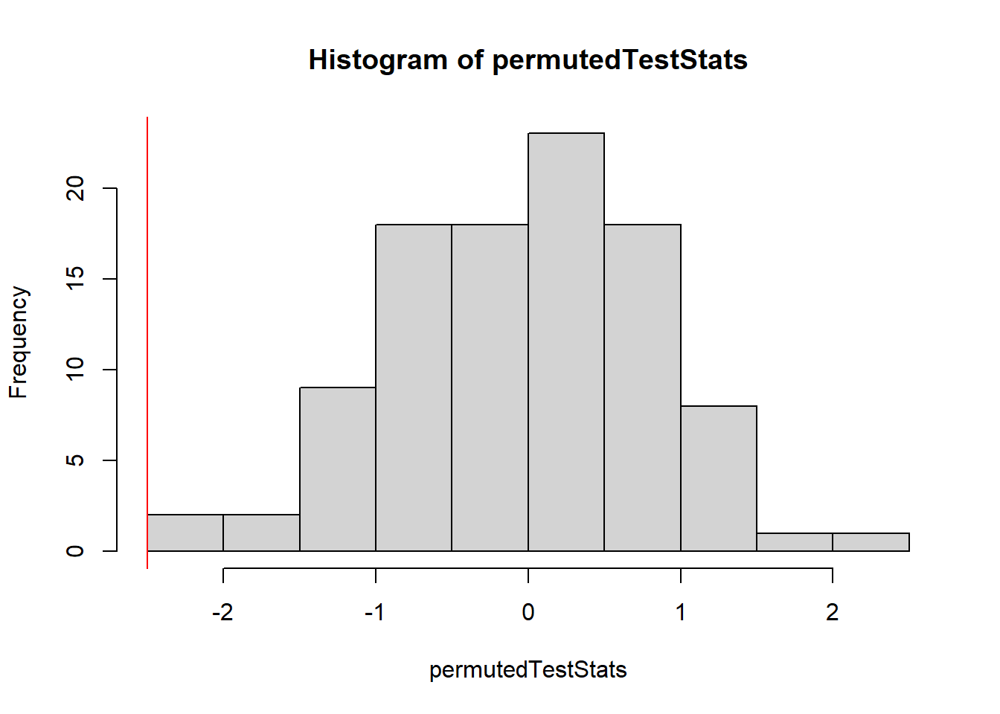{width=672}
:::

```{.r .cell-code}
# Step 3
sum(permutedTestStats >= observedTestStat)/N
```

::: {.cell-output .cell-output-stdout}

```
[1] 1
```


:::

```{.r .cell-code}
sum(permutedTestStats <= observedTestStat)/N
```

::: {.cell-output .cell-output-stdout}

```
[1] 0
```


:::

```{.r .cell-code}
2*sum(permutedTestStats <= observedTestStat)/N
```

::: {.cell-output .cell-output-stdout}

```
[1] 0
```


:::
:::
