# Week 2 Day 1


::: {.cell}

```{.r .cell-code}
library(mosaic)
library(pander)
library(tidyverse)
library(car)
```
:::


## Making Inference
Inference is the process of using information from a sample to make a general statement about an entire population. It involves using data from a subset of a population to infer something about the larger group.

### Define Inference


::: {.cell}

```{.r .cell-code}
# Define inference first in class and then with the group.
# Do not use the textbook when going over this. Use the script below as your guide.
```
:::


### Hypothesis Testing

### Type I vs. Type II Errors – Example: Flip Flops vs. Medicine

#### Type I Error (FALSE POSITIVE)
  - Rejecting a true null hypothesis.
  - It is the probability of rejecting the null hypothesis when you **should have accepted it**.
  - **Example:** A medical test incorrectly detects a disease in a healthy person.

#### Type II Error (FALSE NEGATIVE)
  - Failing to reject a false null hypothesis.
  - It is the probability of accepting the null hypothesis when you **should have rejected it**.
  - **Example:** A medical test fails to detect a disease in a sick person.

**In decision-making,**  
  - **Type I errors lead to UNNECESSARY ACTIONS.**  
  - **Type II errors result in MISSED DETECTIONS.**  

### Remembering Type I and II Errors:

#### Hypothesis Definitions:
  - **Null Hypothesis (H₀):** There is no fire.
  - **Alternative Hypothesis (H₁):** There is a fire.

#### Type I Error (FALSE POSITIVE) – "False Alarm"
  - You **reject** the null hypothesis when you **should have accepted it**.
  - **Example:** The fire alarm goes off, but there’s **no actual fire**.
  - **Think:** Overreaction—detecting something that isn’t actually there.

#### Type II Error (FALSE NEGATIVE) – "Missed Detection"
  - You **accept** the null hypothesis when you **should have rejected it**.
  - **Example:** You **miss** detecting a real fire because the alarm **didn’t go off**.
  - **Think:** Underreaction—failing to detect something that actually exists.


| **Decision**         | **Accept H₀ (No Fire)** | **Reject H₀ (Fire Alarm Goes Off)** |
|----------------------|------------------------|-------------------------------------|
| **H₀ is True (No Fire)**  | ✅ Correct Decision  | ❌ Type I Error (False Alarm)       |
| **H₀ is False (There is a Fire)** | ❌ Type II Error (Missed Detection) | ✅ Correct Decision |


### Type I Error and Significance Level

  - **Type I Error = Significance Level (α) = 1 – Confidence Level**
  - The significance level (α) is the probability of making a Type I error.
  - A **lower α** reduces the chance of rejecting a true null hypothesis.

#### Example:
  - A **95% confidence level** means a **0.05 significance level (α = 0.05)**.
  - This means there is a **5% chance of incorrectly rejecting a true null hypothesis**.

### Type II Errors and Power

  - **Type II error:** Probability of accepting the null hypothesis when you **should have rejected it**.
  - **Power of a test:** Probability of correctly rejecting a false null hypothesis.
  - **Power = 1 - Probability of a Type II error**.
  - A **higher power** means a **lower** chance of making a Type II error.
  - **Increasing sample size, effect size, or significance level** can improve power.

#### Example:
  - Suppose a new drug is being tested for effectiveness against a disease.
    - **H₀:** The drug has no effect.
    - **H₁:** The drug is effective.
  - A **Type II error** occurs if we conclude the drug is ineffective (**accept H₀**)  
    when it actually works (**H₁ is true**).
  - The **power** of the test is the probability of correctly detecting the drug's effectiveness.
  - If power is **80%**, it means there’s a **20% chance** of failing to detect a real effect (**Type II error**).

### Sufficient Evidence ≠ Proof

  - Hypothesis testing does **not** **prove** anything.
  - It only provides **sufficient evidence** to support or reject a hypothesis.

### P-Value Requires Two Components:

1. **A test statistic**
2. **The sampling distribution of the test statistic**

## P-value Calculation

## P-value Requirements

A **p-value** requires two components:

1. **Test Statistic** – A value computed from sample data, such as:
   - t-score
   - z-score
   - F-statistic

2. **Sampling Distribution of the Test Statistic** – Describes how the test statistic behaves under the null hypothesis.

### Interpretation:
  - The **p-value** measures how extreme the observed test statistic is, assuming the null hypothesis is true.
  - A **small p-value** suggests evidence against the null hypothesis, potentially leading to rejection of \( H_0 \).


### Data Exploration


::: {.cell}

```{.r .cell-code}
View(KidsFeet)
```
:::


#### Group 1 Analysis


::: {.cell}

```{.r .cell-code}
boxplot(length~sex, data=KidsFeet)
```

::: {.cell-output-display}
{width=672}
:::
:::

::: {.cell}

```{.r .cell-code}
summary <- KidsFeet %>% 
  group_by(sex) %>% 
  summarise(min = min(length), 
            Q1=quantile(length, 0.25), 
            median=median(length), 
            Q3=quantile(length, 0.75),
            max=max(length))

summary
```

::: {.cell-output-display}

`````{=html}
<div data-pagedtable="false">
  <script data-pagedtable-source type="application/json">
{"columns":[{"label":["sex"],"name":[1],"type":["fct"],"align":["left"]},{"label":["min"],"name":[2],"type":["dbl"],"align":["right"]},{"label":["Q1"],"name":[3],"type":["dbl"],"align":["right"]},{"label":["median"],"name":[4],"type":["dbl"],"align":["right"]},{"label":["Q3"],"name":[5],"type":["dbl"],"align":["right"]},{"label":["max"],"name":[6],"type":["dbl"],"align":["right"]}],"data":[{"1":"B","2":"22.9","3":"24.35","4":"24.95","5":"25.8","6":"27.5"},{"1":"G","2":"21.6","3":"23.65","4":"24.20","5":"25.1","6":"26.7"}],"options":{"columns":{"min":{},"max":[10]},"rows":{"min":[10],"max":[10]},"pages":{}}}
  </script>
</div>
`````

:::
:::

::: {.cell}

```{.r .cell-code}
summary <- favstats(length~sex, data=KidsFeet)

summary
```

::: {.cell-output-display}

`````{=html}
<div data-pagedtable="false">
  <script data-pagedtable-source type="application/json">
{"columns":[{"label":["sex"],"name":[1],"type":["chr"],"align":["left"]},{"label":["min"],"name":[2],"type":["dbl"],"align":["right"]},{"label":["Q1"],"name":[3],"type":["dbl"],"align":["right"]},{"label":["median"],"name":[4],"type":["dbl"],"align":["right"]},{"label":["Q3"],"name":[5],"type":["dbl"],"align":["right"]},{"label":["max"],"name":[6],"type":["dbl"],"align":["right"]},{"label":["mean"],"name":[7],"type":["dbl"],"align":["right"]},{"label":["sd"],"name":[8],"type":["dbl"],"align":["right"]},{"label":["n"],"name":[9],"type":["int"],"align":["right"]},{"label":["missing"],"name":[10],"type":["int"],"align":["right"]}],"data":[{"1":"B","2":"22.9","3":"24.35","4":"24.95","5":"25.8","6":"27.5","7":"25.10500","8":"1.216758","9":"20","10":"0"},{"1":"G","2":"21.6","3":"23.65","4":"24.20","5":"25.1","6":"26.7","7":"24.32105","8":"1.330238","9":"19","10":"0"}],"options":{"columns":{"min":{},"max":[10]},"rows":{"min":[10],"max":[10]},"pages":{}}}
  </script>
</div>
`````

:::
:::


#### Group 2 Analysis


::: {.cell}

```{.r .cell-code}
barplot(table(KidsFeet$sex))
```

::: {.cell-output-display}
{width=672}
:::
:::

::: {.cell}

```{.r .cell-code}
table(KidsFeet$sex)
```

::: {.cell-output .cell-output-stdout}

```

 B  G 
20 19 
```


:::
:::


#### Group 3 Analysis


::: {.cell}

```{.r .cell-code}
plot(length~width, data=KidsFeet)
```

::: {.cell-output-display}
{width=672}
:::
:::

::: {.cell}

```{.r .cell-code}
KidsFeet %>% 
  summarise(Correlation=cor(width, length))
```

::: {.cell-output-display}

`````{=html}
<div data-pagedtable="false">
  <script data-pagedtable-source type="application/json">
{"columns":[{"label":["Correlation"],"name":[1],"type":["dbl"],"align":["right"]}],"data":[{"1":"0.6410961"}],"options":{"columns":{"min":{},"max":[10]},"rows":{"min":[10],"max":[10]},"pages":{}}}
  </script>
</div>
`````

:::
:::


---


# Week 2 Day 2

1) Take a few moments to knit your index.rmd file
2) Do the Good Graphics question in the quiz
3) Go over the Stephanie Analysis


::: {.cell}

```{.r .cell-code}
library(mosaic)
library(tidyverse)
```
:::

::: {.cell}

```{.r .cell-code}
View(airquality)
# ?airquality
```
:::


## Histograms (length)


::: {.cell}

```{.r .cell-code}
hist(airquality$Wind,main="La Guardia Airport from May to September, 1973", 
     xlab="Daily Average Wind Speeds (mph)",ylab="Frequency",col="steelblue",breaks = 22)
```

::: {.cell-output-display}
{width=672}
:::
:::

::: {.cell}

```{.r .cell-code}
ggplot(airquality,aes(x=Wind))+
  geom_histogram(fill="steelblue")+
  labs(title="La Guardia Airport from May to September, 1973",
       x="Daily Average Wind Speeds (mph)",
       y="Frequency")
```

::: {.cell-output-display}
{width=672}
:::
:::


## Go through the four questions below for Question 3

## Boxplots


::: {.cell}

```{.r .cell-code}
boxplot(Wind~Month,main="Wind by Month", xlab="Month",
     ylab="Wind",col=c("steelblue1", "steelblue2", "steelblue3","steelblue3",
                       "steelblue2"),data=airquality)
```

::: {.cell-output-display}
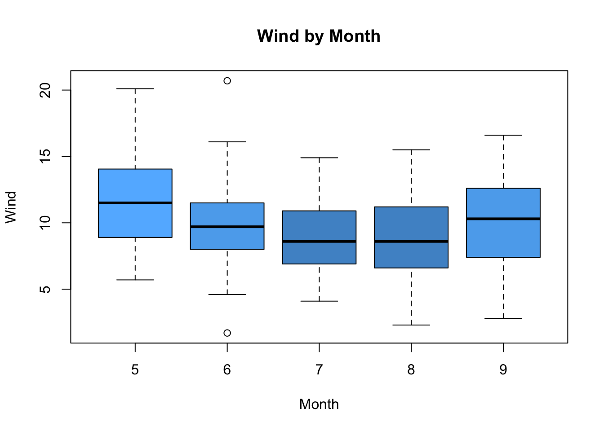{width=672}
:::
:::

::: {.cell}

```{.r .cell-code}
ggplot(data=airquality,aes(y=Wind,x=Month,group=Month))+
  geom_boxplot(fill=c("steelblue1", "steelblue2", "steelblue3","steelblue3",
                      "steelblue2"))+
  labs(title = "Wind by Month",
       y="Wind",
       x="Month")
```

::: {.cell-output-display}
{width=672}
:::
:::


## Scatterplots


::: {.cell}

```{.r .cell-code}
plot(Ozone~Temp,data=airquality,main="Relationship Between Ozone and Temperature",
     xlab="Temp", ylab="Ozone",pch = 19, col="blue")
```

::: {.cell-output-display}
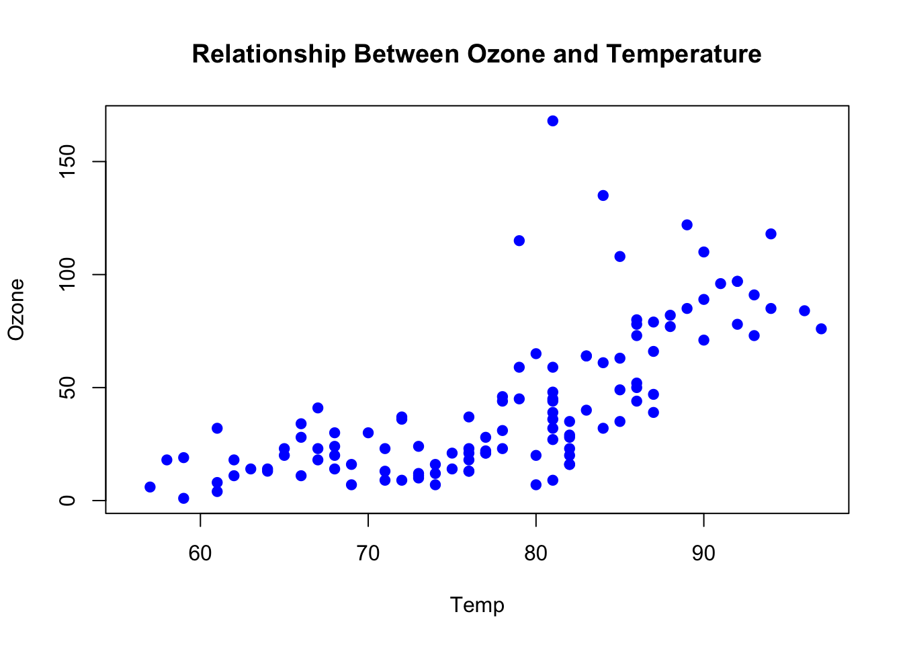{width=672}
:::
:::

::: {.cell}

```{.r .cell-code}
ggplot(airquality,aes(x=Temp,y=Ozone))+
  geom_point(color="blue")+
  labs(title="Relationship Between Ozone and Temperature", 
       x="Temp", 
       y="Ozone")
```

::: {.cell-output-display}
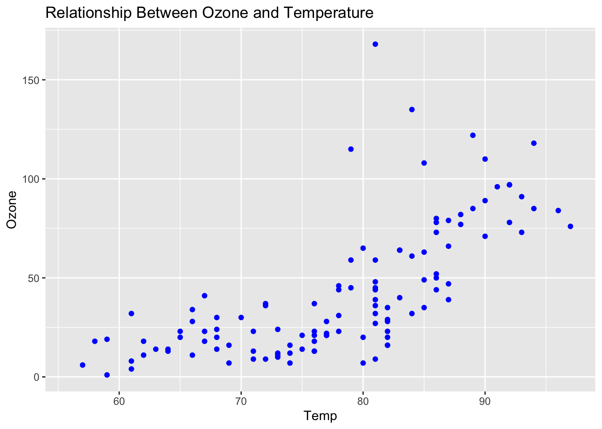{width=672}
:::
:::


---

# Week 3 Days 1 & 2


::: {.cell}

```{.r .cell-code}
library(mosaic)
library(tidyverse)
library(pander)
```
:::


### A) Quantitative vs Categorical Data - KidsFeet


::: {.cell}

```{.r .cell-code}
# One Quantitative Response Variable Y - length
summary(KidsFeet$length) %>%
  pander()
```

::: {.cell-output-display}

--------------------------------------------------
 Min.   1st Qu.   Median   Mean    3rd Qu.   Max. 
------ --------- -------- ------- --------- ------
 21.6     24       24.5    24.72    25.6     27.5 
--------------------------------------------------


:::
:::

::: {.cell}

```{.r .cell-code}
# Quantitative Y | Categorical X (2 Groups) - length by sex
tapply(KidsFeet$length, KidsFeet$sex, summary) %>%
  pander()
```

::: {.cell-output-display}


  * **B**:

    --------------------------------------------------
     Min.   1st Qu.   Median   Mean    3rd Qu.   Max.
    ------ --------- -------- ------- --------- ------
     22.9    24.35    24.95    25.11    25.8     27.5
    --------------------------------------------------

  * **G**:

    --------------------------------------------------
     Min.   1st Qu.   Median   Mean    3rd Qu.   Max.
    ------ --------- -------- ------- --------- ------
     21.6    23.65     24.2    24.32    25.1     26.7
    --------------------------------------------------


<!-- end of list -->


:::

```{.r .cell-code}
# NOTE: tapply() is a function used to apply a function to subsets of a vector, grouped by factors. It is particularly useful for summarizing data by categories
```
:::

::: {.cell}

```{.r .cell-code}
# Quantitative Y | Categorical X (3+ Groups) - Nothing in the data with 3+ groups
```
:::

::: {.cell}

```{.r .cell-code}
# Quantitative Y | Multiple Categorical X - length by sex and biggerfoot
tapply(KidsFeet$length, list(KidsFeet$sex, KidsFeet$biggerfoot), summary) %>%
  pander()
```

::: {.cell-output-display}

------------------------------------------------------------------------
 &nbsp;                 L                               R               
-------- ------------------------------- -------------------------------
 **B**    24.20000, 24.60000, 25.20000,   22.9, 23.9, 24.5, 24.7, 25.5, 
          25.43636, 26.10000, 27.10000                27.5              

 **G**    22.90000, 24.10000, 24.50000,      21.600, 23.325, 23.850,    
          24.77273, 26.00000, 26.70000       23.700, 24.175, 25.500     
------------------------------------------------------------------------


:::
:::

::: {.cell}

```{.r .cell-code}
# Quantitative Y | Quantitative X - length and width
cor(KidsFeet$length, KidsFeet$width) %>%
  pander()
```

::: {.cell-output-display}
_0.6411_
:::

```{.r .cell-code}
# The function cor(KidsFeet$length, KidsFeet$width) in R calculates the Pearson correlation 
# coefficient between the length and width columns of the KidsFeet dataset, measuring the 
# strength and direction of their linear relationship. A result close to 1 indicates a 
# strong positive correlation (as foot length increases, width also increases), while a 
# result near -1 suggests a strong negative correlation (as length increases, width 
# decreases). A value around 0 implies no significant linear relationship between the two 
# variables.
```
:::

::: {.cell}

```{.r .cell-code}
# Quantitative Y | Multiple X  - length and width and sex
lm(length ~ width + sex, data = KidsFeet) %>%
  pander()
```

::: {.cell-output-display}

---------------------------------------------------------------
     &nbsp;        Estimate   Std. Error   t value   Pr(>|t|)  
----------------- ---------- ------------ --------- -----------
 **(Intercept)**    10.36       3.323       3.118    0.003575  

    **width**       1.604       0.3607      4.447    8.015e-05 

    **sexG**       -0.1329      0.363      -0.3661    0.7164   
---------------------------------------------------------------

Table: Fitting linear model: length ~ width + sex


:::

```{.r .cell-code}
# NOTE: lm() is a function used for linear regression modeling. It is short for 
# "linear model" and helps you fit a linear relationship between a dependent 
# variable and one or more independent variables.
```
:::

::: {.cell}

```{.r .cell-code}
# Binomial Y | Quantitative X - sex and length - opposite x and y 
glm(sex ~ length, data = KidsFeet, family = binomial) %>%
  pander()
```

::: {.cell-output-display}

--------------------------------------------------------------
     &nbsp;        Estimate   Std. Error   z value   Pr(>|z|) 
----------------- ---------- ------------ --------- ----------
 **(Intercept)**    12.49       6.966       1.792    0.07306  

   **length**      -0.5074      0.2818     -1.801    0.07174  
--------------------------------------------------------------

Table: Fitting generalized (binomial/logit) linear model: sex ~ length


:::

```{.r .cell-code}
# NOTE: The glm() function in R is used for Generalized Linear Models (GLMs), 
# which extend linear regression (lm()) to support non-normal response 
# distributions (e.g., binary, count data).
```
:::

::: {.cell}

```{.r .cell-code}
# Binomial Y | Multiple X - Don't worry about it
```
:::

::: {.cell}

```{.r .cell-code}
# Categorical Y | Categorical X - biggerfoot and domhand
table(KidsFeet$biggerfoot, KidsFeet$domhand) %>%
  pander()
```

::: {.cell-output-display}

-----------------
 &nbsp;   L   R  
-------- --- ----
 **L**    2   20 

 **R**    6   11 
-----------------


:::
:::


### B - Summary Statistics


::: {.cell}

```{.r .cell-code}
# group_by() - categorical
KidsFeet %>% 
  group_by(sex) %>% 
  summarise(mean_length = mean(length))  %>%
    pander()
```

::: {.cell-output-display}

-------------------
 sex   mean_length 
----- -------------
  B       25.11    

  G       24.32    
-------------------


:::
:::


### C - Visualization


::: {.cell}

```{.r .cell-code}
# Histogram - quantitative
hist(KidsFeet$length, main="Histogram of Kids Feet Length", xlab="Length")
```

::: {.cell-output-display}
{width=672}
:::
:::

::: {.cell}

```{.r .cell-code}
# Boxplot - quantitative
boxplot(KidsFeet$length, main="Boxplot of Kids Feet Length", xlab="Length")
```

::: {.cell-output-display}
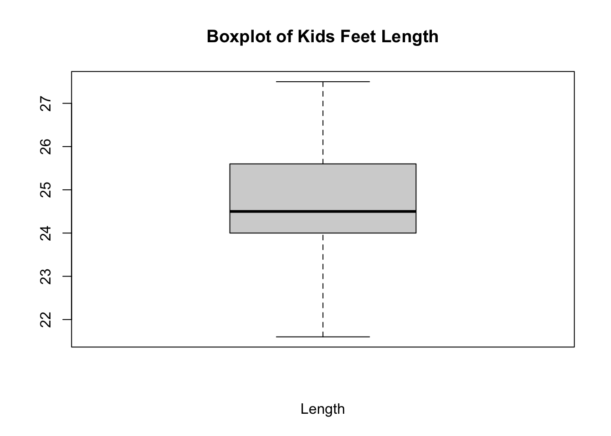{width=672}
:::
:::

::: {.cell}

```{.r .cell-code}
# Dot plot - quantitative
stripchart(KidsFeet$length, method = "jitter", pch = 19, col = "blue", main = "Dot Plot of Kids Feet Length")
```

::: {.cell-output-display}
{width=672}
:::
:::

::: {.cell}

```{.r .cell-code}
# Scatterplot - quantitative
plot(KidsFeet$width, KidsFeet$length, main="Scatterplot of Length vs Width", xlab="Width", ylab="Length")
```

::: {.cell-output-display}
{width=672}
:::
:::

::: {.cell}

```{.r .cell-code}
# Bar plot - categorical
barplot(table(KidsFeet$sex), main="Barplot of Gender Count", col=c("blue","pink"))
```

::: {.cell-output-display}
{width=672}
:::
:::


### D - Answering Specific Questions


::: {.cell}

```{.r .cell-code}
# How many boys and how many girls are in the KidsFeet dataset?
table(KidsFeet$sex)  %>%
  pander()
```

::: {.cell-output-display}

---------
 B    G  
---- ----
 20   19 
---------


:::
:::

::: {.cell}

```{.r .cell-code}
barplot(table(KidsFeet$sex), col=c("blue", "pink"), main="Count of Boys and Girls")
```

::: {.cell-output-display}
{width=672}
:::
:::

::: {.cell}

```{.r .cell-code}
# What is the average length of feet in the KidsFeet dataset?
favstats(KidsFeet$length) %>% pander()
```

::: {.cell-output-display}

-----------------------------------------------------------------
 min    Q1   median    Q3    max    mean     sd     n    missing 
------ ---- -------- ------ ------ ------- ------- ---- ---------
 21.6   24    24.5    25.6   27.5   24.72   1.318   39      0    
-----------------------------------------------------------------


:::
:::

::: {.cell}

```{.r .cell-code}
boxplot(KidsFeet$length, main="Length of Kids Feet")
```

::: {.cell-output-display}
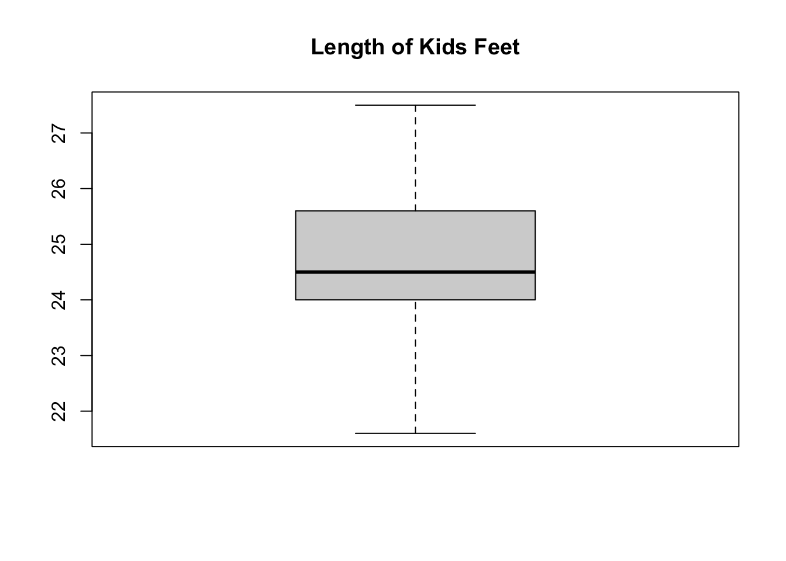{width=672}
:::
:::

::: {.cell}

```{.r .cell-code}
# Do boys or girls have longer feet, on average?
favstats(length~sex, data=KidsFeet) %>% 
  pander()
```

::: {.cell-output-display}

--------------------------------------------------------------------------
 sex   min     Q1     median    Q3    max    mean     sd     n    missing 
----- ------ ------- -------- ------ ------ ------- ------- ---- ---------
  B    22.9   24.35   24.95    25.8   27.5   25.11   1.217   20      0    

  G    21.6   23.65    24.2    25.1   26.7   24.32   1.33    19      0    
--------------------------------------------------------------------------


:::
:::

::: {.cell}

```{.r .cell-code}
boxplot(length~sex, data=KidsFeet, main="Comparing Length of Feet Across Gender", 
        xlab="Gender", ylab="Length of Foot", col=c("blue","pink"))
```

::: {.cell-output-display}
{width=672}
:::
:::

::: {.cell}

```{.r .cell-code}
# Are there certain months of the year associated with longer feet?
favstats(length~birthmonth, data=KidsFeet) %>% 
  pander()
```

::: {.cell-output-display}

----------------------------------------------------------------------------------
 birthmonth   min     Q1     median    Q3     max    mean      sd     n   missing 
------------ ------ ------- -------- ------- ------ ------- -------- --- ---------
     1        21.6   22.5     23.4    24.3    25.2   23.4    2.546    2      0    

     2        25.1   25.6     26.1    26.1    26.1   25.77   0.5774   3      0    

     3        22.9   24.65   25.15    25.77    27    25.14   1.218    8      0    

     4        23.6   23.65    23.7    24.2    24.7    24     0.6083   3      0    

     5        23.6   23.8      24     24.2    24.4    24     0.5657   2      0    

     6         23    23.75     24     24.68   26.7   24.43   1.588    4      0    

     7        22.5   23.45    24.4    25.75   27.1   24.67   2.312    3      0    

     8        23.9   24.45     25     25.55   26.1    25     1.556    2      0    

     9        22.9    24      24.5    24.6    27.5   24.7    1.704    5      0    

     10       24.2   24.5     24.8    25.1    25.4   24.8    0.8485   2      0    

     11       24.2   24.65    25.1    25.55    26    25.1    1.273    2      0    

     12        24    24.25    24.5     25     25.5   24.67   0.7638   3      0    
----------------------------------------------------------------------------------


:::
:::

::: {.cell}

```{.r .cell-code}
boxplot(length~birthmonth, data=KidsFeet, col="navy",
        xlab = "Numerical Birth Month", ylab="Feet Length")
```

::: {.cell-output-display}
{width=672}
:::
:::

::: {.cell}

```{.r .cell-code}
# Is there a relationship between foot length and width?
cor(KidsFeet$length, KidsFeet$width)  %>%
  pander()
```

::: {.cell-output-display}
_0.6411_
:::
:::

::: {.cell}

```{.r .cell-code}
plot(length~width, data=KidsFeet, main="Relationship Between Length and Width of Kids Feet", 
     xlab="Width of Foot", ylab = "Length of Foot")
```

::: {.cell-output-display}
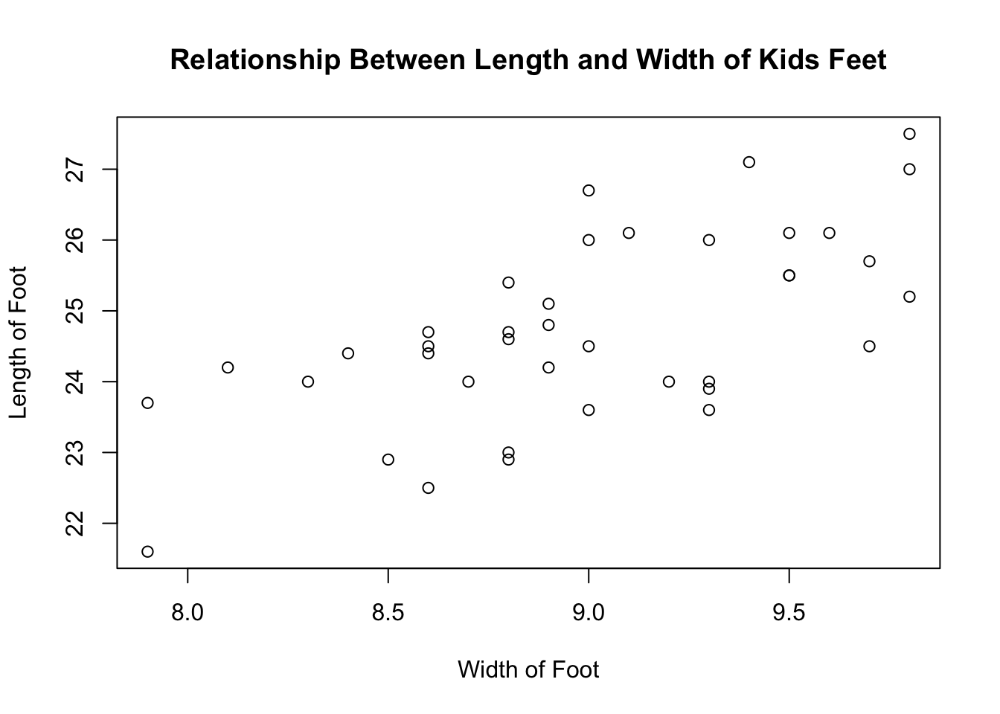{width=672}
:::
:::

::: {.cell}

```{.r .cell-code}
# Is one gender more likely to be born in certain seasons?
Kids3 <- KidsFeet %>% 
  mutate(
    season = case_when(
      birthmonth %in% c(12,1,2) ~ "Winter",
      birthmonth %in% c(3,4,5) ~ "Spring",
      birthmonth %in% c(6,7,8) ~ "Summer",
      birthmonth %in% c(9,10,11) ~ "Fall"
    )
  )  
```
:::

::: {.cell}

```{.r .cell-code}
pander(table(Kids3$season, KidsFeet$sex))
```

::: {.cell-output-display}

--------------------
   &nbsp;     B   G 
------------ --- ---
  **Fall**    4   5 

 **Spring**   6   7 

 **Summer**   5   4 

 **Winter**   5   3 
--------------------


:::
:::

::: {.cell}

```{.r .cell-code}
barplot(table(Kids3$sex, Kids3$season), beside = TRUE,
        col = c("blue","pink"), legend.text=TRUE, 
        xlab="Season", ylab="Frequency", main="Count of Gender by Season")
```

::: {.cell-output-display}
{width=672}
:::
:::


---

# Week 4 Day 1


::: {.cell}

```{.r .cell-code}
library(mosaic)
library(pander)
library(tidyverse)
library(car)
data(KidsFeet)
```
:::


## Parametric Distributions

The four main **parametric distributions** used in statistical tests:

1. **Normal distribution**
2. **t-distribution**
3. **Chi-square distribution**
4. **F-distribution**

These distributions are used in hypothesis testing and confidence interval estimation in STAT 221.

## Parametric vs. Non-Parametric Methods

- **Parametric methods** assume that data follows a specific distribution (e.g., normal distribution).
- **Non-parametric methods** do not require a specific distribution, making them more flexible.
- **When to use non-parametric tests:**  
  - When the assumptions for parametric tests (e.g., normality) **are not met**.  
  - When working with **small sample sizes** or **ordinal data**.  
- **Non-parametric tests** can sometimes be **more powerful** than parametric tests when assumptions are violated.

## Example of a t-Test


::: {.cell}

```{.r .cell-code}
t.test(KidsFeet$length, mu = 25.1, alternative = "two.sided", conf.level = 0.95) %>% pander()
```

::: {.cell-output-display}

--------------------------------------------------------------------
 Test statistic   df   P value   Alternative hypothesis   mean of x 
---------------- ---- --------- ------------------------ -----------
     -1.787       38    0.082          two.sided            24.72   
--------------------------------------------------------------------

Table: One Sample t-test: `KidsFeet$length`


:::
:::


### Hypotheses:

- **Null Hypothesis (H₀):** μ = 25.1  
- **Alternative Hypothesis (Hₐ):** μ ≠ 25.1  
- **Level of significance:** 0.05

If the p-value is greater than alpha (0.05), we fail to reject H₀. Otherwise, we reject H₀.

## Example of a Paired t-Test


::: {.cell}

```{.r .cell-code}
KidsFeet3 <- KidsFeet %>% 
  mutate(width3 = 3 * width, difference = length - width3)

t.test(KidsFeet3$length, KidsFeet3$width3, mu = 0, paired = TRUE, 
       alternative = "two.sided", conf.level = 0.95) %>% pander()
```

::: {.cell-output-display}

----------------------------------------------------------------------------------
 Test statistic   df       P value       Alternative hypothesis   mean difference 
---------------- ---- ----------------- ------------------------ -----------------
     -11.53       38   5.668e-14 * * *         two.sided              -2.254      
----------------------------------------------------------------------------------

Table: Paired t-test: `KidsFeet3$length` and `KidsFeet3$width3`


:::
:::


### Example of an Independent Samples t-Test


::: {.cell}

```{.r .cell-code}
t.test(length ~ sex, data = KidsFeet, alternative = "two.sided", conf.level = 0.95) %>% pander()
```

::: {.cell-output-display}

-----------------------------------------------------------------------------
 Test statistic    df     P value   Alternative hypothesis   mean in group B 
---------------- ------- --------- ------------------------ -----------------
     1.917        36.27   0.06308         two.sided               25.11      
-----------------------------------------------------------------------------

Table: Welch Two Sample t-test: `length` by `sex` (continued below)

 
-----------------
 mean in group G 
-----------------
      24.32      
-----------------


:::
:::


## Checking Assumptions

### Normality Assumption for One-Sample t-Test


::: {.cell}

```{.r .cell-code}
qqPlot(KidsFeet$length)
```

::: {.cell-output-display}
{width=672}
:::

::: {.cell-output .cell-output-stdout}

```
[1] 38 11
```


:::
:::


### Normality Assumption for Paired t-Test


::: {.cell}

```{.r .cell-code}
qqPlot(KidsFeet3$difference)
```

::: {.cell-output-display}
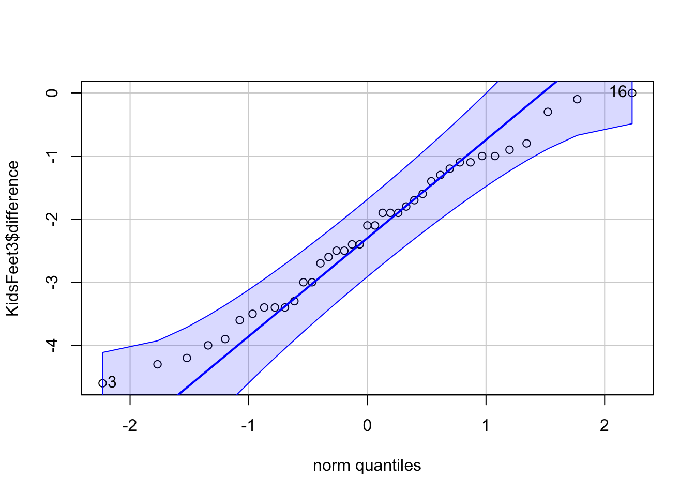{width=672}
:::

::: {.cell-output .cell-output-stdout}

```
[1]  3 16
```


:::
:::


### Normality Assumption for Independent Samples t-Test


::: {.cell}

```{.r .cell-code}
qqPlot(KidsFeet$length)
```

::: {.cell-output-display}
{width=672}
:::

::: {.cell-output .cell-output-stdout}

```
[1] 38 11
```


:::
:::


## Graphics

### Boxplot for One-Sample t-Test


::: {.cell}

```{.r .cell-code}
boxplot(KidsFeet$length)
```

::: {.cell-output-display}
{width=672}
:::
:::

::: {.cell}

```{.r .cell-code}
ggplot(data = KidsFeet, aes(x = length)) + 
  geom_boxplot(fill = "skyblue")
```

::: {.cell-output-display}
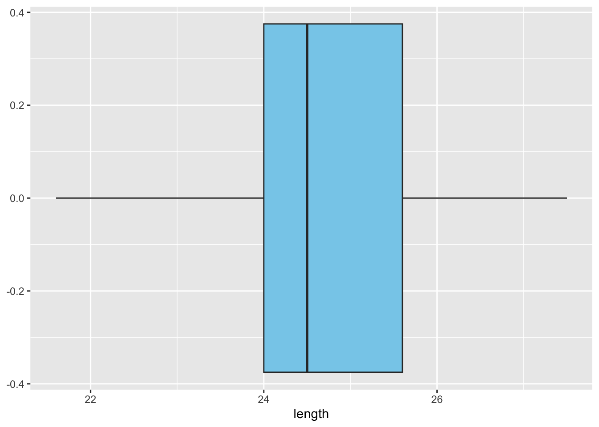{width=672}
:::
:::


### Boxplot for Paired t-Test


::: {.cell}

```{.r .cell-code}
boxplot(KidsFeet3$difference)
```

::: {.cell-output-display}
{width=672}
:::
:::

::: {.cell}

```{.r .cell-code}
ggplot(data = KidsFeet3, aes(x = difference)) + 
  geom_boxplot(fill = "skyblue")
```

::: {.cell-output-display}
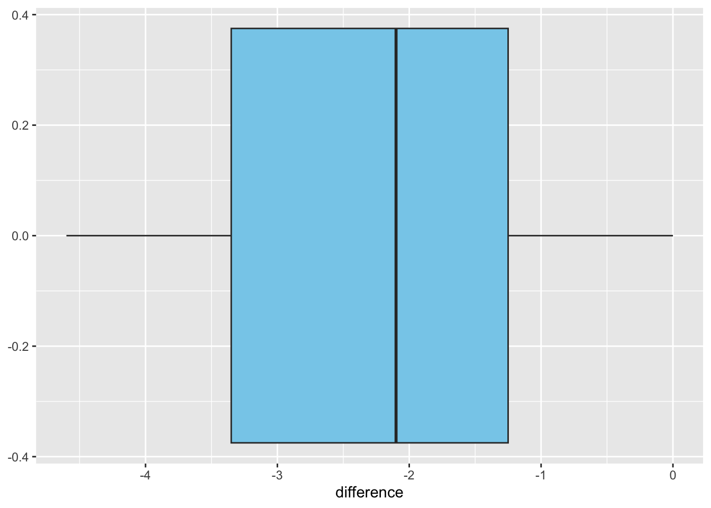{width=672}
:::
:::


### Boxplot for Independent Samples t-Test


::: {.cell}

```{.r .cell-code}
boxplot(length ~ sex, data = KidsFeet)
```

::: {.cell-output-display}
{width=672}
:::
:::

::: {.cell}

```{.r .cell-code}
ggplot(data = KidsFeet, aes(y = length, x = sex)) +
  geom_boxplot(fill = c("skyblue", "pink"))
```

::: {.cell-output-display}
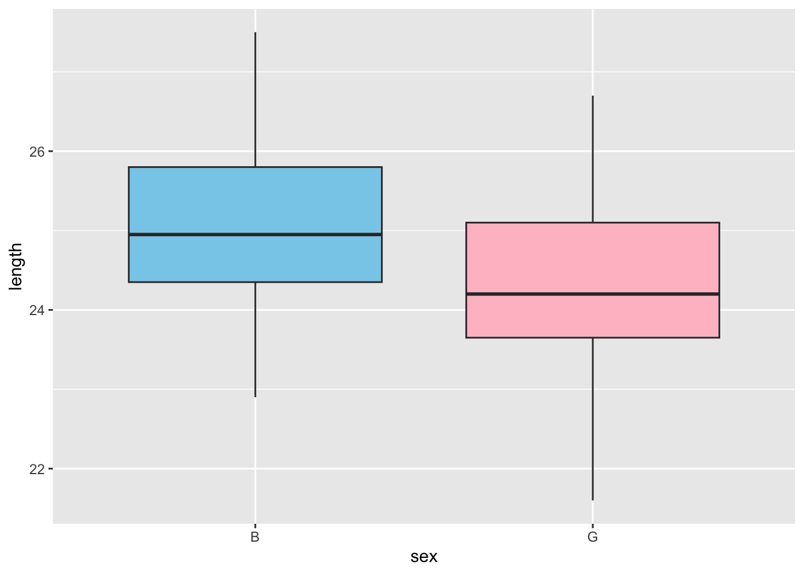{width=672}
:::
:::


## Numerical Summaries


::: {.cell}

```{.r .cell-code}
pander(favstats(~length, data = KidsFeet))
```

::: {.cell-output-display}

-----------------------------------------------------------------
 min    Q1   median    Q3    max    mean     sd     n    missing 
------ ---- -------- ------ ------ ------- ------- ---- ---------
 21.6   24    24.5    25.6   27.5   24.72   1.318   39      0    
-----------------------------------------------------------------


:::
:::

::: {.cell}

```{.r .cell-code}
pander(favstats(~difference, data = KidsFeet3))
```

::: {.cell-output-display}

----------------------------------------------------------------------------
 min     Q1     median    Q3        max        mean     sd     n    missing 
------ ------- -------- ------- ------------ -------- ------- ---- ---------
 -4.6   -3.35    -2.1    -1.25   -3.553e-15   -2.254   1.221   39      0    
----------------------------------------------------------------------------


:::
:::

::: {.cell}

```{.r .cell-code}
pander(favstats(length ~ sex, data = KidsFeet))
```

::: {.cell-output-display}

--------------------------------------------------------------------------
 sex   min     Q1     median    Q3    max    mean     sd     n    missing 
----- ------ ------- -------- ------ ------ ------- ------- ---- ---------
  B    22.9   24.35   24.95    25.8   27.5   25.11   1.217   20      0    

  G    21.6   23.65    24.2    25.1   26.7   24.32   1.33    19      0    
--------------------------------------------------------------------------


:::
:::


## Writing Hypotheses in LaTeX

$$
H_0: \mu = 10 \\
$$

$$
H_a: \mu \neq 10
$$

---

# Week 6 Day 1


::: {.cell}

```{.r .cell-code}
library(pander)
library(mosaic)
library(tidyverse)
library(lattice)
data(airquality)
data(chickwts)
data(warpbreaks)
```
:::


## ANOVA Analysis

### Tasks
1. Find the ANOVA using Statistics Notebook.
2. Compare the difference between t-test and ANOVA using the `index.html` file.
3. Go through the Overview, Explanation, and Instructions in the Textbook.

## Defining Factor and Levels in `airquality`
- The `Month` variable in the `airquality` dataset is a factor with levels: 5, 6, 7, 8, and 9.

## Two-Way ANOVA Preview
- We will cover **two-way ANOVA** next week.

## Numerical and Graphical Summary - `airquality`


::: {.cell}

```{.r .cell-code}
boxplot(Wind ~ Month, data = airquality)
```

::: {.cell-output-display}
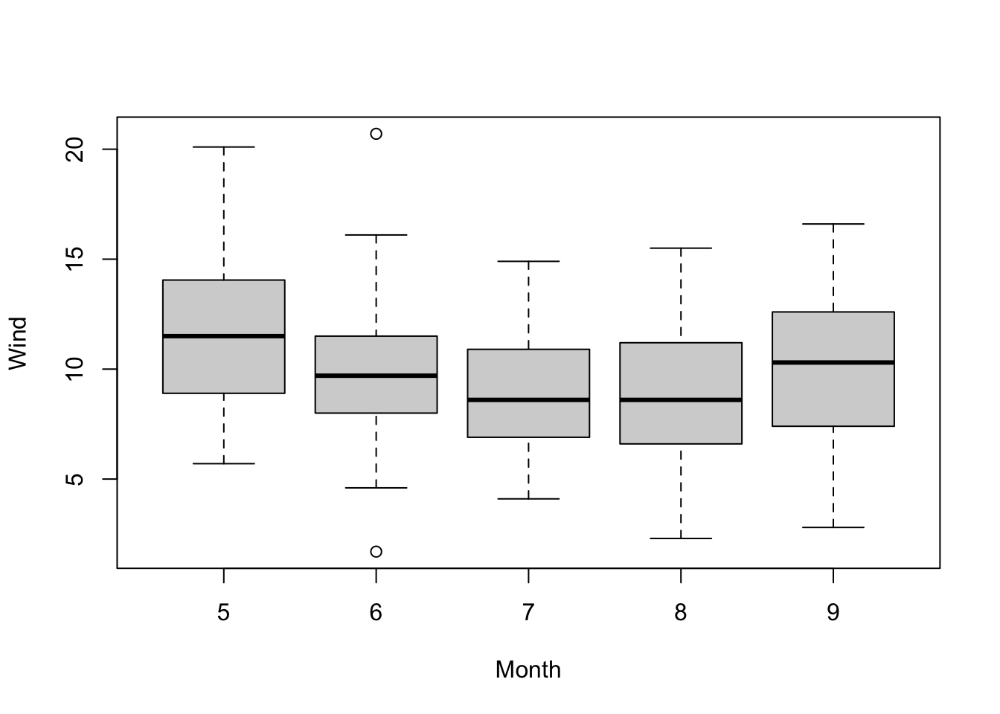{width=672}
:::

```{.r .cell-code}
ggplot(data = airquality, aes(x = as.factor(Month), y = Wind)) +
  geom_boxplot(fill = c("blue", "red", "yellow", "green", "purple"))
```

::: {.cell-output-display}
{width=672}
:::

```{.r .cell-code}
pander(favstats(Wind ~ Month, data = airquality))
```

::: {.cell-output-display}

---------------------------------------------------------------------------
 Month   min    Q1    median    Q3     max    mean     sd     n    missing 
------- ----- ------ -------- ------- ------ ------- ------- ---- ---------
   5     5.7   8.9     11.5    14.05   20.1   11.62   3.531   31      0    

   6     1.7    8      9.7     11.5    20.7   10.27   3.769   30      0    

   7     4.1   6.9     8.6     10.9    14.9   8.942   3.036   31      0    

   8     2.3   6.6     8.6     11.2    15.5   8.794   3.226   31      0    

   9     2.8   7.55    10.3    12.32   16.6   10.18   3.461   30      0    
---------------------------------------------------------------------------


:::
:::


## One-Way ANOVA - `airquality`


::: {.cell}

```{.r .cell-code}
airq.aov <- aov(Wind ~ as.factor(Month), data = airquality)
pander(summary(airq.aov))
```

::: {.cell-output-display}

-------------------------------------------------------------------
        &nbsp;          Df    Sum Sq   Mean Sq   F value   Pr(>F)  
---------------------- ----- -------- --------- --------- ---------
 **as.factor(Month)**    4    164.3     41.07     3.529    0.00879 

    **Residuals**       148    1722     11.64      NA        NA    
-------------------------------------------------------------------

Table: Analysis of Variance Model


:::
:::


## Checking Assumptions


::: {.cell}

```{.r .cell-code}
par(mfrow = c(1, 2))
plot(airq.aov, which = 1:2)
```

::: {.cell-output-display}
{width=672}
:::

```{.r .cell-code}
par(mfrow = c(1, 1))
```
:::


## One-Way ANOVA - `chickwts`

### Hypotheses
$$ H_0: \mu_1 = \mu_2 = \mu_3 = \mu_4 = \mu_5 = \mu_6 $$
$$ H_a: \text{at least one } \mu \text{ is different} $$

### Numerical and Graphical Summary


::: {.cell}

```{.r .cell-code}
boxplot(weight ~ feed, data = chickwts)
```

::: {.cell-output-display}
{width=672}
:::

```{.r .cell-code}
ggplot(data = chickwts, aes(y = weight, x = feed)) +
  geom_boxplot(fill = c("blue", "white", "green", "yellow", "orange", "brown"))
```

::: {.cell-output-display}
{width=672}
:::

```{.r .cell-code}
xyplot(weight ~ feed, data = chickwts,
       main = "Effect of Feed Type on Chicken Growth",
       ylab = "Adult Weight of Chickens (g)",
       xlab = "Type of Feed (Blue line shows mean weights per type)",
       type = c("p", "a"))
```

::: {.cell-output-display}
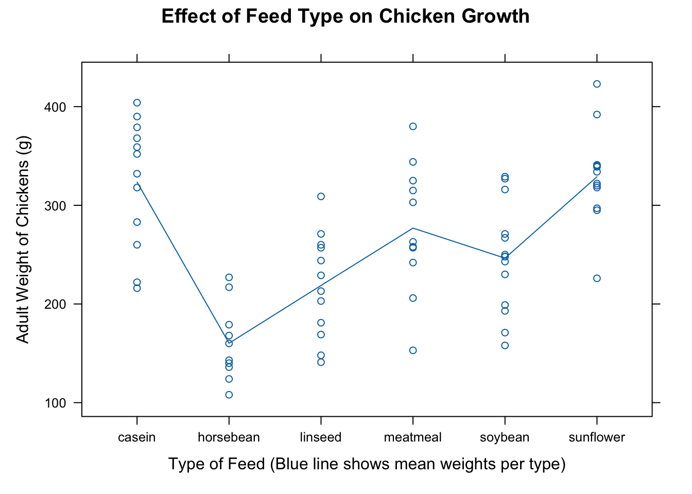{width=672}
:::

```{.r .cell-code}
pander(favstats(weight ~ feed, data = chickwts)[, c("feed", "mean", "sd", "n")])
```

::: {.cell-output-display}

--------------------------------
   feed      mean     sd     n  
----------- ------- ------- ----
  casein     323.6   64.43   12 

 horsebean   160.2   38.63   10 

  linseed    218.8   52.24   12 

 meatmeal    276.9   64.9    11 

  soybean    246.4   54.13   14 

 sunflower   328.9   48.84   12 
--------------------------------


:::
:::


## One-Way ANOVA - `chickwts`


::: {.cell}

```{.r .cell-code}
chickwt.aov <- aov(weight ~ feed, data = chickwts)
pander(summary(chickwt.aov))
```

::: {.cell-output-display}

-------------------------------------------------------------
    &nbsp;       Df   Sum Sq   Mean Sq   F value    Pr(>F)   
--------------- ---- -------- --------- --------- -----------
   **feed**      5    231129    46226     15.36    5.936e-10 

 **Residuals**   65   195556    3009       NA         NA     
-------------------------------------------------------------

Table: Analysis of Variance Model


:::
:::


## Checking Assumptions


::: {.cell}

```{.r .cell-code}
par(mfrow = c(1, 2))
plot(chickwt.aov, which = 1:2)
```

::: {.cell-output-display}
{width=672}
:::
:::


## Two-Way ANOVA - `warpbreaks`

### Hypotheses
$$ H_0: \mu_1 = \mu_2 = \mu_3 = \mu \text{ for tension} $$
$$ H_a: \text{at least one } \mu \text{ is different for tension} $$
$$ H_0: \mu_1 = \mu_2 = \mu \text{ for wool} $$
$$ H_a: \text{at least one } \mu \text{ is different for wool} $$
$$ H_0: \text{ The effect of tension is the same for all types of wool} $$
$$ H_a: \text{ The effect of tension is not the same for all types of wool} $$

## Numerical Summaries - `warpbreaks`


::: {.cell}

```{.r .cell-code}
warpbreaks %>% 
  group_by(tension) %>% 
  summarise(ave = mean(breaks), sd = sd(breaks), SampleSize = n()) %>% pander()
```

::: {.cell-output-display}

--------------------------------------
 tension    ave     sd     SampleSize 
--------- ------- ------- ------------
    L      36.39   16.45       18     

    M      26.39   9.121       18     

    H      21.67   8.353       18     
--------------------------------------


:::

```{.r .cell-code}
warpbreaks %>% 
  group_by(wool) %>% 
  summarise(ave = mean(breaks), sd = sd(breaks), SampleSize = n()) %>% pander()
```

::: {.cell-output-display}

-----------------------------------
 wool    ave     sd     SampleSize 
------ ------- ------- ------------
  A     31.04   15.85       27     

  B     25.26   9.301       27     
-----------------------------------


:::

```{.r .cell-code}
warpbreaks %>% 
  group_by(wool, tension) %>% 
  summarise(ave = mean(breaks), sd = sd(breaks), SampleSize = n()) %>% pander()
```

::: {.cell-output-display}

---------------------------------------------
 wool   tension    ave     sd     SampleSize 
------ --------- ------- ------- ------------
  A        L      44.56   18.1        9      

  A        M       24     8.66        9      

  A        H      24.56   10.27       9      

  B        L      28.22   9.859       9      

  B        M      28.78   9.431       9      

  B        H      18.78   4.893       9      
---------------------------------------------


:::
:::


## Graphical Summaries - `warpbreaks`


::: {.cell}

```{.r .cell-code}
xyplot(breaks ~ wool, data = warpbreaks, type = c("p", "a"),
       main = "Type of Wool", col = 'blue',
       xlab = "Type of Wool", ylab = "Number of Warps that Broke")
```

::: {.cell-output-display}
{width=672}
:::

```{.r .cell-code}
xyplot(breaks ~ tension, data = warpbreaks, type = c("p", "a"),
       main = "Type of Tension", col = 'blue',
       xlab = "Type of Tension", ylab = "Number of Warps that Broke")
```

::: {.cell-output-display}
{width=672}
:::

```{.r .cell-code}
xyplot(breaks ~ tension, data = warpbreaks, groups = wool, type = c("p", "a"),
       main = "Significance of Interaction",
       auto.key = list(corner = c(1, 1)))
```

::: {.cell-output-display}
{width=672}
:::
:::


## Inferential Statistics - `warpbreaks`


warp.aov <- aov(breaks ~ wool + tension + wool:tension, data = warpbreaks)
pander(summary(warp.aov))

par(mfrow = c(1, 2))
plot(warp.aov, which = 1:2, pch = 16)

