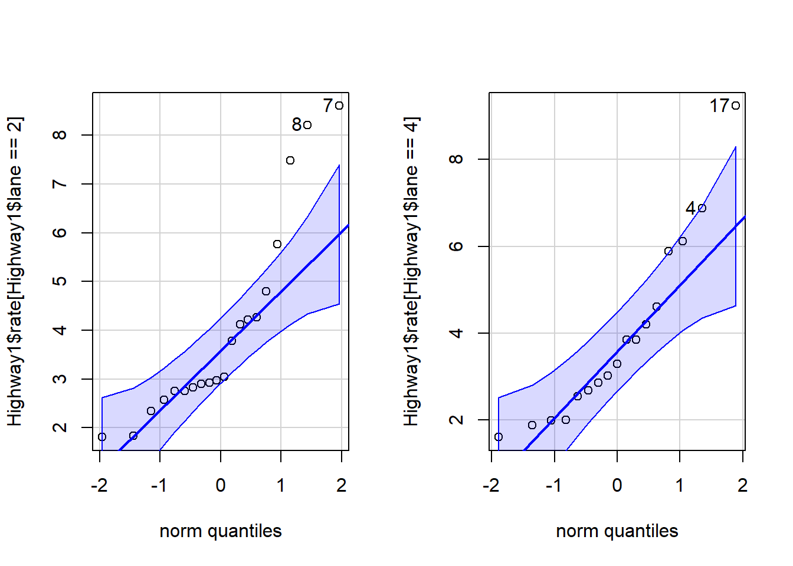
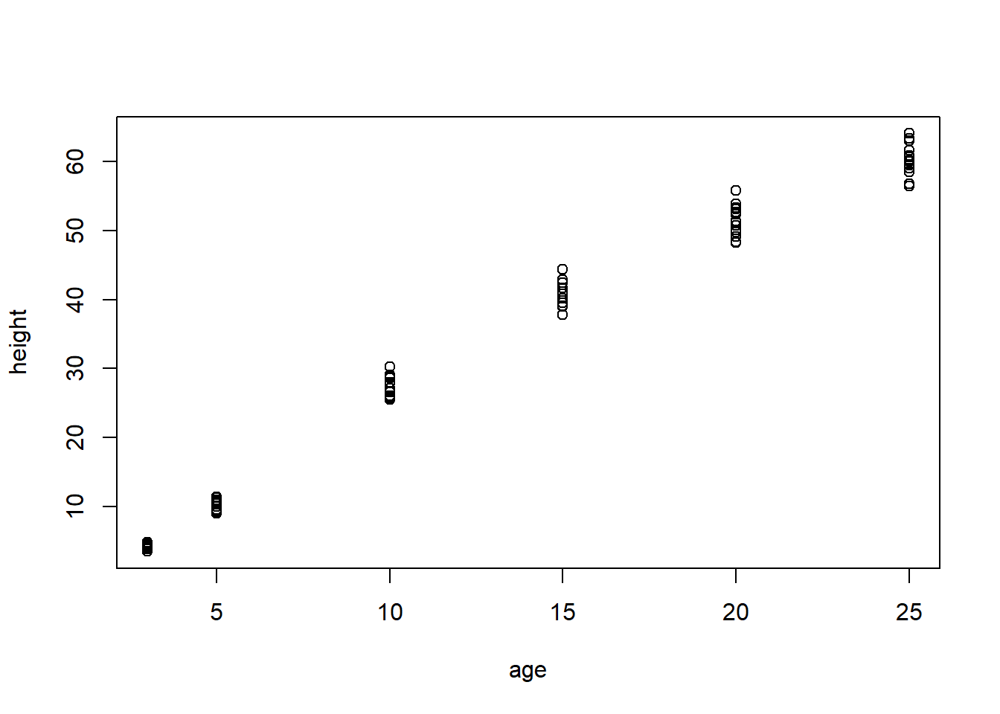

::: {.cell}

```{.r .cell-code}
pacman::p_load(mosaic, pander, tidyverse, car, lattice, DT, alr4, ResourceSelection)
```
:::


## Question 1
Use an appropriate test and the starwars dataset in R to determine if, on average, the species of Wookiees, Gungans, or Kaminoans are taller.


::: {.cell}

```{.r .cell-code}
# 3 CATEGORICAL VARIABLES + 1 QUANTITATIVE = ANOVA

# Load the tidyverse
library(tidyverse)

# Filter the starwars dataset to only include the 3 species of interest
sw_subset <- starwars %>%
  filter(species %in% c("Wookiee", "Gungan", "Kaminoan")) %>%
  select(name, species, height) %>%
  drop_na(height)

# Check how many individuals per group
table(sw_subset$species)
```

::: {.cell-output .cell-output-stdout}

```

  Gungan Kaminoan  Wookiee 
       3        2        2 
```


:::

```{.r .cell-code}
# Run the ANOVA test
anova_result <- aov(height ~ species, data = sw_subset)

# View the results
summary(anova_result) %>%
  pander()
```

::: {.cell-output-display}

----------------------------------------------------------
    &nbsp;       Df   Sum Sq   Mean Sq   F value   Pr(>F) 
--------------- ---- -------- --------- --------- --------
  **species**    2     615      307.5     2.242    0.2223 

 **Residuals**   4    548.7     137.2      NA        NA   
----------------------------------------------------------

Table: Analysis of Variance Model


:::
:::


## Question 2
Use the Highway1 dataset in R to answer this question. Suppose someone wanted to perform a t Test of the hypotheses

 H0:μ2 Lanes=μ4 Lanes

 Ha:μ2 Lanes≠μ4 Lanes
 
where  μ2 Lanes represents the 1973 accident rate (per million vehicle miles) on 2 lane highways, and  μ4 Lanes  represents the 1973 accident rate (per million vehicle miles) on 4 lane highways.

Which of the following statements would be most correct concerning the appropriateness of performing this test for this data?
	
- This test is appropriate for these data because even though the data is not normal, the sample size is over 30.

- This test would not be appropriate for this data because there are too many ties in the data so the p-value is not exact.
	
__- This test would not be appropriate for this data because of the small sample sizes of each group and non-normality of the data.__

- This test is appropriate for these data because there is only one tie in the data, so the non exact p-value is still meaningful.


::: {.cell}

```{.r .cell-code}
# CHECKING ASSUMPTIONS FOR INDEPENDENT SAMPLE T TEST

# Load required packages  
library(car)      # For qqPlot function  
  
# We assume the variable 'rate' represents the 1973 accident rate per million vehicle miles,  
# and the variable 'lane' represents the number of lanes.  
# For this example, we consider lane==2 as 2-lane highways and lane==4 as 4-lane highways.  

# SAMPLE SIZES:
n_2lane <- sum(Highway1$lane == 2)
n_2lane #20
```

::: {.cell-output .cell-output-stdout}

```
[1] 20
```


:::

```{.r .cell-code}
n_4lane <- sum(Highway1$lane == 4)
n_4lane #17
```

::: {.cell-output .cell-output-stdout}

```
[1] 17
```


:::

```{.r .cell-code}
# NORMALITY CHECKS:
# Set up side-by-side plots for QQ plots:  
par(mfrow = c(1, 2))  
  
# QQ Plot for 2-lane highways  
qqPlot(Highway1$rate[Highway1$lane == 2])  
```

::: {.cell-output .cell-output-stdout}

```
[1] 7 8
```


:::

```{.r .cell-code}
# QQ Plot for 4-lane highways  
qqPlot(Highway1$rate[Highway1$lane == 4])
```

::: {.cell-output-display}
{width=672}
:::

::: {.cell-output .cell-output-stdout}

```
[1] 17  4
```


:::
:::


## 3 

Run the following code in R.

  > plot(height ~ age, data=Loblolly)

Is it appropriate to perform a simple linear regression on this data?

__- No, there is a strong non-linear pattern in the residual plot.__

- No, while the data is linear, there is non-constant variance.

- Yes, the regression requirements all appear to be well satisfied.

- Yes, but there is some difficulty with the normality of the residuals.


::: {.cell}

```{.r .cell-code}
plot(height ~ age, data=Loblolly)
```

::: {.cell-output-display}
{width=672}
:::

```{.r .cell-code}
# PLOT SHOWS heteroscedasticity. MEANING, Constant Variance Assumption is Violated
```
:::
