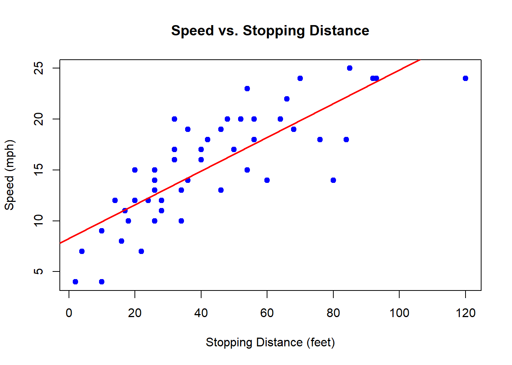
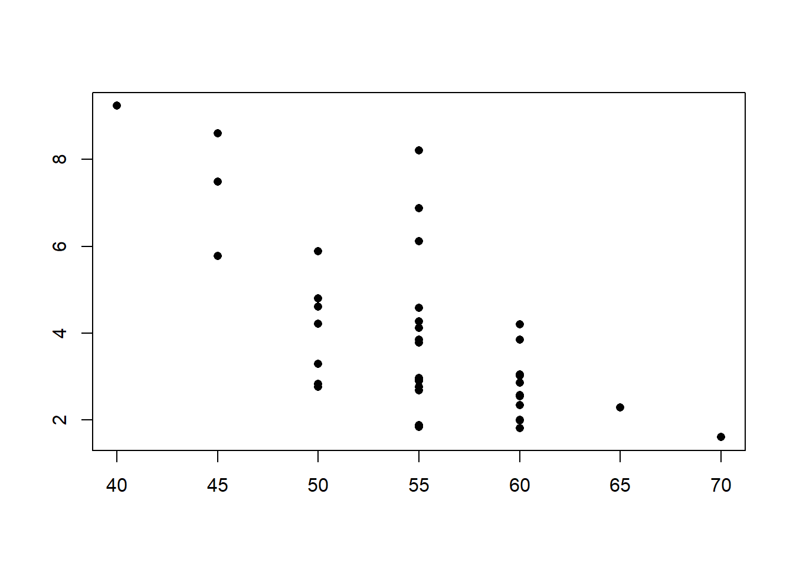
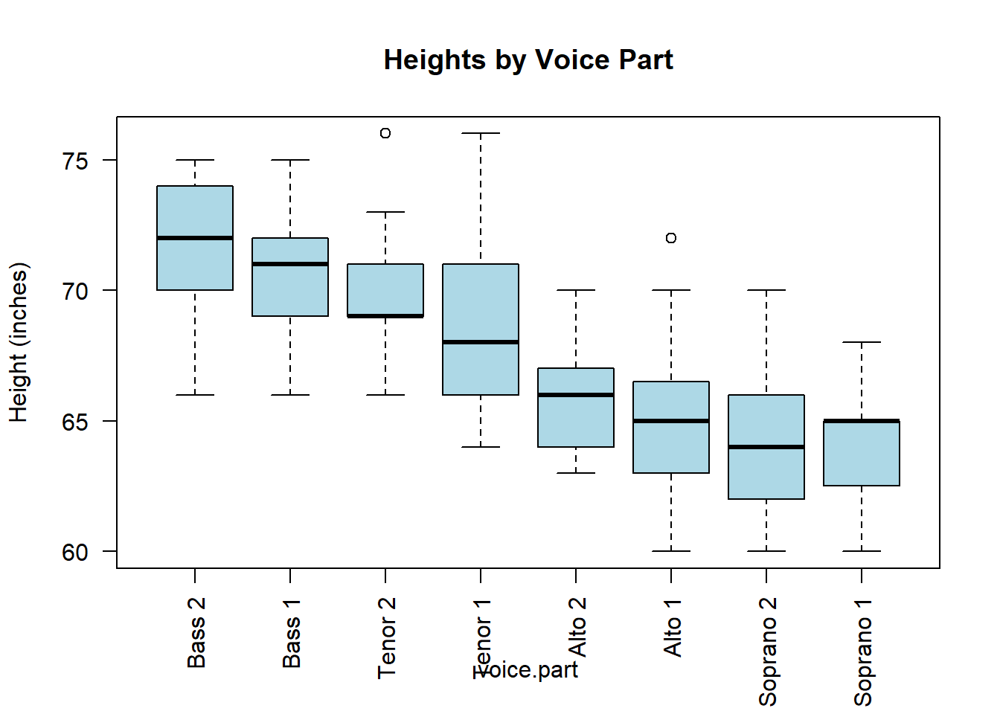
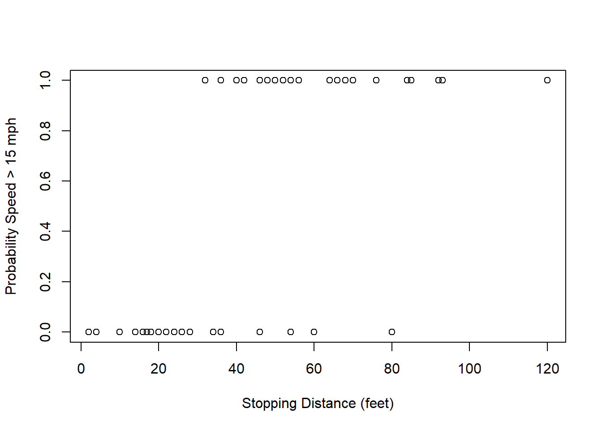
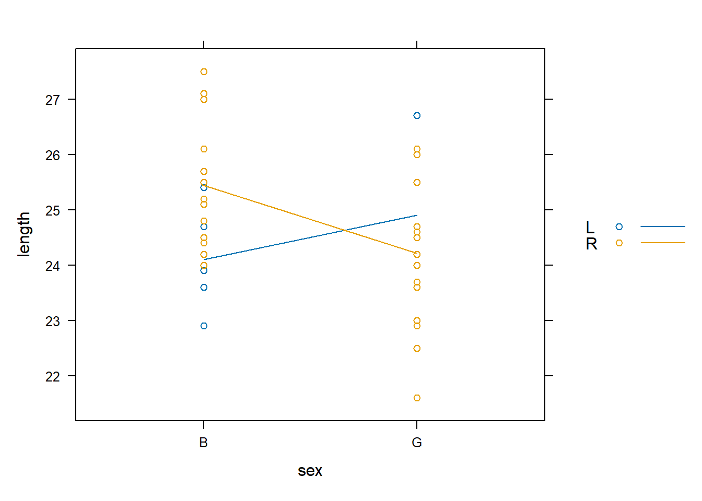
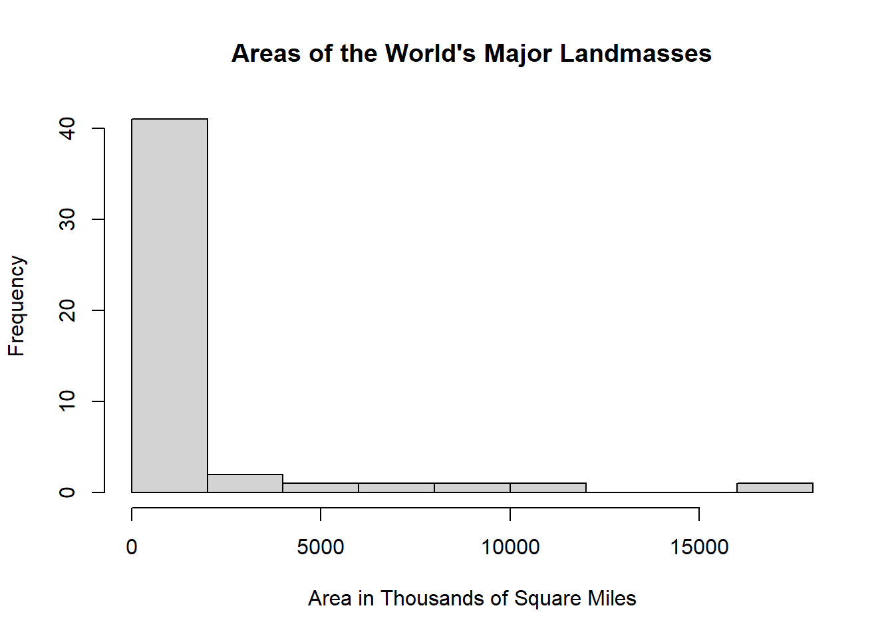
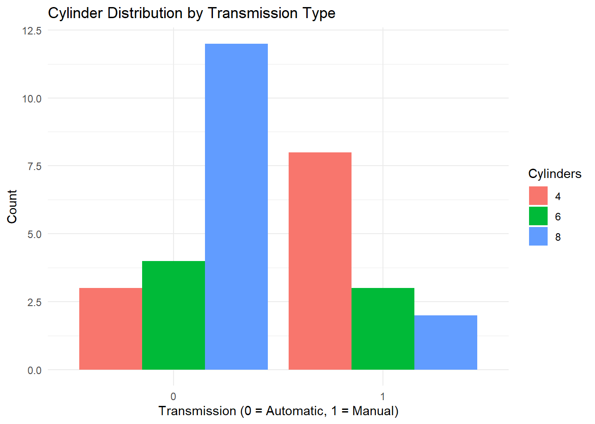
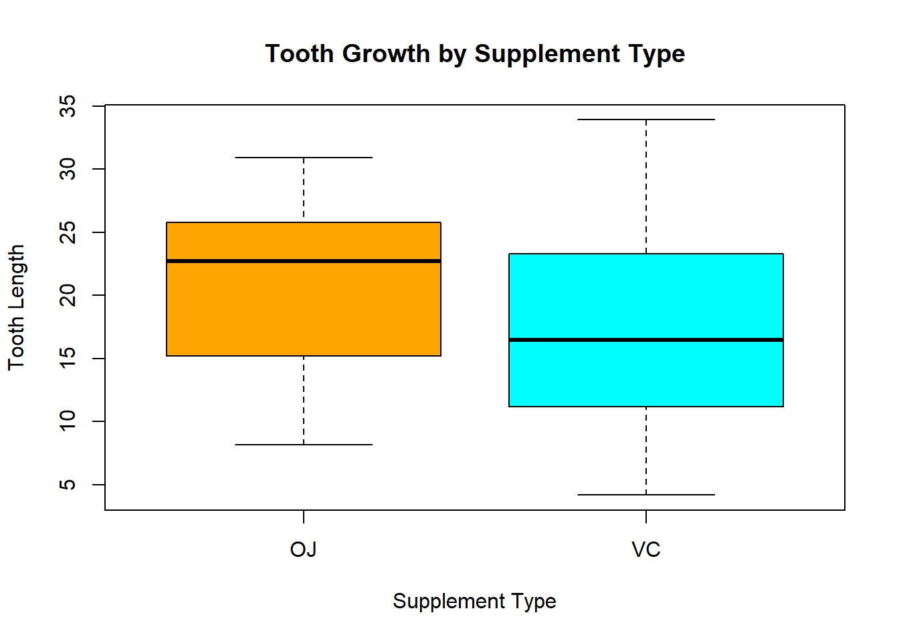

::: {.cell}

```{.r .cell-code}
pacman::p_load(mosaic, pander, tidyverse, car, lattice, DT, alr4, ResourceSelection, dplyr, AER)
```
:::


## Question 1
Use an appropriate test and the starwars dataset in R to determine if, on average, the species of Wookiees, Gungans, or Kaminoans are taller.


::: {.cell}

```{.r .cell-code}
# 3 CATEGORICAL VARIABLES + 1 QUANTITATIVE = ANOVA

# Load the tidyverse
library(tidyverse)

# Filter the starwars dataset to only include the 3 species of interest
sw_subset <- starwars %>%
  filter(species %in% c("Wookiee", "Gungan", "Kaminoan")) %>%
  select(name, species, height) %>%
  drop_na(height)

# Check how many individuals per group
table(sw_subset$species)
```

::: {.cell-output .cell-output-stdout}

```

  Gungan Kaminoan  Wookiee 
       3        2        2 
```


:::

```{.r .cell-code}
# Run the ANOVA test
anova_result <- aov(height ~ species, data = sw_subset)

# View the results
summary(anova_result) %>%
  pander()
```

::: {.cell-output-display}

----------------------------------------------------------
    &nbsp;       Df   Sum Sq   Mean Sq   F value   Pr(>F) 
--------------- ---- -------- --------- --------- --------
  **species**    2     615      307.5     2.242    0.2223 

 **Residuals**   4    548.7     137.2      NA        NA   
----------------------------------------------------------

Table: Analysis of Variance Model


:::
:::


## Question 2
Use the Highway1 dataset in R to answer this question. Suppose someone wanted to perform a t Test of the hypotheses

 H0:μ2 Lanes=μ4 Lanes

 Ha:μ2 Lanes≠μ4 Lanes
 
where  μ2 Lanes represents the 1973 accident rate (per million vehicle miles) on 2 lane highways, and  μ4 Lanes  represents the 1973 accident rate (per million vehicle miles) on 4 lane highways.

Which of the following statements would be most correct concerning the appropriateness of performing this test for this data?
	
- This test is appropriate for these data because even though the data is not normal, the sample size is over 30.

- This test would not be appropriate for this data because there are too many ties in the data so the p-value is not exact.
	
__- This test would not be appropriate for this data because of the small sample sizes of each group and non-normality of the data.__

- This test is appropriate for these data because there is only one tie in the data, so the non exact p-value is still meaningful.


::: {.cell}

```{.r .cell-code}
# CHECKING ASSUMPTIONS FOR INDEPENDENT SAMPLE T TEST

# Load required packages  
library(car)      # For qqPlot function  
data("Highway1")

# We assume the variable 'rate' represents the 1973 accident rate per million vehicle miles,  
# and the variable 'lane' represents the number of lanes.  
# For this example, we consider lane==2 as 2-lane highways and lane==4 as 4-lane highways.  

# SAMPLE SIZES:
n_2lane <- sum(Highway1$lane == 2)
n_2lane #20
```

::: {.cell-output .cell-output-stdout}

```
[1] 20
```


:::

```{.r .cell-code}
n_4lane <- sum(Highway1$lane == 4)
n_4lane #17
```

::: {.cell-output .cell-output-stdout}

```
[1] 17
```


:::

```{.r .cell-code}
# NORMALITY CHECKS:
# Set up side-by-side plots for QQ plots:  
par(mfrow = c(1, 2))  
  
# QQ Plot for 2-lane highways  
qqPlot(Highway1$rate[Highway1$lane == 2])  
```

::: {.cell-output .cell-output-stdout}

```
[1] 7 8
```


:::

```{.r .cell-code}
# QQ Plot for 4-lane highways  
qqPlot(Highway1$rate[Highway1$lane == 4])
```

::: {.cell-output-display}
{width=672}
:::

::: {.cell-output .cell-output-stdout}

```
[1] 17  4
```


:::
:::


## 3 

Run the following code in R.

  > plot(height ~ age, data=Loblolly)

Is it appropriate to perform a simple linear regression on this data?

__- No, there is a strong non-linear pattern in the residual plot.__

- No, while the data is linear, there is non-constant variance.

- Yes, the regression requirements all appear to be well satisfied.

- Yes, but there is some difficulty with the normality of the residuals.


::: {.cell}

```{.r .cell-code}
plot(height ~ age, data=Loblolly)
```

::: {.cell-output-display}
{width=672}
:::

```{.r .cell-code}
# PLOT SHOWS heteroscedasticity. MEANING, Constant Variance Assumption is Violated
```
:::


## 4

Which analysis would allow you to predict whether or not it will rain on a given day based on the low temperature of that day?

Chi-squared Test

Paired Samples t Test

__Logistic Regression__
	
Linear Regression

## 5

Use the sample of children's feet contained in the KidsFeet dataset to answer this question.

Why might a Wilcoxon Rank Sum Test not be appropriate for testing to see if the median width of a child's foot differs for boys and girls?

- The data is paired so a Wilcoxon Signed-Rank Test should be used instead.

__- There are many ties in the data so the exact p-value cannot be computed.__

- Foot width is quantitative so only a t Test could be used for this data.

- The data is not normal so the requirements of the test are not satisfied.


::: {.cell}

```{.r .cell-code}
# Check number of ties in the 'width' column
table(KidsFeet$width)
```

::: {.cell-output .cell-output-stdout}

```

7.9 8.1 8.3 8.4 8.5 8.6 8.7 8.8 8.9   9 9.1 9.2 9.3 9.4 9.5 9.6 9.7 9.8 
  2   1   1   1   1   4   1   5   3   4   1   1   4   1   3   1   2   3 
```


:::

```{.r .cell-code}
# The Wilcoxon Rank Sum Test (also known as the Mann-Whitney U test) is a non-parametric test used to compare two independent groups when the assumption of normality may not be met.

# However, it assumes that the ranks of the data can be meaningfully ordered. When many tied values exist (as might happen in small datasets or datasets with limited numeric precision), it complicates the rank-based calculations, and the exact p-value cannot be computed.
```
:::


## 6
Use the Highway1 dataset in R for this question.

Compute the average accident rate (per million vehicle miles) in 1973 for each type of roadway: `MC`, `FAI`, `PA`, and `MA`.

__htype     rate__
__1   FAI 2.872000__
__2    MA 4.870000__
__3    MC 3.585000__
__4    PA 3.608421__


::: {.cell}

```{.r .cell-code}
#?Highway1
#View(Highway1)

library(car)
data(Highway1)

View(Highway1)

aggregate(rate ~ htype, data = Highway1, FUN = mean)
```

::: {.cell-output-display}

`````{=html}
<div data-pagedtable="false">
  <script data-pagedtable-source type="application/json">
{"columns":[{"label":["htype"],"name":[1],"type":["fct"],"align":["left"]},{"label":["rate"],"name":[2],"type":["dbl"],"align":["right"]}],"data":[{"1":"FAI","2":"2.872000"},{"1":"MA","2":"4.870000"},{"1":"MC","2":"3.585000"},{"1":"PA","2":"3.608421"}],"options":{"columns":{"min":{},"max":[10]},"rows":{"min":[10],"max":[10]},"pages":{}}}
  </script>
</div>
`````

:::
:::


## 7
Consider the barplot below and the hypothesis that gender and preference for DC or Marvel comics is independent.

If this hypothesis is tested with an appropriate test using the data of this plot, what is the p-value of the test?

Note: DC comics include Superman, Batman, Green Latern, The Flash, and Wonder Woman. Marvel comics include Spiderman, Ironman, Captain America, Thor, and The X-Men.

| Comic Preference | Male | Female |
|------------------|------|--------|
| Marvel           | 22   | 43     |
| DC               | 27   | 8      |


::: {.cell}

```{.r .cell-code}
# Create a matrix with the observed counts
comic_data <- matrix(c(22, 27, 43, 8), 
                     nrow = 2, 
                     byrow = TRUE)

# Add row and column names
rownames(comic_data) <- c("Male", "Female")
colnames(comic_data) <- c("Marvel", "DC")

# View the table
comic_data
```

::: {.cell-output .cell-output-stdout}

```
       Marvel DC
Male       22 27
Female     43  8
```


:::

```{.r .cell-code}
# Chi-square test of independence
test_result <- chisq.test(comic_data)

# View the p-value
test_result$p.value
```

::: {.cell-output .cell-output-stdout}

```
[1] 8.804708e-05
```


:::
:::


## 8

In the KidsFeet dataset in R, there are three names of the children that occur twice, while all the other names occur only once. Compute the average foot width for the three names that occur more than once. Select the answer below that shows these three averages.


::: {.cell}

```{.r .cell-code}
# Load the Dataset
library(mosaicData)
data(KidsFeet)

# Find Duplicated Names
name_counts <- table(KidsFeet$name)
name_counts
```

::: {.cell-output .cell-output-stdout}

```

    Abby   Alisha     Andy  Caitlin      Cal      Cam Caroline    Damon 
       1        1        1        2        1        1        1        1 
Danielle    David   Dwayne    Dylan   Edward  Eleanor    Erica     Glen 
       1        2        1        1        1        1        1        1 
  Hannah   Hayley  Heather     Josh    Julie     Kate     Lang     Lars 
       1        1        1        2        1        1        1        1 
   Laura      Lee    Leigh   Maggie     Mark     Mike    Peggy    Peter 
       1        1        1        1        1        1        1        1 
     Ray   Scotty Teshanna     Zach 
       1        1        1        1 
```


:::

```{.r .cell-code}
duplicated_names <- names(name_counts[name_counts > 1])
duplicated_names
```

::: {.cell-output .cell-output-stdout}

```
[1] "Caitlin" "David"   "Josh"   
```


:::

```{.r .cell-code}
# Filter the Dataset for Duplicated Names
dup_data <- subset(KidsFeet, name %in% duplicated_names)
dup_data
```

::: {.cell-output-display}

`````{=html}
<div data-pagedtable="false">
  <script data-pagedtable-source type="application/json">
{"columns":[{"label":[""],"name":["_rn_"],"type":[""],"align":["left"]},{"label":["name"],"name":[1],"type":["fct"],"align":["left"]},{"label":["birthmonth"],"name":[2],"type":["int"],"align":["right"]},{"label":["birthyear"],"name":[3],"type":["int"],"align":["right"]},{"label":["length"],"name":[4],"type":["dbl"],"align":["right"]},{"label":["width"],"name":[5],"type":["dbl"],"align":["right"]},{"label":["sex"],"name":[6],"type":["fct"],"align":["left"]},{"label":["biggerfoot"],"name":[7],"type":["fct"],"align":["left"]},{"label":["domhand"],"name":[8],"type":["fct"],"align":["left"]}],"data":[{"1":"David","2":"5","3":"88","4":"24.4","5":"8.4","6":"B","7":"L","8":"R","_rn_":"1"},{"1":"Josh","2":"1","3":"88","4":"25.2","5":"9.8","6":"B","7":"L","8":"R","_rn_":"4"},{"1":"Caitlin","2":"6","3":"88","4":"23.0","5":"8.8","6":"G","7":"L","8":"R","_rn_":"8"},{"1":"Josh","2":"7","3":"88","4":"24.4","5":"8.6","6":"B","7":"L","8":"R","_rn_":"22"},{"1":"David","2":"12","3":"87","4":"25.5","5":"9.5","6":"B","7":"R","8":"R","_rn_":"28"},{"1":"Caitlin","2":"7","3":"88","4":"22.5","5":"8.6","6":"G","7":"R","8":"R","_rn_":"32"}],"options":{"columns":{"min":{},"max":[10]},"rows":{"min":[10],"max":[10]},"pages":{}}}
  </script>
</div>
`````

:::

```{.r .cell-code}
# Compute the Average Width for Each Duplicated Name
aggregate(width ~ name, data = dup_data, FUN = mean)
```

::: {.cell-output-display}

`````{=html}
<div data-pagedtable="false">
  <script data-pagedtable-source type="application/json">
{"columns":[{"label":["name"],"name":[1],"type":["fct"],"align":["left"]},{"label":["width"],"name":[2],"type":["dbl"],"align":["right"]}],"data":[{"1":"Caitlin","2":"8.70"},{"1":"David","2":"8.95"},{"1":"Josh","2":"9.20"}],"options":{"columns":{"min":{},"max":[10]},"rows":{"min":[10],"max":[10]},"pages":{}}}
  </script>
</div>
`````

:::
:::


## 9

Use the iris dataset in R and the image below to come up with the regression equation for the versicolor species.


::: {.cell}

```{.r .cell-code}
## Subset iris dataset to only versicolor species
versicolor_data <- subset(iris, Species == 'versicolor')

## Build a linear regression model predicting Sepal.Length using Sepal.Width
model_sepal_corrected <- lm(Sepal.Length ~ Sepal.Width, data = versicolor_data)

## Print model summary
model_sepal_summary <- summary(model_sepal_corrected)
print(model_sepal_summary)
```

::: {.cell-output .cell-output-stdout}

```

Call:
lm(formula = Sepal.Length ~ Sepal.Width, data = versicolor_data)

Residuals:
     Min       1Q   Median       3Q      Max 
-0.73497 -0.28556 -0.07544  0.43666  0.83805 

Coefficients:
            Estimate Std. Error t value Pr(>|t|)    
(Intercept)   3.5397     0.5629   6.289 9.07e-08 ***
Sepal.Width   0.8651     0.2019   4.284 8.77e-05 ***
---
Signif. codes:  0 '***' 0.001 '**' 0.01 '*' 0.05 '.' 0.1 ' ' 1

Residual standard error: 0.4436 on 48 degrees of freedom
Multiple R-squared:  0.2766,	Adjusted R-squared:  0.2615 
F-statistic: 18.35 on 1 and 48 DF,  p-value: 8.772e-05
```


:::

```{.r .cell-code}
# Extract coefficients
coeff_sepal <- coef(model_sepal_corrected)
cat('The regression equation for predicting Sepal.Length is:\
')
```

::: {.cell-output .cell-output-stdout}

```
The regression equation for predicting Sepal.Length is:
```


:::

```{.r .cell-code}
cat(sprintf('Sepal.Length = %.4f + %.4f * Sepal.Width\
', coeff_sepal[1], coeff_sepal[2]))
```

::: {.cell-output .cell-output-stdout}

```
Sepal.Length = 3.5397 + 0.8651 * Sepal.Width
```


:::
:::


## 10

Select the test that would be most appropriate to use in answering the following question for students here at BYU-Idaho.

Are Business majors more likely to be married than Data Analysis, Biostatistics, or Mathematics majors?
	
- One-way ANOVA
	
- Independent Samples t Test

__- Chi-squared Test__
	
- Kruskal-Wallis Test

## 11

Use the cars dataset in R for this question.

Predict how fast a car (from 1920, see ?cars) was going if it took 130 feet for it to come to a complete stop after applying the brakes.

	
Roughly 35 mph

Roughly 30 mph
	
Roughly 40 mph
	
Roughly 25 mph


::: {.cell}

```{.r .cell-code}
# Create a linear regression model
model <- lm(speed ~ dist, data = cars)

# Summary of the model
summary(model)
```

::: {.cell-output .cell-output-stdout}

```

Call:
lm(formula = speed ~ dist, data = cars)

Residuals:
    Min      1Q  Median      3Q     Max 
-7.5293 -2.1550  0.3615  2.4377  6.4179 

Coefficients:
            Estimate Std. Error t value Pr(>|t|)    
(Intercept)  8.28391    0.87438   9.474 1.44e-12 ***
dist         0.16557    0.01749   9.464 1.49e-12 ***
---
Signif. codes:  0 '***' 0.001 '**' 0.01 '*' 0.05 '.' 0.1 ' ' 1

Residual standard error: 3.156 on 48 degrees of freedom
Multiple R-squared:  0.6511,	Adjusted R-squared:  0.6438 
F-statistic: 89.57 on 1 and 48 DF,  p-value: 1.49e-12
```


:::

```{.r .cell-code}
# Plot the data and the regression line
plot(cars$dist, cars$speed, 
     main = "Speed vs. Stopping Distance",
     xlab = "Stopping Distance (feet)", 
     ylab = "Speed (mph)",
     pch = 19, col = "blue")
abline(model, col = "red", lwd = 2)
```

::: {.cell-output-display}
{width=672}
:::

```{.r .cell-code}
# Predict the speed for a stopping distance of 130 feet
new_data <- data.frame(dist = 130)
predicted_speed <- predict(model, newdata = new_data)
print(paste("Predicted speed for a stopping distance of 130 feet:", round(predicted_speed, 1), "mph"))
```

::: {.cell-output .cell-output-stdout}

```
[1] "Predicted speed for a stopping distance of 130 feet: 29.8 mph"
```


:::
:::


## 12

Use the Galton dataset to answer this question.

Perform a permutation test to determine if the average height of Males is different that the average height of Females.

How does the observed test statistic compare to the distribution of test statistics from the permutated data (i.e., the "permuted test statistics")?

__The observed test statistic is much lower than the lowest permuted test statistic, p-value ≈ 0.__


::: {.cell}

```{.r .cell-code}
# Load the dataset
data("Galton")

# View structure to ensure 'sex' and 'height' are present
str(Galton)
```

::: {.cell-output .cell-output-stdout}

```
'data.frame':	898 obs. of  6 variables:
 $ family: Factor w/ 197 levels "1","10","100",..: 1 1 1 1 108 108 108 108 123 123 ...
 $ father: num  78.5 78.5 78.5 78.5 75.5 75.5 75.5 75.5 75 75 ...
 $ mother: num  67 67 67 67 66.5 66.5 66.5 66.5 64 64 ...
 $ sex   : Factor w/ 2 levels "F","M": 2 1 1 1 2 2 1 1 2 1 ...
 $ height: num  73.2 69.2 69 69 73.5 72.5 65.5 65.5 71 68 ...
 $ nkids : int  4 4 4 4 4 4 4 4 2 2 ...
```


:::

```{.r .cell-code}
# Observed test statistic: difference in means
observed_diff <- mean(Galton$height[Galton$sex == "M"]) - mean(Galton$height[Galton$sex == "F"])

# Permutation test
set.seed(123)  # for reproducibility
n_permutations <- 10000
perm_diffs <- replicate(n_permutations, {
  permuted_sex <- sample(Galton$sex)
  mean(Galton$height[permuted_sex == "M"]) - mean(Galton$height[permuted_sex == "F"])
})

abs(observed_diff)
```

::: {.cell-output .cell-output-stdout}

```
[1] 5.118656
```


:::

```{.r .cell-code}
# Calculate p-value
p_value <- mean(abs(perm_diffs) >= abs(observed_diff))

p_value
```

::: {.cell-output .cell-output-stdout}

```
[1] 0
```


:::
:::


## 13

Use the Highway1 dataset in R for this question.

Use an appropriate Wilcoxon Test to test if the median 1973 accident rate (per million vehicle miles) on 2 lane highways is different than the median 1973 accident rate (per million vehicle miles) on 4 lane highways.

Select the answer showing the test statistic and p-value of your test.

- W = 113, p-value = 0.3526
	
- W = 253, p-value = 0.5281
	
- W = 195, p-value = 0.9925

__- W = 176, p-value = 0.8669__


::: {.cell}

```{.r .cell-code}
data("Highway1")
# View(Highway1)
# glimpse(Highway1)

# Check the structure of the data
str(Highway1)
```

::: {.cell-output .cell-output-stdout}

```
'data.frame':	39 obs. of  12 variables:
 $ rate : num  4.58 2.86 3.02 2.29 1.61 6.87 3.85 6.12 3.29 5.88 ...
 $ len  : num  4.99 16.11 9.75 10.65 20.01 ...
 $ adt  : int  69 73 49 61 28 30 46 25 43 23 ...
 $ trks : int  8 8 10 13 12 6 8 9 12 7 ...
 $ sigs1: num  0.2004 0.0621 0.1026 0.0939 0.05 ...
 $ slim : int  55 60 60 65 70 55 55 55 50 50 ...
 $ shld : int  10 10 10 10 10 10 8 10 4 5 ...
 $ lane : int  8 4 4 6 4 4 4 4 4 4 ...
 $ acpt : num  4.6 4.4 4.7 3.8 2.2 24.8 11 18.5 7.5 8.2 ...
 $ itg  : num  1.2 1.43 1.54 0.94 0.65 0.34 0.47 0.38 0.95 0.12 ...
 $ lwid : int  12 12 12 12 12 12 12 12 12 12 ...
 $ htype: Factor w/ 4 levels "FAI","MA","MC",..: 1 1 1 1 1 4 4 4 4 4 ...
```


:::

```{.r .cell-code}
# Preview key variables
head(Highway1[, c("rate", "lane")])
```

::: {.cell-output-display}

`````{=html}
<div data-pagedtable="false">
  <script data-pagedtable-source type="application/json">
{"columns":[{"label":[""],"name":["_rn_"],"type":[""],"align":["left"]},{"label":["rate"],"name":[1],"type":["dbl"],"align":["right"]},{"label":["lane"],"name":[2],"type":["int"],"align":["right"]}],"data":[{"1":"4.58","2":"8","_rn_":"1"},{"1":"2.86","2":"4","_rn_":"2"},{"1":"3.02","2":"4","_rn_":"3"},{"1":"2.29","2":"6","_rn_":"4"},{"1":"1.61","2":"4","_rn_":"5"},{"1":"6.87","2":"4","_rn_":"6"}],"options":{"columns":{"min":{},"max":[10]},"rows":{"min":[10],"max":[10]},"pages":{}}}
  </script>
</div>
`````

:::

```{.r .cell-code}
# Subset data based on number of lanes
rate_2lane <- Highway1$rate[Highway1$lane == 2]
rate_4lane <- Highway1$rate[Highway1$lane == 4]

is.numeric(rate_2lane)
```

::: {.cell-output .cell-output-stdout}

```
[1] TRUE
```


:::

```{.r .cell-code}
is.numeric(rate_4lane)
```

::: {.cell-output .cell-output-stdout}

```
[1] TRUE
```


:::

```{.r .cell-code}
# Perform the Wilcoxon rank-sum test
wilcox.test(rate_2lane, rate_4lane)
```

::: {.cell-output .cell-output-stdout}

```

	Wilcoxon rank sum test with continuity correction

data:  rate_2lane and rate_4lane
W = 176, p-value = 0.8669
alternative hypothesis: true location shift is not equal to 0
```


:::
:::


# 14

Run the following code in R.

  > plot(rate ~ slim, data=Highway1, pch=16, xlab="", ylab="", main="")

Which set of plot labels would provide the most correct and most useful information for the graphic produced by this code?
 
- xlab="Speed Limit", ylab="Accident Rate", main="Speed Limit and Accident Rates"
	
- xlab="Accident Rate", ylab="Speed Limit", main="Speed Limit and Accident Rates"
	
- xlab="Accident Rate", ylab="Speed Limit", main="1973 Minnesoty Highway Safety Study"

__- xlab="Speed Limit", ylab="Accident Rate", main="1973 Minnesota Highway Safety Study"__


::: {.cell}

```{.r .cell-code}
plot(rate ~ slim, data=Highway1, pch=16, xlab="", ylab="", main="")
```

::: {.cell-output-display}
{width=672}
:::
:::


# 15

Use an appropriate test and graphic for the singer dataset in R (?singer) to determine if and how the median height differs for different voice parts.

__- The median heights differ significantly for the different voice parts with bases being the tallest and sopranos being the shortest (p < 0.001).__

- The median heights differ significantly for the different voice parts with tenors being the tallest and altos being the shortest (p < 0.001).

- The median heights are all apparently about the same for the different voice parts (p = 0.22016)

- The median heights are all apparently about the same for the different voice parts (p = 0.06216).


::: {.cell}

```{.r .cell-code}
library(lattice)
data(singer)
kruskal.test(height ~ voice.part, data = singer)
```

::: {.cell-output .cell-output-stdout}

```

	Kruskal-Wallis rank sum test

data:  height by voice.part
Kruskal-Wallis chi-squared = 141.84, df = 7, p-value < 2.2e-16
```


:::

```{.r .cell-code}
boxplot(height ~ voice.part, data = singer, las = 2, col = "lightblue",
        main = "Heights by Voice Part", ylab = "Height (inches)")
```

::: {.cell-output-display}
{width=672}
:::
:::


## 16


Run the following code in R.

  > plot(speed > 15 ~ dist, data=cars, ylab="Probability Speed > 15 mph", xlab="Stopping Distance (feet)")

What is the estimated probability that the speed of the car is greater than 15 mph if the car takes 70 feet to stop?

(Note this data is from the 1920's, see ?cars for details.)
	
- 0.9632993
	
- 0.9234143
	
- 0.9401975
	
- 0.8927474


::: {.cell}

```{.r .cell-code}
plot(speed > 15 ~ dist, data=cars, ylab="Probability Speed > 15 mph", xlab="Stopping Distance (feet)")
```

::: {.cell-output-display}
{width=672}
:::
:::

::: {.cell}

```{.r .cell-code}
# To estimate the probability that speed > 15 when dist = 70, we should:
# Fit a logistic regression model:
model <- glm((speed > 15) ~ dist, data = cars, family = binomial)

# Predict for dist = 70:
predict(model, newdata = data.frame(dist = 70), type = "response")
```

::: {.cell-output .cell-output-stdout}

```
        1 
0.9234143 
```


:::
:::


# 17

Which of the following is a nonparametric test?
	
Chi-squared Test

Independent Samples t Test

__Permutation Test__
	
Two-way ANOVA

## 18

Perform a two-way ANOVA using the KidsFeet dataset in R that will allow you to test if the pattern shown in the following plot is real. Use the  α=0.05
  level and report the p-value of the test.

  > xyplot(length ~ sex, data=KidsFeet, group=domhand, type=c("p","a"), auto.key=TRUE)

	
No, the pattern shown is not real (p = 0.0526)
	
Yes, the pattern shown is real (p = 0.0415)

No, the pattern shown is not real (p = 0.2892)

__Yes, the pattern is real (p = 0.0487)__


::: {.cell}

```{.r .cell-code}
xyplot(length ~ sex, data = KidsFeet, group = domhand, type = c("p", "a"), auto.key = TRUE)
```

::: {.cell-output-display}
{width=672}
:::
:::

::: {.cell}

```{.r .cell-code}
# Perform a Two-Way ANOVA: We want to test:

# Main effect of sex

# Main effect of domhand

# Interaction: sex:domhand

# Load package and data
data(KidsFeet)

# Two-way ANOVA with interaction
model <- aov(length ~ sex * domhand, data = KidsFeet)
summary(model)
```

::: {.cell-output .cell-output-stdout}

```
            Df Sum Sq Mean Sq F value Pr(>F)  
sex          1   5.99   5.988   4.026 0.0526 .
domhand      1   1.72   1.723   1.158 0.2892  
sex:domhand  1   6.20   6.205   4.172 0.0487 *
Residuals   35  52.05   1.487                 
---
Signif. codes:  0 '***' 0.001 '**' 0.01 '*' 0.05 '.' 0.1 ' ' 1
```


:::

```{.r .cell-code}
# Interpret Results: The interaction term (sex:domhand) tests whether the effect of sex on foot length depends on dominant hand. This is what the plot suggests, and what we test at α = 0.05.
```
:::


# 19

Run the following code in R.

  > hist(islands, xlab="Area in Thousands of Square Miles", main="Areas of the World's Major Landmasses")

Which set of statistics would be most meaningful to include in an analysis containing this histogram?

median(islands) and sd(islands)
	
mean(islands) and sd(islands)

__summary(islands)__
	
var(islands) and max(islands)


::: {.cell}

```{.r .cell-code}
hist(islands, xlab="Area in Thousands of Square Miles", main="Areas of the World's Major Landmasses")
```

::: {.cell-output-display}
{width=672}
:::
:::


## 20

Using mtcars dataset in r, create a chart that shows the distribution of cylinders per transmission type.


::: {.cell}

```{.r .cell-code}
# Load required package
library(ggplot2)

# Load and prepare data
data(mtcars)
mtcars$am <- as.factor(mtcars$am)  # X-axis: 0 = automatic, 1 = manual
mtcars$cyl <- as.factor(mtcars$cyl)  # Legend: 4, 6, 8 cylinders

# Create plot
ggplot(mtcars, aes(x = am, fill = cyl)) +
  geom_bar(position = "dodge") +
  labs(title = "Cylinder Distribution by Transmission Type",
       x = "Transmission (0 = Automatic, 1 = Manual)",
       y = "Count",
       fill = "Cylinders") +
  theme_minimal()
```

::: {.cell-output-display}
{width=672}
:::
:::


## 21

What two things are needed to compute a p-value?

	
A parametric test and a nonparametric test.

Normal data and R.
	
__A test statistic and a distribution of the test statistic.__
	
A donkey and a hula-hoop.


## 22

A logistic regression was performed to determine how cholesterol levels of adult men (X) impact their probability of having a heart attack (Y=1 denoting a heart attack). The value of  β0 in the model was estimated to be 56.4146 while the value of  β1 in the model was estimated to be 0.251.

Interpret the estimate for  β1 in context of the odds of an adult male having a heart attack.


::: {.cell}

```{.r .cell-code}
# To interpret the logistic regression coefficient β₁ = 0.251 in context, we need to relate it to how a 1-unit increase in cholesterol (X) affects the odds of a heart attack (Y = 1). β1=0.251 is the change in the log-odds of a heart attack for every 1-unit increase in cholesterol
```
:::

::: {.cell}

```{.r .cell-code}
# Given coefficient
beta1 <- 0.251

# Calculate the odds ratio
odds_ratio <- exp(beta1)

# Calculate percent increase in odds
percent_increase <- (odds_ratio - 1) * 100

# Display results
cat("Odds Ratio:", round(odds_ratio, 3), "\n")
```

::: {.cell-output .cell-output-stdout}

```
Odds Ratio: 1.285 
```


:::

```{.r .cell-code}
cat("Percent increase in odds per unit increase in cholesterol:", round(percent_increase, 1), "%\n")
```

::: {.cell-output .cell-output-stdout}

```
Percent increase in odds per unit increase in cholesterol: 28.5 %
```


:::
:::


# 23

An ANOVA is performed with the following output, but the F value is missing.
| Source     | Df | Sum Sq | Mean Sq | F value | Pr(>F)     | Signif |
|------------|----|--------|---------|---------|------------|--------|
| feed       |  5 | 231129 |   46226 |         | 5.94e-10   | ***    |
| Residuals  | 65 | 195556 |    3009 |         |            |        |


What must be the value of the F-statistic for this test? __15.37__


::: {.cell}

```{.r .cell-code}
# F = Mean SQ (between groups - 46226) / mean sq (residuals - 3009)

# Load dataset
data(chickwts)

# Perform one-way ANOVA
anova_model <- aov(weight ~ feed, data = chickwts)

# Show ANOVA table
summary(anova_model)
```

::: {.cell-output .cell-output-stdout}

```
            Df Sum Sq Mean Sq F value   Pr(>F)    
feed         5 231129   46226   15.37 5.94e-10 ***
Residuals   65 195556    3009                     
---
Signif. codes:  0 '***' 0.001 '**' 0.01 '*' 0.05 '.' 0.1 ' ' 1
```


:::
:::


## 24
Suppose a permutation test is performed and the following histogram of 2,000 permuted test statistics is obtained. The observed test statistic is denoted by the vertical line. What is the p-value of the test?


::: {.cell}

```{.r .cell-code}
# If You Only Have the Histogram Image
# If you don’t have the data used to generate the histogram:

# Estimate the observed statistic from the position of the vertical line (e.g., obs_stat ≈ 7.5).

# Count how many bars (bins) in the histogram are to the right of that line.

# Estimate the number of permutations that fall into those bins (by approximating bar heights).

# Divide that number by 2000 to get the p-value.

# Rough estimate from image: maybe ~40 out of 2000 values ≥ 7.5 →
# Estimated p-value = 40 / 2000 = 0.02
```
:::


## 25


::: {.cell}

```{.r .cell-code}
# Load the dataset
data("ToothGrowth")

# Preview the first few rows
head(ToothGrowth)
```

::: {.cell-output-display}

`````{=html}
<div data-pagedtable="false">
  <script data-pagedtable-source type="application/json">
{"columns":[{"label":[""],"name":["_rn_"],"type":[""],"align":["left"]},{"label":["len"],"name":[1],"type":["dbl"],"align":["right"]},{"label":["supp"],"name":[2],"type":["fct"],"align":["left"]},{"label":["dose"],"name":[3],"type":["dbl"],"align":["right"]}],"data":[{"1":"4.2","2":"VC","3":"0.5","_rn_":"1"},{"1":"11.5","2":"VC","3":"0.5","_rn_":"2"},{"1":"7.3","2":"VC","3":"0.5","_rn_":"3"},{"1":"5.8","2":"VC","3":"0.5","_rn_":"4"},{"1":"6.4","2":"VC","3":"0.5","_rn_":"5"},{"1":"10.0","2":"VC","3":"0.5","_rn_":"6"}],"options":{"columns":{"min":{},"max":[10]},"rows":{"min":[10],"max":[10]},"pages":{}}}
  </script>
</div>
`````

:::

```{.r .cell-code}
# Check how the data is distributed between the two supplement types:
table(ToothGrowth$supp)
```

::: {.cell-output .cell-output-stdout}

```

OJ VC 
30 30 
```


:::

```{.r .cell-code}
# You can also visualize the differences:
boxplot(len ~ supp, data = ToothGrowth,
        main = "Tooth Growth by Supplement Type",
        xlab = "Supplement Type",
        ylab = "Tooth Length",
        col = c("orange", "cyan"))
```

::: {.cell-output-display}
{width=672}
:::

```{.r .cell-code}
# Run t test
t.test(len ~ supp, data = ToothGrowth)
```

::: {.cell-output .cell-output-stdout}

```

	Welch Two Sample t-test

data:  len by supp
t = 1.9153, df = 55.309, p-value = 0.06063
alternative hypothesis: true difference in means between group OJ and group VC is not equal to 0
95 percent confidence interval:
 -0.1710156  7.5710156
sample estimates:
mean in group OJ mean in group VC 
        20.66333         16.96333 
```


:::
:::
