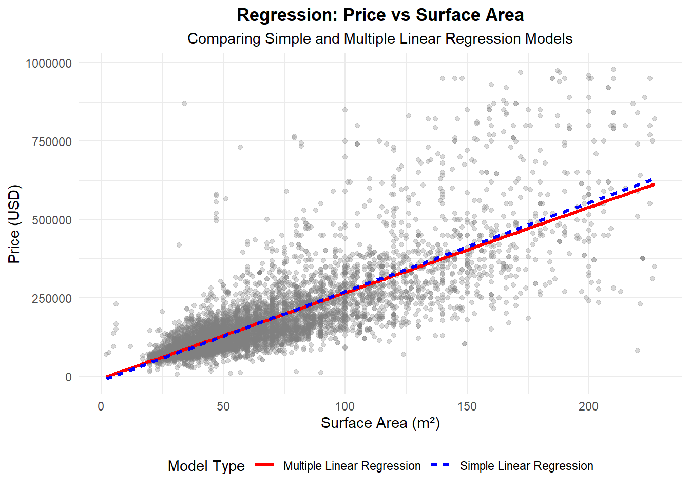
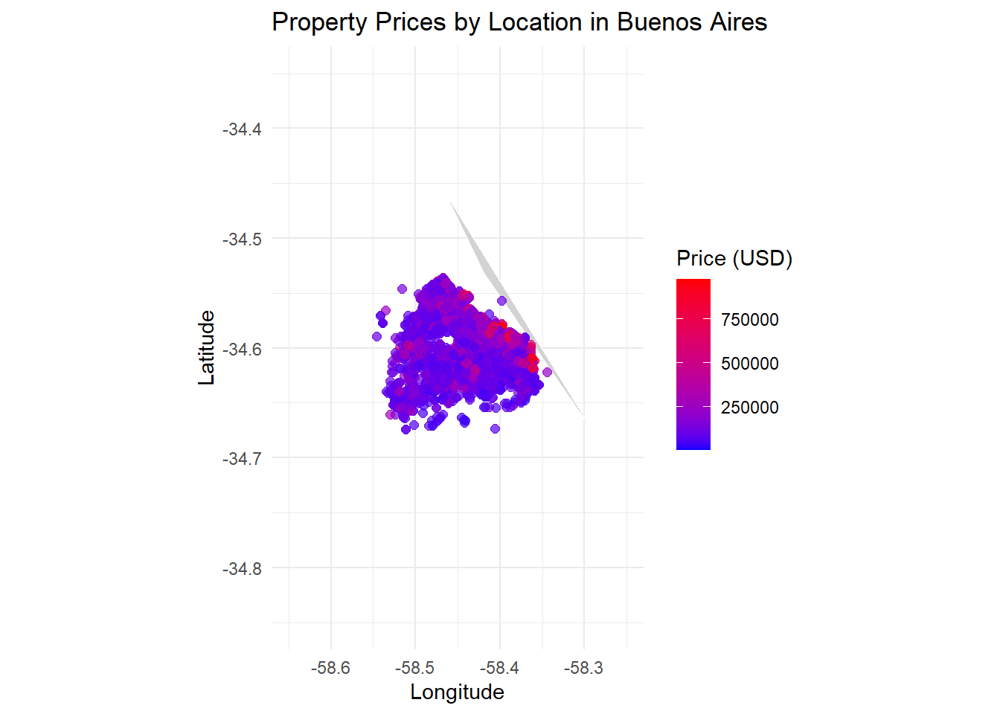
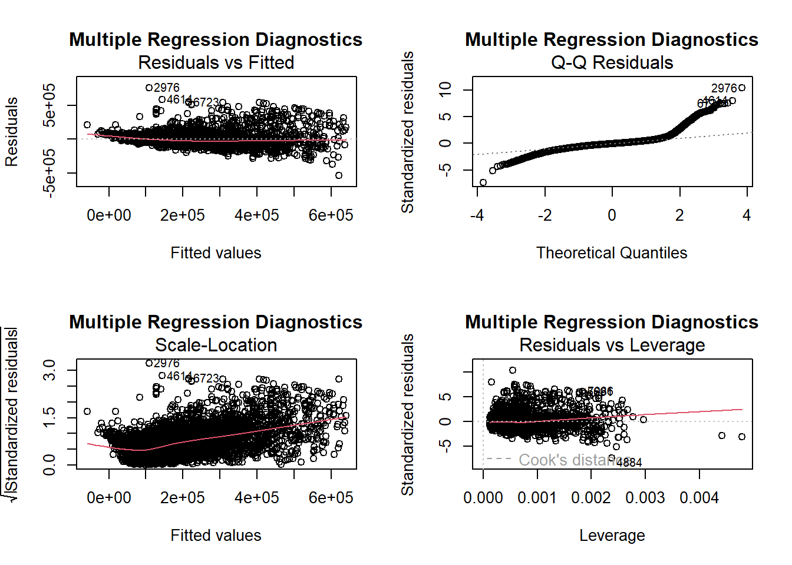

## 1) Background  
  
In this study of Buenos Aires real estate, our objective is to understand how the price of an apartment (expressed in approximate USD) is influenced by its surface area and location. We pre-filtered data so that the surface area is between 1 and 500 m², ensuring that the analysis targets typical residential units rather than extreme outliers. Additionally, location variables (latitude and longitude) are included to adjust for spatial influences, though the primary focus remains on the relationship between price and size.  


::: {.cell}

```{.r .cell-code}
# Read CSV files from the local computer
df1 <- read.csv("buenos-aires-real-estate-1 - Sheet1.csv", stringsAsFactors = FALSE)
df2 <- read.csv("buenos-aires-real-estate-2 - Sheet1.csv", stringsAsFactors = FALSE)
df3 <- read.csv("buenos-aires-real-estate-3 - Sheet1.csv", stringsAsFactors = FALSE)
df4 <- read.csv("buenos-aires-real-estate-4 - Sheet1.csv", stringsAsFactors = FALSE)
df5 <- read.csv("buenos-aires-real-estate-5 - Sheet1.csv", stringsAsFactors = FALSE)

# Combine all dataframes
all_data <- rbind(df1, df2, df3, df4, df5)

# Filter for apartments in Buenos Aires (Capital Federal)
data_apartments <- all_data %>%
  filter(property_type == 'apartment' & grepl('Capital Federal', place_with_parent_names))

# Process the lat.lon column by splitting into 'lat' and 'lon'
data_apartments <- data_apartments %>%
  separate(lat.lon, into = c('lat', 'lon'), sep = ',', convert = TRUE, extra = 'drop', fill = 'right')

# Remove rows with missing key variables
 data_apartments <- data_apartments %>%
  filter(!is.na(price_aprox_usd),
         !is.na(surface_covered_in_m2),
         !is.na(lat),
         !is.na(lon))

# Filter for surface area between 1 and 500 square meters
 data_filtered <- data_apartments %>%
  filter(surface_covered_in_m2 >= 1 & surface_covered_in_m2 <= 500)

# Remove outliers:
# We'll remove observations where price and surface area are outside of mu +- 3 sigma
remove_outliers <- function(x) {
  m <- mean(x, na.rm = TRUE)
  s <- sd(x, na.rm = TRUE)
  lower_bound <- m - 3*s
  upper_bound <- m + 3*s
  x >= lower_bound & x <= upper_bound
}

data_clean <- data_filtered %>%
  filter(remove_outliers(price_aprox_usd),
         remove_outliers(surface_covered_in_m2),
         remove_outliers(lat),
         remove_outliers(lon))

# Check number of rows at each step
# print(paste("Original data rows:", nrow(data_apartments)))
# print(paste("Data rows after surface area filter (1-500 m²):", # nrow(data_filtered)))
# print(paste("Data rows after outlier removal:", nrow(data_clean)))

# Display summary statistics using pander
pander(summary(data_clean[, c('price_aprox_usd', 'surface_covered_in_m2', 'lat', 'lon')]), 
       caption = "Summary Statistics of Clean Data")
```

::: {.cell-output-display}

---------------------------------------------------------------------------
 price_aprox_usd   surface_covered_in_m2        lat              lon       
----------------- ----------------------- ---------------- ----------------
  Min.  : 5196         Min.  : 2.00        Min.  :-34.67    Min.  :-58.55  

 1st Qu.: 90000       1st Qu.: 38.00       1st Qu.:-34.62   1st Qu.:-58.46 

 Median :125000       Median : 51.00       Median :-34.60   Median :-58.43 

  Mean :168027         Mean : 64.11         Mean :-34.60     Mean :-58.43  

 3rd Qu.:190000       3rd Qu.: 78.00       3rd Qu.:-34.58   3rd Qu.:-58.40 

  Max.  :980000        Max.  :227.00       Max.  :-34.54    Max.  :-58.34  
---------------------------------------------------------------------------

Table: Summary Statistics of Clean Data


:::
:::


## 2) Model and the Different $H_0/H_a$
We consider a multiple regression model of the form:

$$
price\_aprox\_usd = \beta_0 + \beta_1 \times surface\_covered\_in\_m2 + \beta_2 \times lat + \beta_3 \times lon + \epsilon
$$
$\beta_0$ (Intercept): This is the estimated price when all predictors are zero. While a zero value for surface area and location is outside our range of interest, $\beta_0$ serves as a baseline.

$\beta_1$ (Slope for surface area): This coefficient describes the change in property price for each additional square meter of surface area.

$H_0$: $\beta_1 = 0$ (i.e., surface area has no effect on price)

$H_a$: $\beta_1 \neq 0$ (i.e., surface area does affect price)

$\beta_2$ (Slope for latitude) and $\beta_3$ (Slope for longitude): These coefficients capture how the property's geographic location influences its price. Although these are adjusted variables in our model, they are not the primary focus of the hypothesis test, which is mainly concerned with the impact of surface area.

$H_0$: $\beta_2 = 0$ and $\beta_3 = 0$ (location does not affect price)

$H_a$: $\beta_2 \neq 0$ and $\beta_3 \neq 0$ (location does affect price)


::: {.cell}

```{.r .cell-code}
# Fit the multiple linear regression model WITH location variables  
model <- lm(price_aprox_usd ~ surface_covered_in_m2 + lat + lon, data = data_clean)  
  
# Fit a simple linear regression model with just surface area  
model_simple <- lm(price_aprox_usd ~ surface_covered_in_m2, data = data_clean)  
  
# Print the summary of the regression models using pander  
pander(summary(model), caption = "Multiple Linear Regression Model Summary")  
```

::: {.cell-output-display}

--------------------------------------------------------------------------
          &nbsp;             Estimate   Std. Error   t value    Pr(>|t|)  
--------------------------- ---------- ------------ --------- ------------
      **(Intercept)**        52685028    1962774      26.84    4.929e-152 

 **surface_covered_in_m2**     2733       22.57       121.1        0      

          **lat**             933716      33365       27.98    1.746e-164 

          **lon**             348898      22304       15.64    2.375e-54  
--------------------------------------------------------------------------


--------------------------------------------------------------
 Observations   Residual Std. Error   $R^2$    Adjusted $R^2$ 
-------------- --------------------- -------- ----------------
     7995              73340          0.6821       0.682      
--------------------------------------------------------------

Table: Multiple Linear Regression Model Summary


:::

```{.r .cell-code}
pander(summary(model_simple), caption = "Simple Linear Regression Model Summary")  
```

::: {.cell-output-display}

------------------------------------------------------------------------
          &nbsp;             Estimate   Std. Error   t value   Pr(>|t|) 
--------------------------- ---------- ------------ --------- ----------
      **(Intercept)**         -13948       1730      -8.062    8.57e-16 

 **surface_covered_in_m2**     2838       23.39       121.3       0     
------------------------------------------------------------------------


--------------------------------------------------------------
 Observations   Residual Std. Error   $R^2$    Adjusted $R^2$ 
-------------- --------------------- -------- ----------------
     7995              77144          0.6482       0.6481     
--------------------------------------------------------------

Table: Simple Linear Regression Model Summary


:::

```{.r .cell-code}
# ANOVA Table for the fitted model  
anova_table <- anova(model)  
pander(anova_table, caption = "ANOVA Table for the Regression Model")  
```

::: {.cell-output-display}

---------------------------------------------------------------------------------
          &nbsp;              Df     Sum Sq      Mean Sq    F value     Pr(>F)   
--------------------------- ------ ----------- ----------- --------- ------------
 **surface_covered_in_m2**    1     8.764e+13   8.764e+13    16293        0      

          **lat**             1     3.269e+12   3.269e+12    607.8    2.061e-129 

          **lon**             1     1.316e+12   1.316e+12    244.7    2.375e-54  

       **Residuals**         7991   4.298e+13   5.379e+09     NA          NA     
---------------------------------------------------------------------------------

Table: ANOVA Table for the Regression Model


:::

```{.r .cell-code}
# Check multicollinearity using Variance Inflation Factors (VIF)  
vif_values <- car::vif(model)  
pander(as.data.frame(vif_values), caption = "Variance Inflation Factors")  
```

::: {.cell-output-display}

----------------------------------------
          &nbsp;             vif_values 
--------------------------- ------------
 **surface_covered_in_m2**      1.03    

          **lat**              1.092    

          **lon**              1.093    
----------------------------------------

Table: Variance Inflation Factors


:::
:::


## 3) Regression Plot


::: {.cell}

```{.r .cell-code}
mean_lat <- mean(data_clean$lat)  
mean_lon <- mean(data_clean$lon)  
  
# Create a sequence of surface area values for prediction  
surface_seq <- seq(min(data_clean$surface_covered_in_m2),   
                   max(data_clean$surface_covered_in_m2),   
                   length.out = 100)  
  
# Predict using the simple model  
pred_simple <- predict(model_simple,   
                       newdata = data.frame(surface_covered_in_m2 = surface_seq))  
  
# Predict using the multiple model (fixing lat and lon at their means)  
pred_multiple <- predict(model,   
                         newdata = data.frame(surface_covered_in_m2 = surface_seq,  
                                             lat = mean_lat,  
                                             lon = mean_lon))  
  
# Create a data frame for plotting  
plot_data <- data.frame(  
  surface_covered_in_m2 = rep(surface_seq, 2),  
  price_aprox_usd = c(pred_simple, pred_multiple),  
  Model = rep(c("Simple Linear Regression", "Multiple Linear Regression"), each = 100)  
)  
  
# Create the plot  
ggplot() +  
  geom_point(data = data_clean,   
             aes(x = surface_covered_in_m2, y = price_aprox_usd),  
             alpha = 0.3, color = "gray50") +  
  geom_line(data = plot_data,   
            aes(x = surface_covered_in_m2, y = price_aprox_usd, color = Model, linetype = Model),  
            size = 1.2) +  
  scale_color_manual(values = c("Simple Linear Regression" = "blue",   
                                "Multiple Linear Regression" = "red")) +  
  labs(title = "Regression: Price vs Surface Area",  
       subtitle = "Comparing Simple and Multiple Linear Regression Models",  
       x = "Surface Area (m²)",  
       y = "Price (USD)",  
       color = "Model Type",  
       linetype = "Model Type") +  
  theme_minimal() +  
  theme(legend.position = "bottom",  
        plot.title = element_text(hjust = 0.5, face = "bold"),  
        plot.subtitle = element_text(hjust = 0.5))  
```

::: {.cell-output-display}
{width=672}
:::
:::

::: {.cell}

```{.r .cell-code}
# Real Map Visualization:  
# Get Argentina map data  
argentina_map <- map_data("world", region = "Argentina")  
  
# Overlay property data within approximate bounds for Buenos Aires  
ggplot() +  
  geom_polygon(data = argentina_map,   
               aes(x = long, y = lat, group = group),  
               fill = "lightgrey", color = "white") +  
  geom_point(data = data_clean,   
             aes(x = lon, y = lat, color = price_aprox_usd),  
             alpha = 0.7, size = 2) +  
  scale_color_gradient(low = "blue", high = "red", name = "Price (USD)") +  
  coord_fixed(1.3) +  
  xlim(-58.65, -58.25) +  # Approximate limits for Buenos Aires  
  ylim(-34.85, -34.35) +  # Approximate limits for Buenos Aires  
  labs(title = "Property Prices by Location in Buenos Aires",  
       x = "Longitude",  
       y = "Latitude") +  
  theme_minimal()  
```

::: {.cell-output-display}
{width=672}
:::
:::


## 4) Model
The multiple regression model includes surface area, latitude, and longitude as predictors of property price:


::: {.cell}

```{.r .cell-code}
# Diagnostic Plots for the multiple regression model  
par(mfrow = c(2, 2))  
plot(model, main = "Multiple Regression Diagnostics")  
```

::: {.cell-output-display}
{width=672}
:::
:::


## 5) Values of the Slope and Y-Intercept for Both Lines


::: {.cell}

```{.r .cell-code}
# Extract coefficients from the simple linear regression model  
simple_coef <- coef(model_simple)  
simple_intercept <- simple_coef[1]  
simple_slope <- simple_coef[2]  
  
# Extract coefficients from the multiple linear regression model  
multiple_coef <- coef(model)  
multiple_intercept <- multiple_coef[1]  
multiple_slope_surface <- multiple_coef[2]  
multiple_slope_lat <- multiple_coef[3]  
multiple_slope_lon <- multiple_coef[4]  
  
# Create a table of coefficients  
coef_table <- data.frame(  
  Model = c("Simple Linear Regression", "Multiple Linear Regression"),  
  Intercept = c(simple_intercept, multiple_intercept),  
  Slope_Surface = c(simple_slope, multiple_slope_surface),  
  Slope_Lat = c(NA, multiple_slope_lat),  
  Slope_Lon = c(NA, multiple_slope_lon)  
)  

coef_table_tidy <- coef_table %>%
  pivot_longer(cols = -Model, names_to = "Coefficient", values_to = "Value") %>%
  pivot_wider(names_from = Model, values_from = Value)

# Display the table using pander  
pander(coef_table_tidy, caption = "Comparison of Model Coefficients")  
```

::: {.cell-output-display}

-----------------------------------------------------------------------
  Coefficient    Simple Linear Regression   Multiple Linear Regression 
--------------- -------------------------- ----------------------------
   Intercept              -13948                     52685028          

 Slope_Surface             2838                        2733            

   Slope_Lat                NA                        933716           

   Slope_Lon                NA                        348898           
-----------------------------------------------------------------------

Table: Comparison of Model Coefficients


:::
:::


## 6) Conclusions with Future Studies
__Interpretation:__

- Holding location constant, for each additional square meter of surface area, the property price increases by approximately $ 2733.42  USD.

- For each degree increase in latitude (moving northward), the property price changes by approximately $ 933716.5  USD.

- For each degree increase in longitude (moving eastward), the property price changes by approximately $ 348898.2  USD.

__Conclusions:__
The analysis confirms that surface area has a strong positive impact on property price in Buenos Aires.
Even after adjusting for spatial location (latitude and longitude), each additional square meter is associated with a statistically significant increase in price.
The simple linear regression line provides clear interpretability for decision-makers in evaluating property value based on size.
The multiple regression model explains approximately r round(summary(model)$r.squared * 100, 1)% of the variance in property prices, indicating that surface area and location are important but not the only factors influencing price.

__Future Studies:__

__Incorporate Additional Variables:__ Future research could incorporate more detailed neighborhood characteristics (e.g., proximity to schools, parks, or transportation hubs) that can further explain price variation.

__Nonlinear Relationships:__ There may be a nonlinear relationship between property size and price; models such as polynomial regression or splines could capture curvature in the trend.
