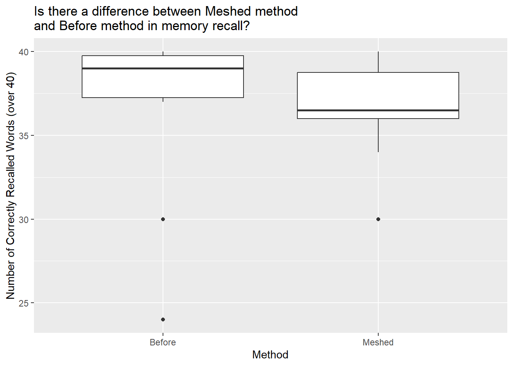
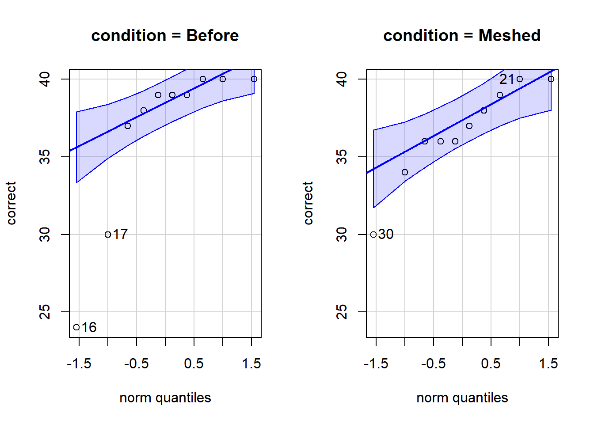

::: {.cell}

:::

::: {.cell}

:::


<br />

## Background 

Many teachers and other educators are interested in understanding how to best deliver new content to students. In general, they have two choices of how to do this.

1. The Meshed Approach
    * Deliver new content while simultaneously reviewing previously understood content.

2. The Before Approach
    * Deliver new content after fully reviewing previously understood content.

A study was performed to determine whether the *Meshed* or *Before* approaches to delivering content had any positive benefits on memory recall. 


## {.tabset .tabset-pills}

### Hide

### Show the Experiment Details

Individuals were seated at a computer and shown a list of words. Words appeared on the screen one at a time, for two seconds each, until all words had been shown (40 total). After all words were shown, they were required to perform a few two-digit mathematical additions (like 15 + 25) for 15 seconds to avoid immediate memory recall of the words. They were then asked to write down as many of the 40 words as they could remember. They were given a maximum of 5.3 minutes to recall words.

The process of showing words and recalling words was repeated four times with the same list of words each time (four chances to get it right). The presentation of the first trial was the same for all treatment conditions. However, trials 2, 3, and 4 were slightly different for each treatment condition.

<div style="padding-left:15px;">

The `SFR` group (the control group) stands for Standard Free Recall. In all four trials the same list of 40 words was presented, in a random order each time.

The `Before` group also used the same 40 words during each trial. However, any words that were correctly recalled in a previous trial were presented first, or *before* the words that were not recalled in the last trial. After all the correct words were presented in random order, the non-recalled words were presented in a random order.

The `Meshed` group also used the same 40 words during each trial. However, words that were correctly recalled in a previous trial were alternated with a missed word during the next presentation order. 

</div>

The data records the number of correctly recalled words (out of the 40 possible) from the fourth trial. Results were obtained for 30 students, 10 in each of the three treatment groups: `SFR`, `Before`, and `Meshed`. 


## {.tabset .tabset-pills}

### Hide

### Show the Data

The results from the study can be found in the `Friendly` data set in R after loading `library(car)`. 

Click the "Code" button to see the data.


::: {.cell}

```{.r .cell-code}
datatable(Friendly, options=list(lengthMenu = c(3,10,30)))
```

::: {.cell-output-display}


```{=html}
<div class="datatables html-widget html-fill-item" id="htmlwidget-06369af8b057eb656a11" style="width:100%;height:auto;"></div>
<script type="application/json" data-for="htmlwidget-06369af8b057eb656a11">{"x":{"filter":"none","vertical":false,"data":[["1","2","3","4","5","6","7","8","9","10","11","12","13","14","15","16","17","18","19","20","21","22","23","24","25","26","27","28","29","30"],["SFR","SFR","SFR","SFR","SFR","SFR","SFR","SFR","SFR","SFR","Before","Before","Before","Before","Before","Before","Before","Before","Before","Before","Meshed","Meshed","Meshed","Meshed","Meshed","Meshed","Meshed","Meshed","Meshed","Meshed"],[39,25,37,25,29,39,21,39,24,25,40,38,39,37,39,24,30,39,40,40,40,39,34,37,40,36,36,38,36,30]],"container":"<table class=\"display\">\n  <thead>\n    <tr>\n      <th> <\/th>\n      <th>condition<\/th>\n      <th>correct<\/th>\n    <\/tr>\n  <\/thead>\n<\/table>","options":{"lengthMenu":[3,10,30],"columnDefs":[{"className":"dt-right","targets":2},{"orderable":false,"targets":0},{"name":" ","targets":0},{"name":"condition","targets":1},{"name":"correct","targets":2}],"order":[],"autoWidth":false,"orderClasses":false}},"evals":[],"jsHooks":[]}</script>
```


:::
:::


<!-- Begin writing your analysis below here. -->

<!-- Note that your goal is to use the Friendly data to show whether or not the Meshed or Before methods have any positive benefit on memory recall. -->

## Analysis

### Introduction
Understanding how information is best retained is a crucial area of research in cognitive psychology and education. Educators and researchers have long debated the effectiveness of different teaching methodologies in improving memory recall. This study examines two primary instructional approaches: the Meshed Approach, where new content is introduced while simultaneously reviewing previously learned material, and the Before Approach, where a thorough review of old material precedes the introduction of new content.

To evaluate the impact of these approaches on memory recall, participants were presented with a structured word recall task, where they were exposed to a series of words in a controlled environment. This experiment aimed to determine whether either approach offers a significant advantage in enhancing memory retention. The findings from this study have implications for optimizing learning strategies in academic and professional settings.

### Hypotheses for the t test
$$
  H_0: \mu_\text{meshed} = \mu_\text{before}
$$

$$
  H_a: \mu_\text{meshed} \neq \mu_\text{before}
$$

### Graphical and Numerical Summaries


::: {.cell}

```{.r .cell-code}
Friendly <- Friendly %>%
  filter(condition %in% c("Before", "Meshed")) %>%
  droplevels()
```
:::

::: {.cell}

```{.r .cell-code}
# Independent Samples t-Test Numerical Summary
pander(favstats(correct~condition, data=Friendly))
```

::: {.cell-output-display}

------------------------------------------------------------------------------
 condition   min    Q1     median    Q3     max   mean    sd     n    missing 
----------- ----- ------- -------- ------- ----- ------ ------- ---- ---------
  Before     24    37.25     39     39.75   40    36.6   5.337   10      0    

  Meshed     30     36      36.5    38.75   40    36.6   3.026   10      0    
------------------------------------------------------------------------------


:::
:::


At a first glance, it looks like there is no difference in the two methods' means. Both of them have 36.6 mean.


::: {.cell}

```{.r .cell-code}
# Independent Samples t-Test Graphic
ggplot(data=Friendly, aes(y=correct, x=condition)) + 
  geom_boxplot() +
  labs(title="Is there a difference between Meshed method
and Before method in memory recall?",
      x = "Method",
      y = "Number of Correctly Recalled Words (over 40)")
```

::: {.cell-output-display}
{width=672}
:::
:::


To see if there really is no difference, let's conduct a two-tailed independent t-Test.

### t-Test


::: {.cell}

```{.r .cell-code}
statresult <- t.test(correct~condition, data=Friendly, mu=0, alternative="two.sided", conf.level=0.95)

pander(statresult)
```

::: {.cell-output-display}

-----------------------------------------------------------
 Test statistic    df     P value   Alternative hypothesis 
---------------- ------- --------- ------------------------
       0          14.24      1            two.sided        
-----------------------------------------------------------

Table: Welch Two Sample t-test: `correct` by `condition` (continued below)

 
---------------------------------------------
 mean in group Before   mean in group Meshed 
---------------------- ----------------------
         36.6                   36.6         
---------------------------------------------


:::
:::


Oops... the p-value is 1, which is way higher than our significance level of 0.05, which indicates that their is no difference between the two.

But wait, let's back up of a second here to make sure that doing a t-Test is appropriate for this analysis. To do that, let's take a look at the distribution of the data.

### Checking Requirements (qqPlot)


::: {.cell}

```{.r .cell-code}
qqPlot(correct~condition, data=Friendly)
```

::: {.cell-output-display}
{width=672}
:::
:::


It looks like some of our data points don't follow the blue line, which means the data is not normally distributed. In this case, let's do a Wilcoxon test for two independent samples, called Mann Whitney test.

### Wilcoxon Test 

__Hypotheses for the Wilcoxon__

$$
  H_0: \text{difference in medians} = 0
$$

$$
  H_a: \text{difference in medians} \neq 0
$$


__Wilcoxon Test__


::: {.cell}

```{.r .cell-code}
# Wilcoxon rank-sum test (Mann-Whitney U test)
wilcox_test <- wilcox.test(correct ~ condition, data = Friendly, exact = FALSE)

pander(wilcox_test)
```

::: {.cell-output-display}

---------------------------------------------------
 Test statistic   P value   Alternative hypothesis 
---------------- --------- ------------------------
       62          0.378          two.sided        
---------------------------------------------------

Table: Wilcoxon rank sum test with continuity correction: `correct` by `condition`


:::
:::


After doing a Wilcoxon test, we got a p-value of 0.378 which is still higher than our significance level of 0.05.

### Conclusions and Interpretations
Because our our p-value is greater than our alpha, we fail to reject the null and conclude that there is insufficient evidence to conclude that there is difference between the Meshed and Before methods.

The results of this study provide valuable insights into the relationship between learning methods and memory retention. While both the Meshed and Before approaches have their merits, the analysis did not indicate a significant difference in memory recall performance between the two methods. This suggests that other factors, such as individual learning styles and cognitive load, may play a more substantial role in retention.

These findings highlight the importance of tailoring educational strategies to fit diverse learner needs rather than relying on a one-size-fits-all approach. Further research could explore how these approaches interact with different subject matters, age groups, and cognitive abilities to refine best practices for memory-based learning.


