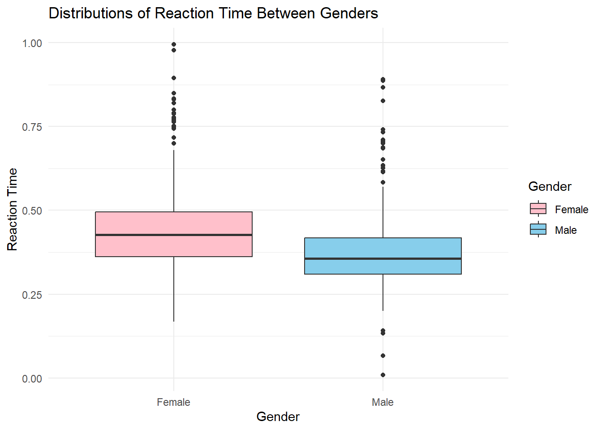

### Context
This study examines whether there is a difference in reaction times between male and female high school seniors. The data comes from the Census at School survey, a project that collects real-world data from students to help them learn about statistics. Participants in this study answered various questions, including their reaction time, which was measured through an interactive test.

Since reaction time is an important factor in activities like sports, driving, and video games, I wanted to see if there was a significant difference between genders. By analyzing the reaction time data, we can determine whether males and females tend to respond at different speeds on average and whether this difference is meaningful.

To determine whether of not there is a difference, I decided to use two sample t-Test. This test is appropriate for this analysis since the samples are two unrelated groups.

### Null and Alternative Hypotheses
$$
H_0: \mu_{male reaction time} = \mu_{female reaction time}
$$

$$
H_0: \mu_{male reaction time} \neq \mu_{female reaction time}
$$
$$
a = 0.05
$$


::: {.cell}

```{.r .cell-code}
library(tidyverse)
library(DT)
library(pander)
library(readr)

HSS <- read_csv("../../Data/HighSchoolSeniors.csv")

HSS2 <- HSS %>%
  filter(!is.na(Reaction_time), !is.na(Gender)) %>%
  filter(Reaction_time < 1.0) %>%
  select(Gender, Reaction_time)
```
:::


### Numerical and Graphical Summaries


::: {.cell}

```{.r .cell-code}
HSS2 %>%
  group_by(Gender) %>%
  summarise(
    Count = n(),
    Mean = mean(Reaction_time, na.rm = TRUE),
    Median = median(Reaction_time, na.rm = TRUE),
    SD = sd(Reaction_time, na.rm = TRUE),
    Min = min(Reaction_time, na.rm = TRUE),
    Max = max(Reaction_time, na.rm = TRUE)
  ) %>%
  pander()
```

::: {.cell-output-display}

-----------------------------------------------------------
 Gender   Count    Mean    Median     SD      Min     Max  
-------- ------- -------- -------- -------- ------- -------
 Female    208    0.4553   0.427    0.1449   0.168   0.995 

  Male     239    0.3873   0.356    0.1315   0.01    0.89  
-----------------------------------------------------------


:::
:::


Looking at the summary statistics, it looks like women have have higher reaction time than men, on average. Women have an average reaction time of 0.4553 while men have 0.3873.


::: {.cell}

```{.r .cell-code}
ggplot(HSS2, aes(x = Gender, y = Reaction_time, fill = Gender)) +
  geom_boxplot() +
  scale_fill_manual(values = c("pink", "skyblue")) +  # Manually assign colors
  theme_minimal() +
  labs(
    title = "Distributions of Reaction Time Between Genders",
    y = "Reaction Time"
  )
```

::: {.cell-output-display}
{width=672}
:::
:::


This boxplot confirms what we saw in the summary statistics. Looking at the chart, the women, on average, have higher reaction time than men.


### Requirements

1. Both samples are representative of the population.

2. Since both groups have sample sizes of greater than 30, we assume that the distribution of the difference of the sample means is normal.

### Test Results


::: {.cell}

```{.r .cell-code}
# independent t test
t.test(Reaction_time ~ Gender, HSS2, mu = 0, alternative = "two.sided", conf.level = 0.95) %>%
  pander()
```

::: {.cell-output-display}

------------------------------------------------------------------
 Test statistic    df        P value       Alternative hypothesis 
---------------- ------- ---------------- ------------------------
      5.17        421.6   3.63e-07 * * *         two.sided        
------------------------------------------------------------------

Table: Welch Two Sample t-test: `Reaction_time` by `Gender` (continued below)

 
-------------------------------------------
 mean in group Female   mean in group Male 
---------------------- --------------------
        0.4553                0.3873       
-------------------------------------------


:::
:::


### Interpretation
The study looked at whether there is a difference in reaction times between male and female high school seniors. The null hypothesis stated that there is no difference, while the alternative hypothesis suggested that there is a difference.

The data included 208 females and 239 males, with females having an average reaction time of 0.455 seconds and males having an average of 0.387 seconds. An independent t-test was used to compare the two groups. The test resulted in a p-value of 0.000000363, which is much smaller than 0.05. This means that the difference in reaction times between males and females is very unlikely to be due to random chance.

This solidifies what we've seen in the summary statistics and the boxplot that women, on average, have higher reaction time than men.

### Conclusion
Since the p-value is so small, we reject the null hypothesis. This means there is sufficient evidence to conclude that there is a difference in reaction times between males and females. In simple terms, this study found that females tend to have slightly slower reaction times compared to males, and this difference is statistically significant.


<!-- Instructions

1. Use the HSS dataset in R to come up with a question that can be answered with a t Test. 

Here is a link to the survey given to the students that participated in the study:
https://ww2.amstat.org/censusatschool/pdfs/C@SQuestionnaire.pdf
(Use the link to learn about what each column of data in the data set represents.)

2. Establish why your question is interesting and rephrase the question using a statistical "null" and "alternative" hypothesis. (Hint, see the "Math 325 Notebook -> R Help -> R-Markdown Hints" page of your textbook for instructions on how to write mathematical hypotheses.)

3. Clearly answer your question using statistics. Be sure to compute a p-value and provide supporting numerical and graphical summaries. If your conclusions don't have numbers in them, they likely are not detailed enough to be meaningful conclusions.

Note: you can create "groups" from the data in many ways. For example, suppose you wanted to create a variable that grouped people according to whether they thought recycling was more important than conserving water. You could do this by:


::: {.cell}

```{.r .cell-code}
HSS <- HSS %>%
  mutate(recycling_than_water = ifelse(Importance_recycling_rubbish >	Importance_conserving_water, "Recycling More Important", "Water Conservation More Important"))
```
:::


4. Include Q-Q Plots checking the normality of the data and discuss if the requirements of the test are satisfied for your data or not. Note that Q-Q Plots are not graphics, they are diagnostic plots diagnosing the normality of the data.


-->


