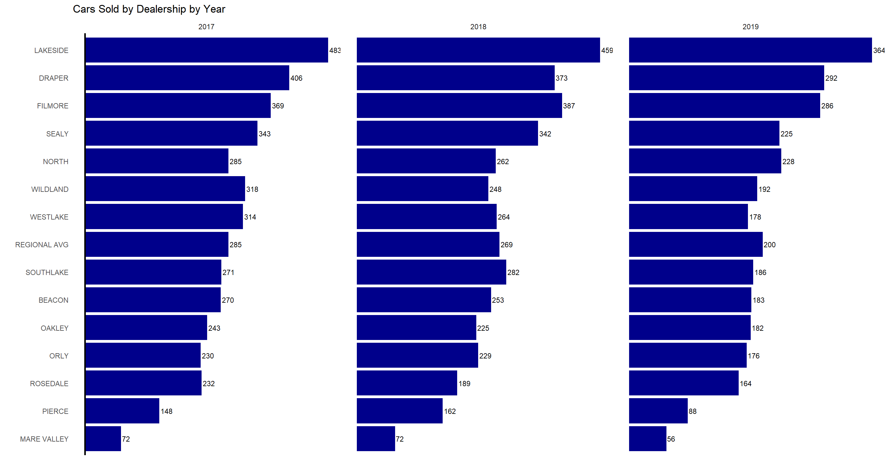

::: {.cell}

```{.r .cell-code}
file_path <- "https://byuistats.github.io/M335/data/dealers.csv"
dealers <- read_csv(file_path)

# View(dealers)
# Glimpse(dealers)
```
:::

::: {.cell}

```{.r .cell-code}
names(dealers)[1] <- 'X'

dealers <- dealers %>% 
  mutate(year = substr(X, 1, 4))

# View(dealers)

dealers_long <- dealers %>% 
  pivot_longer(cols = -c(X, year), names_to = "dealership", values_to = "cars_sold")

# View(dealers_long)
```
:::

::: {.cell}

```{.r .cell-code}
dealers_summary <- dealers_long %>%
  group_by(year, dealership) %>%
  summarise(total = sum(cars_sold), .groups = 'drop')

# View(dealers_summary)

dealers_summary_by_year <- dealers_summary %>%
  filter(year %in% c("2017", "2018", "2019"))

# View(dealers_summary_by_year)

dealers_summary_2017 <- dealers_summary %>%
  filter(year %in% c("2017"))

# View(dealers_summary_2017)
```
:::

::: {.cell}

```{.r .cell-code}
ggplot(dealers_summary_by_year, aes(x = total, y = reorder(dealership, total))) +
  geom_bar(stat = "identity", fill = "darkblue") +
  geom_vline(data = dealers_summary_2017, aes(xintercept = 0), color = "black", size = 1) +
  geom_text(aes(label = total), hjust = -0.1, size = 3) +
  facet_wrap(~ year, scales = "free_x") +
  labs(x = "", y = "", title = "Cars Sold by Dealership by Year") +
  theme_minimal() +
  theme(
    axis.text.x = element_blank(), 
    axis.ticks.x = element_blank(),
    panel.grid.major = element_blank(),
    panel.grid.minor = element_blank(),
    )
```

::: {.cell-output-display}
{width=1440}
:::
:::
